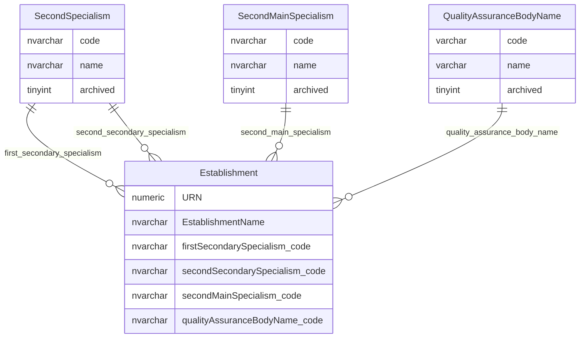

# Specialism And Quality Indicators

This page explains specialism and quality-assurance reference data held against establishment records.

## Business Context

Some values in this area may reflect legacy extract requirements or policy-specific attributes rather than enduring provider-register concepts. They are still present in current data structures and extracts, but that does not mean every value should automatically be treated as current business vocabulary.

New policy-specific attributes are better owned by the service responsible for that policy area, rather than being added to the central provider register by default. There may also be differences between legacy extract fields and the fields displayed to users in the current GIAS interface.

## Scope

This view focuses on:

- secondary specialism classifications;
- second main-specialism classification;
- quality assurance body name classification.

It does not show the wider establishment record, audit tables, permissions tables or the full independent-school quality-assurance workflow.

## How To Read This Model

- These tables are reference data attached to an establishment by code.
- `SecondSpecialism` is reused by two establishment fields: first secondary specialism and second secondary specialism.
- `QualityAssuranceBodyName` is directly used by the establishment details display and edit path.
- The establishment record stores the code. Extract and cache projections can expose both code and name.

## Application-Derived Insights

- Specialism values are part of the current establishment data export surface as code/name pairs.
- Quality assurance body name is not only an extract value; it is also displayed and editable through establishment details where the display or edit policy allows it.
- The physical names are awkward in places. Future modelling should use clear business language for first secondary specialism, second secondary specialism and second main specialism.

## Specialism And Quality Indicator Model



### SecondSpecialism

`SecondSpecialism` classifies secondary specialism values. It is reused for both first secondary specialism and second secondary specialism on the establishment record.

Business-friendly pattern:

```text
For this establishment,
what secondary-specialism classification applies?
```

### SecondMainSpecialism

`SecondMainSpecialism` classifies the second main-specialism value held on an establishment.

Business-friendly pattern:

```text
For this establishment,
what second main-specialism classification applies?
```

### QualityAssuranceBodyName

`QualityAssuranceBodyName` classifies the quality assurance body name held on an establishment.

Business-friendly pattern:

```text
For this establishment,
which quality assurance body name applies?
```

Notes:

- `QualityAssuranceBodyName` is visible in establishment details when the relevant display policy allows it.
- It is editable through a controlled dropdown when the relevant edit policy allows it.
