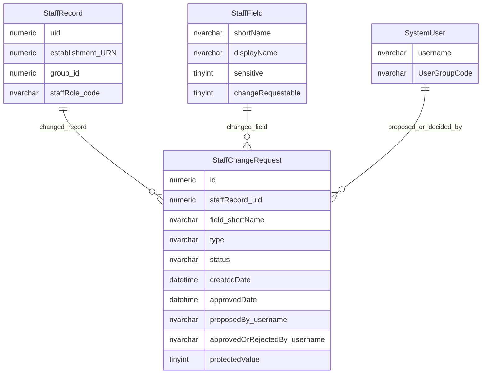
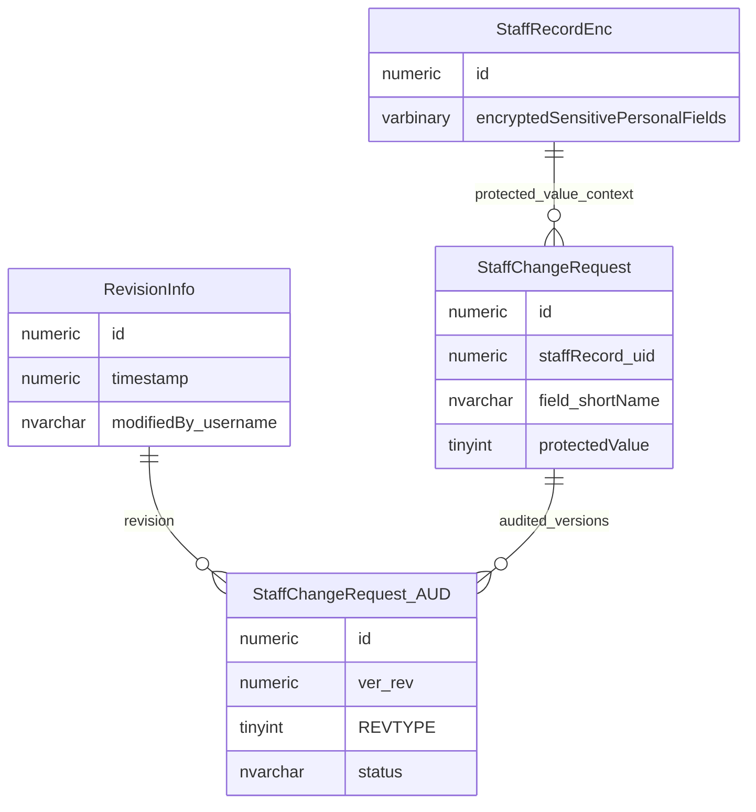

# Staff Change Request Workflow

This page explains how governance and staff field changes are recorded, applied and retained.

## Scope

This view focuses on:

- staff/governance field change requests;
- the staff record and logical staff field being changed;
- proposer and decision user context;
- protected value storage;
- technical audit snapshots.

## How To Read This Model

- `StaffChangeRequest` records field-level changes to a governance/staff record.
- The changed field is identified through `StaffField`.
- The request type and protected-value flag determine which old/new value columns are meaningful.
- Sensitive staff values need special handling in change history.
- Technical audit snapshots are separate from the business change request.

## Application-Derived Insights

- Staff change requests are interpreted by field and change type, not by one uniform value shape.
- Staff field metadata drives display, editability, sensitivity, validation and change behaviour.
- Some staff/governance changes appear to be approved and applied immediately by the current user.
- Protected values can be held in change history, so retention and access rules need to cover change requests as well as the live staff record.
- The frontend works through governance services rather than owning the physical staff change-request table.

## Core Staff Change Workflow



### StaffChangeRequest

`StaffChangeRequest` records a proposed or applied change to a logical staff/governance field.

Business-friendly pattern:

```text
For this governance or staff field change,
what field was changed,
which staff record was affected,
who proposed and decided the change,
and what old and new values were recorded?
```

### StaffField

`StaffField` is the logical-field catalogue used to control staff/governance field behaviour.

Business-friendly pattern:

```text
For this user group, staff field and governance role context,
can the field be seen, edited, withheld as sensitive, required, warning-only or skipped?
```

### StaffRecord

`StaffRecord` is the governance/staff record affected by the change.

Business-friendly pattern:

```text
For this governance/staff person or role instance,
which establishment or group does it belong to,
and what role does it have?
```

## Protected Values And Audit



### StaffRecordEnc

`StaffRecordEnc` stores selected sensitive personal fields for staff/governance records.

Business-friendly pattern:

```text
For this staff/governance record,
which sensitive personal fields are stored in encrypted form,
and when may they be loaded or returned to users?
```

### StaffChangeRequest_AUD

`StaffChangeRequest_AUD` stores audited snapshots of staff change request state.

Business-friendly pattern:

```text
For this staff change request and audit revision,
what request state and value context was persisted at that point?
```

## Reading This Diagram

These ERDs are explanatory views, not a complete workflow specification. Sensitive value handling, approval rules and retention rules should be considered together.

