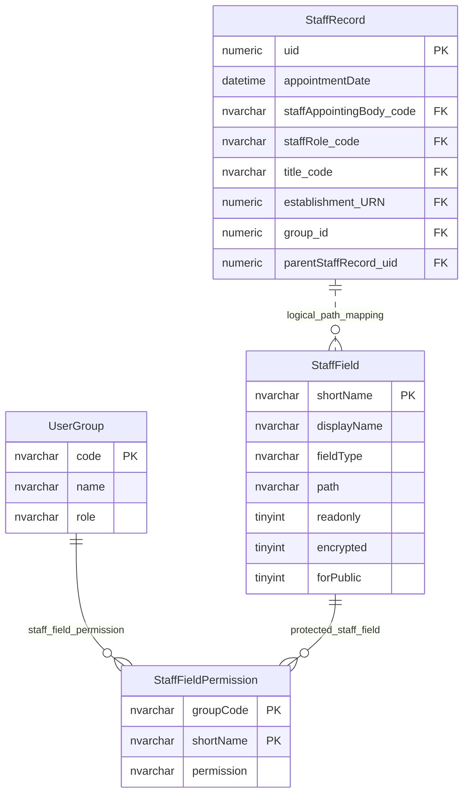

# Staff Field Permissions

This page explains how user groups receive access to governance and staff fields.

## Scope

This model covers:

- staff field metadata;
- staff field permissions by user group;
- staff records as the data context for those fields.

## How To Read This Model

- `StaffField` describes a logical governance/staff field, not the person record itself.
- `StaffFieldPermission` controls whether a user group can use each logical staff field.
- Some staff fields are public-safe and others are protected.
- Role-specific display and validation rules sit around this model, but are not repeated here.

## Application-Derived Insights

- Staff field metadata drives display, editability, sensitivity handling and change creation.
- The same field can behave differently depending on the governance role.
- Public-safe governance output is filtered through field metadata and permission rules.
- Future design should separate field metadata, sensitivity classification, role-specific requirements and access policy.

## Staff Field Permissions



### StaffField

Business-friendly pattern:

```text
For this logical governance or staff field,
how is it named, displayed, found on the staff record,
protected, validated and controlled for each role?
```

### StaffFieldPermission

Business-friendly pattern:

```text
For this user group,
for this governance or staff field,
can the group read it, write it, be trusted for it, or not use it?
```

### StaffRecord

Business-friendly pattern:

```text
For this person or role appointment,
what governance staff record is attached to an establishment, group or parent shared record?
```

## Reading This Diagram

Use this model to understand governance field access. The diagram deliberately shows field metadata and permission relationships without publishing sensitive person-field examples.
