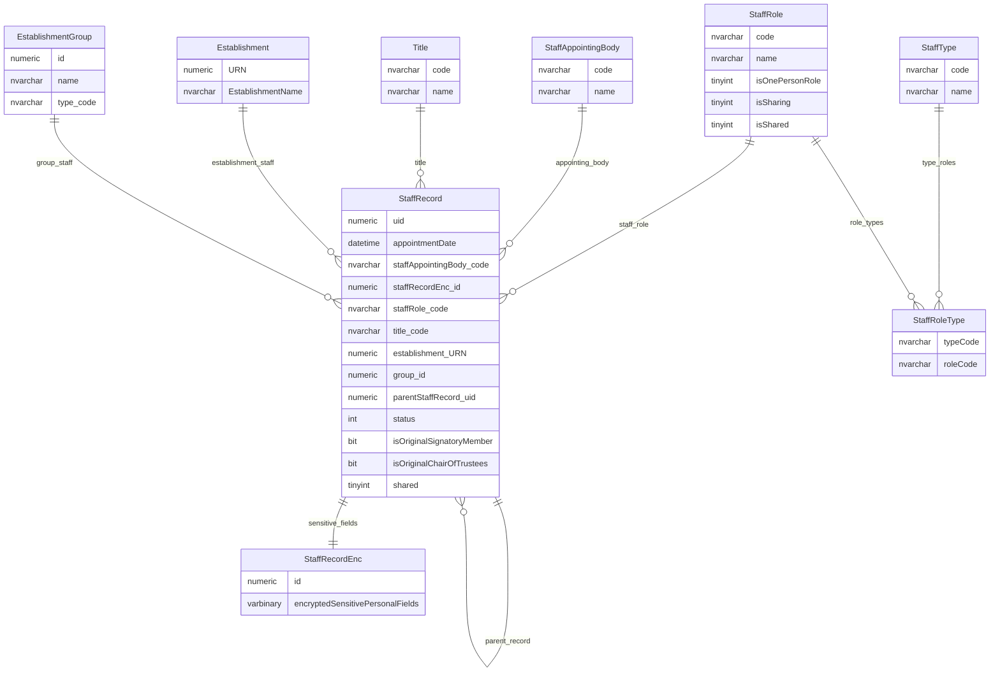
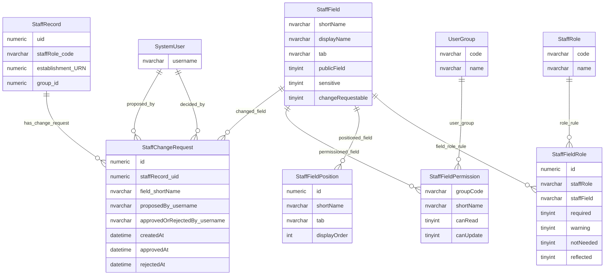
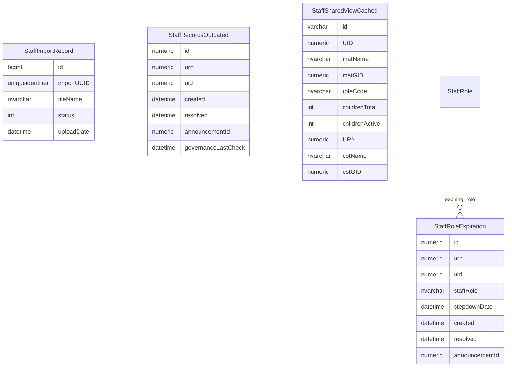

# Staff And Governance Entity Relationship Diagram

This page explains the data model used to describe governance and staff records, including roles, role types, appointing bodies, sensitive personal data handling, field-level controls, change requests and operational governance reminders.

## Scope

This view focuses on:

- governance and staff role records;
- whether a role is attached to an establishment or an organisation group;
- role, role type and appointing body reference data;
- sensitive personal data separation;
- staff field metadata, permissions and change requests;
- shared governance read models and operational reminder state.

It does not show audit tables or tables marked as having no observed activity.

## How To Read This Model

The application behaviour shows some important business meaning that is not obvious from the table names alone:

- `StaffRecord` represents a governance/staff role instance. It is not just a person table.
- A staff record can belong to either an establishment or an organisation group.
- Sensitive personal data is separated from the main staff record and is only returned when the user is allowed to see it.
- Not all sensitive or non-public fields are physically stored in the encrypted companion table, so sensitivity must be treated as a policy concept, not only as a table boundary.
- Shared governance roles use parent/child staff-record relationships and role flags. The model is more complex than a simple person-to-organisation link.
- `StaffRole` is governance reference data with behaviour. Role flags affect whether a role is one-person, shared or reflected into establishments.
- `StaffAppointingBody` is not just a dropdown. It participates in governance validation rules based on role and organisation context.
- `StaffField` controls display, editability, sensitivity, permissions, validation and change-request behaviour for logical staff fields.
- Staff change requests are field-level proposed changes against staff records.
- Shared governance views and reminder tables are operational/read-model structures derived from staff and governance source data.

## Staff Record And Governance Role

This diagram shows the core governance/staff role record, its sensitive-data companion table, and the reference data used to classify roles and appointments.



### StaffRecord

`StaffRecord` is the core governance/staff role record. It can be attached to an establishment or to an organisation group.

Business-friendly pattern:

```text
For this governance/staff person or role instance,
which establishment or group does it belong to,
what role does it have,
and where are its sensitive fields stored?
```

### StaffRecordEnc

`StaffRecordEnc` is the encrypted companion table for sensitive personal fields associated with a staff record.

Business-friendly pattern:

```text
For this staff/governance record,
which sensitive personal fields are stored in encrypted form,
and when may they be loaded or returned to users?
```

### StaffRole

`StaffRole` classifies the governance or staff role represented by a staff record.

Business-friendly pattern:

```text
For this staff/governance record,
what role does the person hold,
and does that role have one-person, shared or reflected-role behaviour?
```

### StaffRoleType

`StaffRoleType` links staff roles to broader staff types.

Business-friendly pattern:

```text
For this staff/governance role,
which broader staff type does it belong to?
```

### StaffType

`StaffType` is reference data for broader staff or governance categories.

Business-friendly pattern:

```text
For this role,
what broad staff or governance type does it belong to?
```

### StaffAppointingBody

`StaffAppointingBody` classifies how a person was appointed to a governance/staff role.

Business-friendly pattern:

```text
For this governance/staff role,
who or what appointed the person to that role,
and is that appointing route valid for the role and group context?
```

Notes:

- `StaffRecord.uid` is the main staff/governance record identifier.
- `StaffRecordEnc` should be read as sensitive-data storage for a staff record, not as a separate person or role.
- `parentStaffRecord_uid` supports shared or reflected governance records.
- Role flags on `StaffRole` help drive one-person role and shared-role behaviour.
- A governance/staff record can attach to an establishment or to an organisation group.

## Staff Field Controls And Change Requests

This diagram shows how logical staff fields are controlled, permissioned and changed.



### StaffField

`StaffField` is the metadata catalogue for logical staff/governance fields.

Business-friendly pattern:

```text
For this staff/governance field,
how should it be displayed, edited, permissioned, validated and changed?
```

### StaffChangeRequest

`StaffChangeRequest` records proposed changes to staff/governance fields.

Business-friendly pattern:

```text
For this staff/governance record,
what field change has been proposed,
who proposed it,
and has it been approved or rejected?
```

### StaffFieldPermission

`StaffFieldPermission` controls user-group access to logical staff/governance fields.

Business-friendly pattern:

```text
For this user group,
what can it read or update for this staff/governance field?
```

### StaffFieldPosition

`StaffFieldPosition` controls where staff/governance fields appear in the user interface.

Business-friendly pattern:

```text
For this staff/governance field,
where should it appear in the display or edit layout?
```

### StaffFieldRole

`StaffFieldRole` stores role-specific field behaviour, such as whether a field is required, warning-only, not needed or reflected.

Business-friendly pattern:

```text
For this staff/governance role,
which fields are required, warning-only, not needed or reflected?
```

Notes:

- Staff field metadata is doing more than display ordering. It participates in permissions, sensitivity, validation and change-request behaviour.
- `StaffChangeRequest` is field-level change state for staff/governance records.
- Staff field validation tables marked as having no observed activity are not shown in this published view.

## Operational And Projection Staff Tables

This diagram shows operational state and read-model tables around governance/staff records.



### StaffImportRecord

`StaffImportRecord` stores operational metadata for staff import processing.

Business-friendly pattern:

```text
For this staff import,
which uploaded file or import job is being processed,
what stage has it reached,
and where is the generated output stored?
```

### StaffRecordsOutdated

`StaffRecordsOutdated` tracks establishments or groups whose governance/staff records are considered out of date.

Business-friendly pattern:

```text
For this establishment or group,
has governance/staff information become stale,
and has the reminder been created or resolved?
```

### StaffRoleExpiration

`StaffRoleExpiration` tracks governance roles where a required one-person role may need a replacement holder after a previous holder has stepped down.

Business-friendly pattern:

```text
For this establishment or group,
has a required one-person governance role expired,
and has the resulting reminder been created or resolved?
```

### StaffSharedViewCached

`StaffSharedViewCached` is a read model for shared governance/staff relationships.

Business-friendly pattern:

```text
For this shared MAT/group governance role,
which establishment-side staff records has it produced,
and which establishments is the person shared with?
```

Notes:

- Operational and projection tables are not the source of truth for staff/governance records.
- `StaffSharedViewCached` exists to answer shared-governance read questions quickly.
- Reminder tables represent derived operational state, such as stale governance data or missing required role holders.

## Reading This Diagram

These ERDs are explanatory views, not a complete schema catalogue. They show the main current-state relationships needed to understand governance/staff records, staff field controls and supporting operational state.

