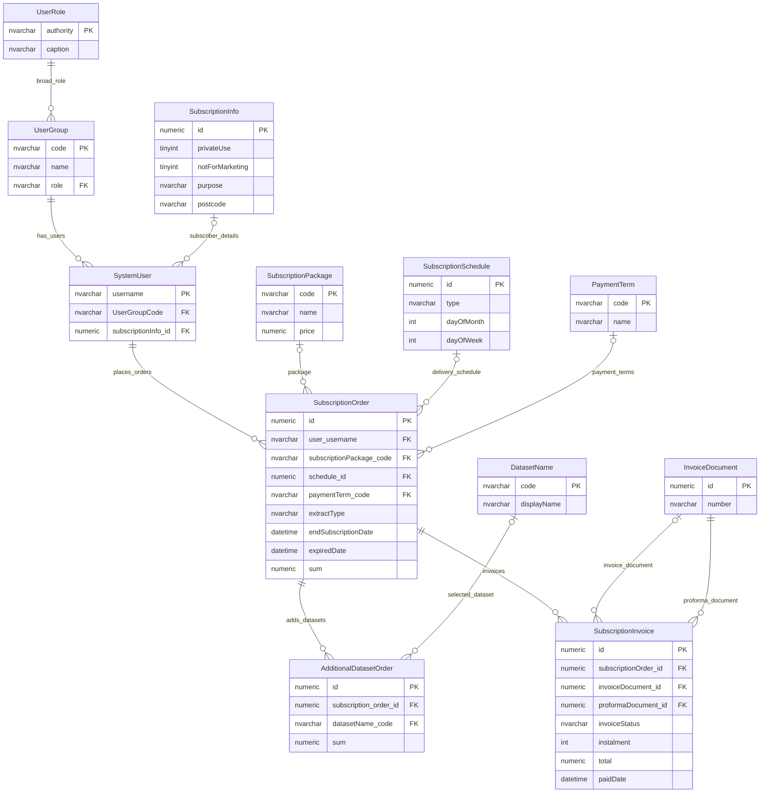

# Subscriber Access And Entitlements

This page records the retired subscriber access and commercial subscription model.

The subscriber subdomain has been confirmed as no longer in use. The model is included to explain the legacy schema and to avoid mistaking these tables for active access-control concepts.

## Scope

This model covers:

- subscriber user group context;
- subscription information;
- subscription orders, packages and schedules;
- additional dataset orders;
- invoices and payment terms.

## How To Read This Model

- This is a retired commercial subscription model.
- It is closer to order management than ordinary application authorisation.
- Shared user and group tables are not retired just because they appear in this model.
- Subscription-specific tables should not be treated as active access-control dependencies without renewed business confirmation.

## Application-Derived Insights

- The model describes packages, orders and invoices rather than simple entitlements.
- The schema does not contain a clean bridge saying that a live subscription grants access to a dataset.
- Future access-control design should not reuse this model as a general entitlement pattern.
- Retired subscriber tables should be separated from active identity and user-group concepts.

## Subscriber Access And Entitlements



### SubscriptionInfo

Business-friendly pattern:

```text
For this subscriber user,
what purpose, address and use declarations were recorded?
```

### SubscriptionOrder

Business-friendly pattern:

```text
For this subscriber user,
what subscription package, delivery schedule and payment term were ordered?
```

### AdditionalDatasetOrder

Business-friendly pattern:

```text
For this subscription order,
which additional datasets were ordered?
```

### SubscriptionInvoice

Business-friendly pattern:

```text
For this subscription order,
what invoice or proforma document was raised,
and what payment status was recorded?
```

## Reading This Diagram

Use this model as a retired-subdomain reference. It should not drive current access-control design unless the subscriber business process is explicitly reinstated.
