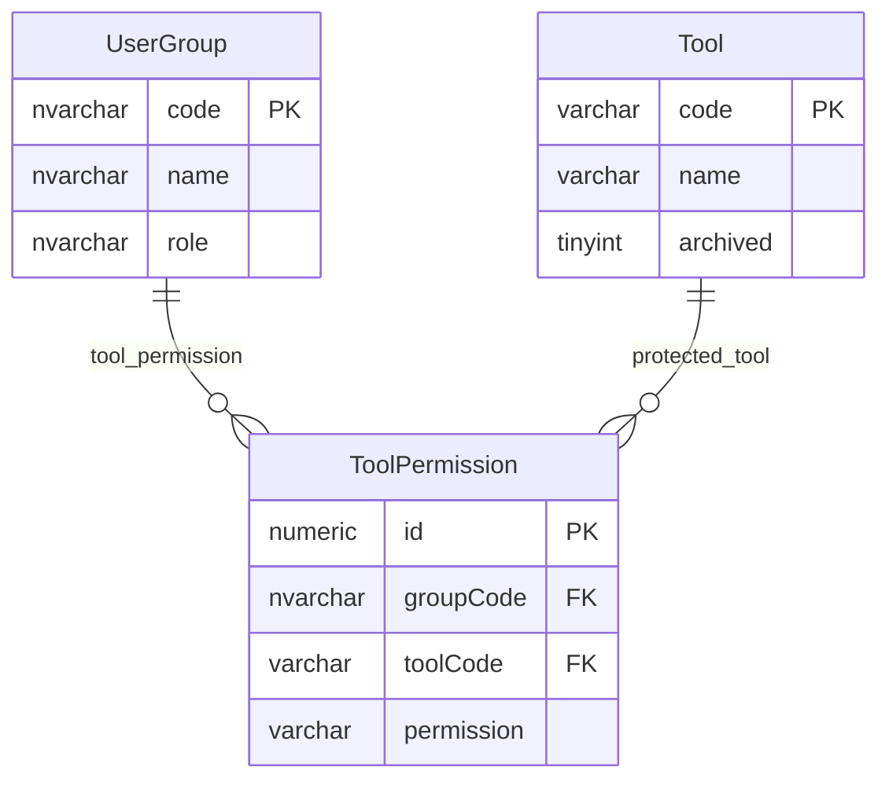

# Tool Permissions

This page explains the model that records tool or capability permissions for user groups.

## Scope

This model covers:

- tool or capability catalogue entries;
- user-group permission rows for those tools;
- broad role context for user groups.

## How To Read This Model

- `Tool` is a catalogue of named operational capabilities.
- `ToolPermission` records a permission value for a user group and tool.
- This model is not the only place where runtime tool access can be enforced.
- Tool permission evidence should be reconciled with current role gates and service checks.

## Application-Derived Insights

- Tool permissions are useful evidence for intended or reported access by user group.
- Some current tool access is also controlled by route, role or service logic.
- The table should not be assumed to be the single runtime source of truth without validation.
- Future design should define whether tool access is policy data, code configuration or both.

## Tool Permissions



### Tool

Business-friendly pattern:

```text
For this named tool or operational capability,
what is the stable code and display name used when permissions are reported?
```

### ToolPermission

Business-friendly pattern:

```text
For this user group,
for this tool or capability,
what level of access does the group have?
```

## Reading This Diagram

Use this model to understand recorded tool access by group. It is a capability matrix, not a field-permission model.
