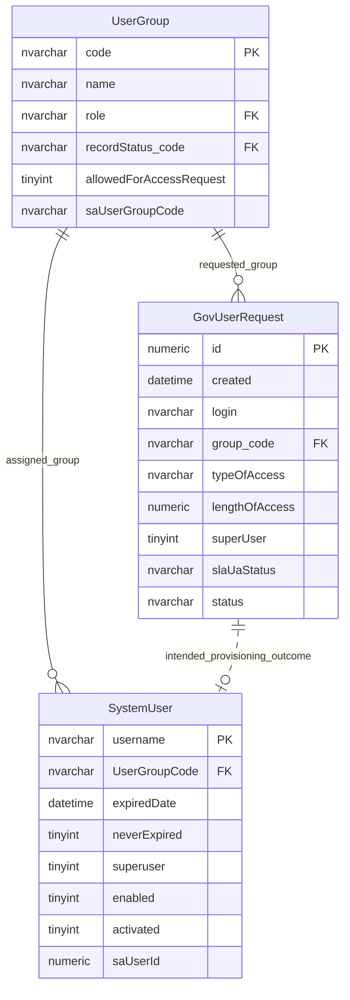

# User Access Request And Provisioning

This page explains the legacy government-user access request and provisioning model.

The traced workflow appears legacy or dormant, so this page should be read as a request-model reference rather than a confirmed active provisioning flow.

## Scope

This model covers:

- requested account details;
- requested user group;
- requested access duration and elevated access;
- intended provisioning outcome into a user account.

## How To Read This Model

- `GovUserRequest` records a request for access.
- The request physically points to the requested user group.
- There is no physical relationship from a request to the user account it may have created.
- Request status values are stored as strings rather than reference-table rows.

## Application-Derived Insights

- The model describes an access-request workflow, but the complete active provisioning path is not evident.
- Request data and account data overlap but are not linked by a durable request-to-user relationship.
- Future design should keep request, approval decision, provisioned account and audit trail explicitly linked.

## User Access Request And Provisioning



### GovUserRequest

Business-friendly pattern:

```text
For this requested user account,
which user group and access level are requested,
for how long,
and what decision has been made about the request?
```

### UserGroup

Business-friendly pattern:

```text
For this access request,
which user group is being requested?
```

### SystemUser

Business-friendly pattern:

```text
For this provisioned account,
which user group is assigned,
and is the account active?
```

## Reading This Diagram

Use this model to understand the legacy request shape. A future access-request model should explicitly connect request, decision, provisioning action and resulting account.
