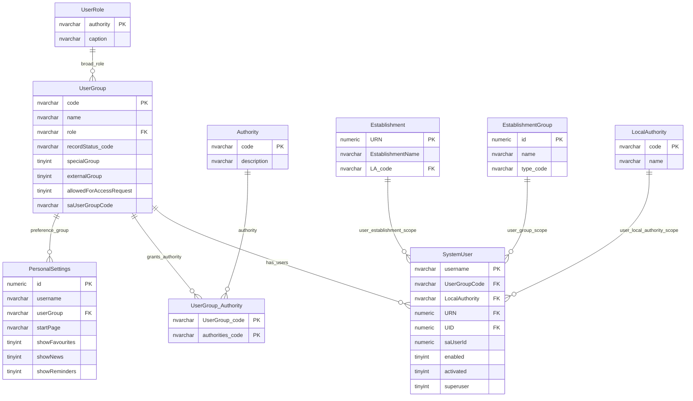

# Users And User Groups

This page explains the user, user-group, role, authority and organisation-scope model.

## Scope

This model covers:

- system users;
- user groups and broad roles;
- authority grants to user groups;
- establishment, local authority and group scope;
- personal settings linked to a user and group context.

## How To Read This Model

- `SystemUser` is the account and access-context table.
- `UserGroup` is the main access-control grouping key.
- `UserRole` gives a broad role to a user group.
- `Authority` grants additional capability-style permissions to user groups.
- Organisation scope is held on the user row and interpreted by policy.

## Application-Derived Insights

- Identity, group membership, organisation scope and preferences are blended in the current user model.
- The external identity-provider user id is important for resolving the signed-in user.
- User group is the anchor for many other permission tables.
- Future design should separate external identity, local account, group membership, organisation scope, authority grants and preferences.

## Users And User Groups



### SystemUser

Business-friendly pattern:

```text
For this signed-in user,
which user group do they act under,
and are they scoped to an establishment, local authority or education provider group?
```

### UserGroup

Business-friendly pattern:

```text
For this user account or policy rule,
which access-control group is being used?
```

### UserRole

Business-friendly pattern:

```text
For this user group,
which broad role family does it belong to?
```

### Authority And UserGroup_Authority

Business-friendly pattern:

```text
For this user group,
which additional authority-style grants does it have?
```

### PersonalSettings

Business-friendly pattern:

```text
For this user,
acting through this user group,
which personal home page and display defaults should be used?
```

## Reading This Diagram

Use this model as the identity and access-control foundation. User group, role, authority and organisation scope are inputs to access decisions; they do not by themselves describe every permission.
