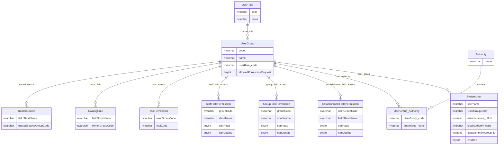

# Users, User Groups And Permissions Overview

This page explains the main areas of the users, user groups and permissions model. The permission model is split across several focused areas because access control is layered across identity, roles, field permissions, tool access, document visibility, row-level scope and change workflow.

## Scope

This view focuses on:

- user identity and broad user groups;
- organisation scope for users;
- field-level read and update permissions;
- tool and report access;
- document, news and announcement visibility;
- row-level access and organisation scope;
- change-request ownership, trusted-source and approval behaviour.

It does not show tables marked as having no observed activity in the 30-day production usage window.

## How To Read This Model

The application behaviour shows some important business meaning that is not obvious from the table names alone:

- `UserGroup` is the central hub for many permission decisions.
- The model is not one single permission table. It combines group membership, field permissions, tool permissions, ownership rules, trusted-source rules, content visibility and row-level organisation scope.
- Some permissions are data-driven through tables, while others are calculated from user context, role, establishment type, establishment status or organisation scope.
- Row-level visibility depends on user group and organisation scope as well as the records being viewed.
- Field-level permissions control whether users can read or update specific establishment, group or staff/governance fields.
- Change workflow access is related to ownership, trusted-source rules, proposer group and approver group.
- Runtime service checks and database permissions need to be understood together.

## Permission Areas



### SystemUser

`SystemUser` represents an application user and their broad group and organisation scope.

Business-friendly pattern:

```text
For this user,
which user group do they belong to,
and what establishment, local authority or organisation group scope applies?
```

### UserGroup

`UserGroup` is the central permission grouping used across field access, tools, content visibility and workflow rules.

Business-friendly pattern:

```text
For this user group,
what broad role, organisation scope and permission behaviour applies?
```

### UserRole

`UserRole` classifies the broad type of user group.

Business-friendly pattern:

```text
For this user group,
what broad user role does it represent?
```

### Authority

`Authority` represents named application authorities attached to user groups.

Business-friendly pattern:

```text
For this user group,
which named application authorities are granted?
```

### Field Permissions

Establishment, group and staff field permission tables control read and update access to logical fields.

Business-friendly pattern:

```text
For this user group,
which fields can be read or updated?
```

### ToolPermission

`ToolPermission` controls access to tool-like capabilities.

Business-friendly pattern:

```text
For this user group,
which tool capabilities can be used?
```

### OwningRule

`OwningRule` identifies which user group owns a field for change and stewardship purposes.

Business-friendly pattern:

```text
For this field,
which user group owns the decision or approval responsibility?
```

### TrustedSource

`TrustedSource` identifies which user groups can act as trusted sources for specific fields.

Business-friendly pattern:

```text
For this field,
which user group is trusted to provide or approve the value?
```

## Reading This Diagram

These ERDs are explanatory views, not a complete access-control specification. The permission model combines relational permission data with runtime policy decisions and organisation-scope rules.

