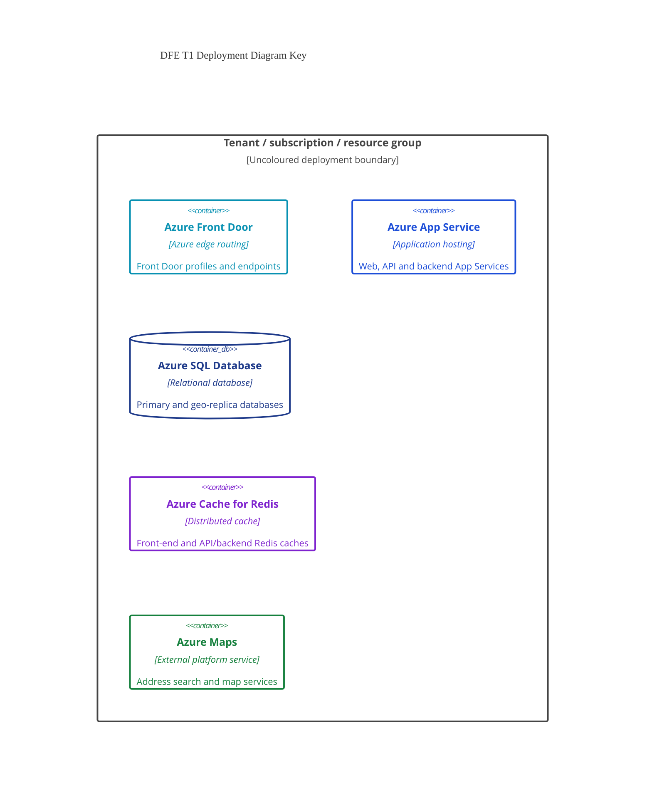
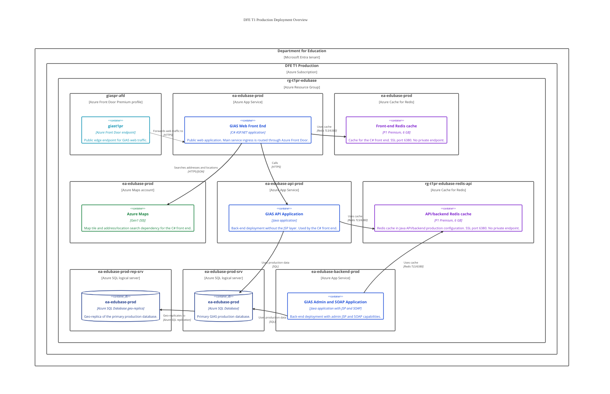
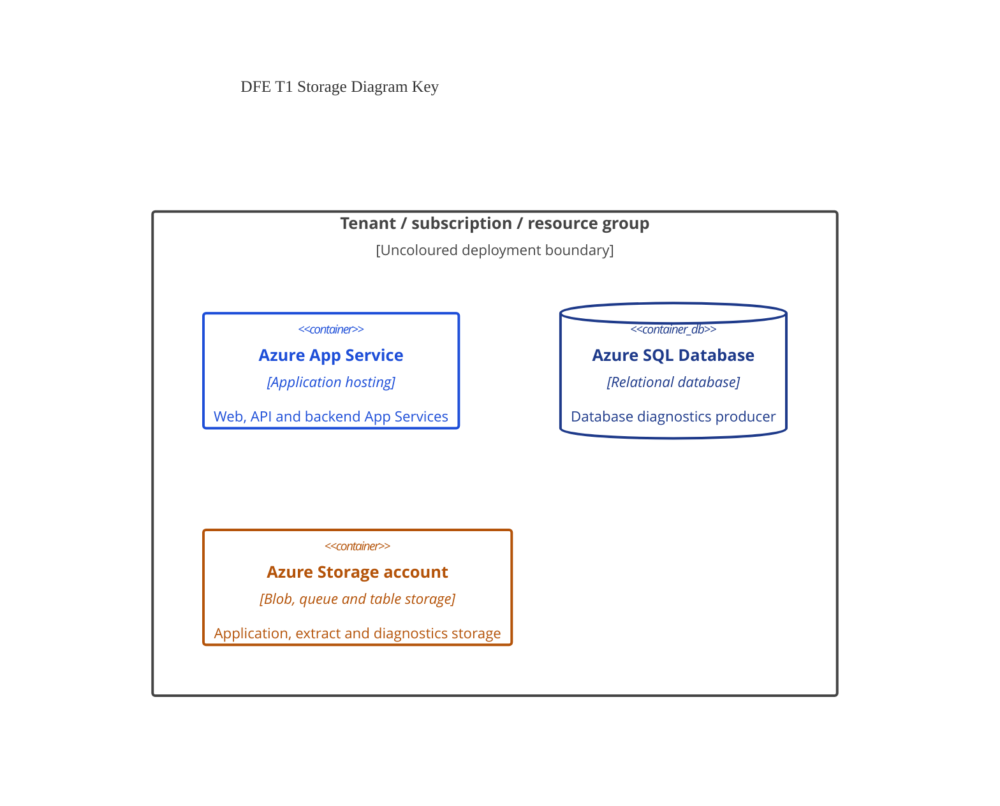
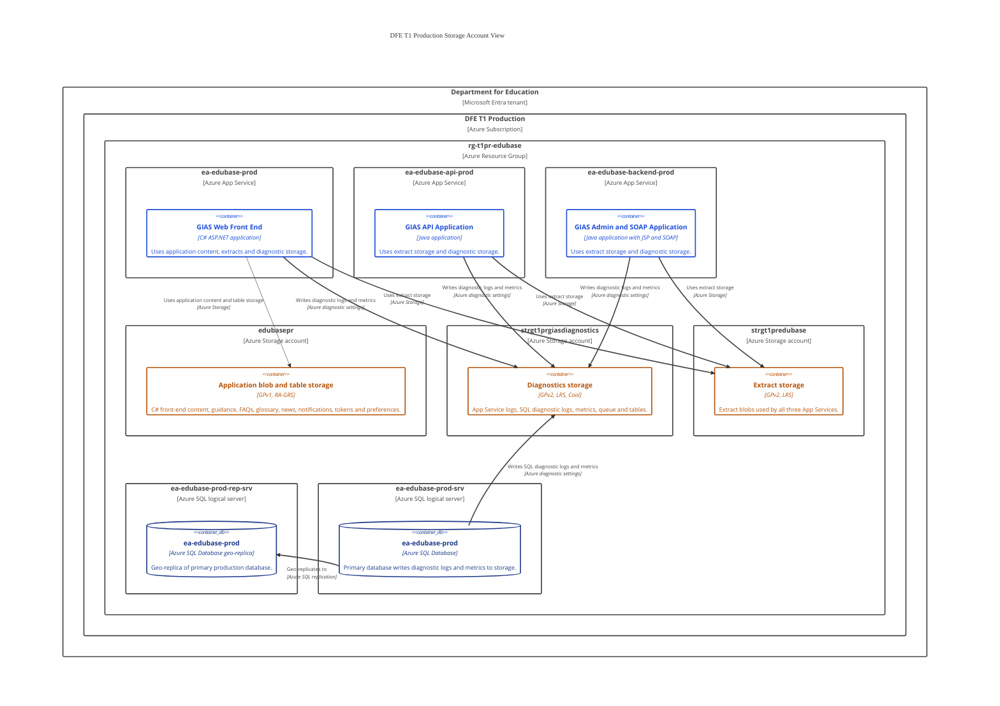
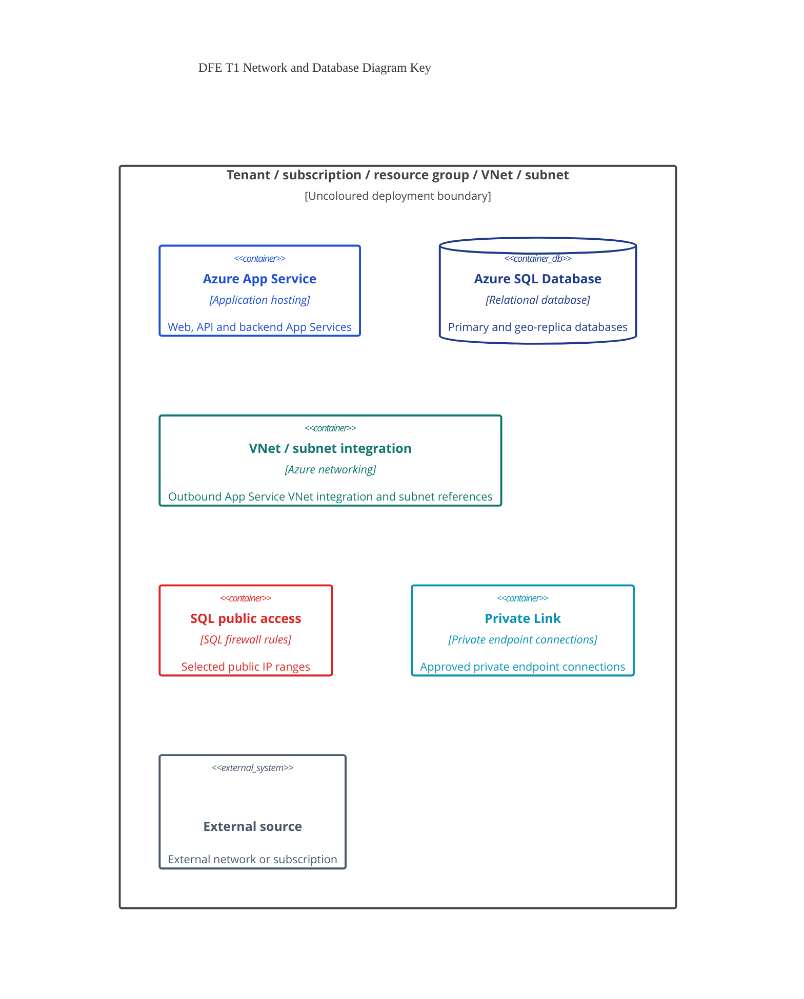
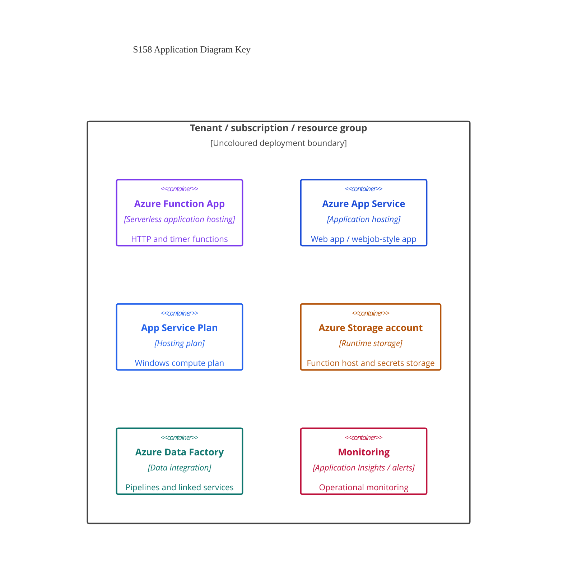
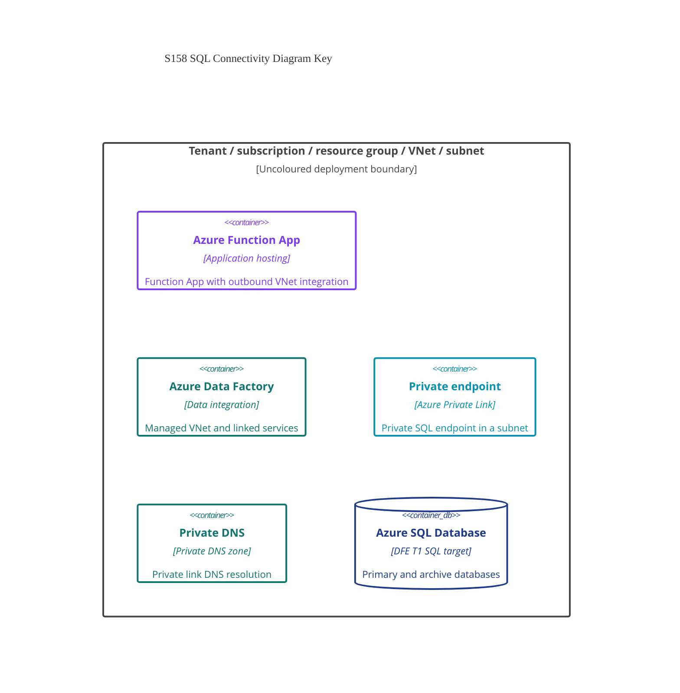
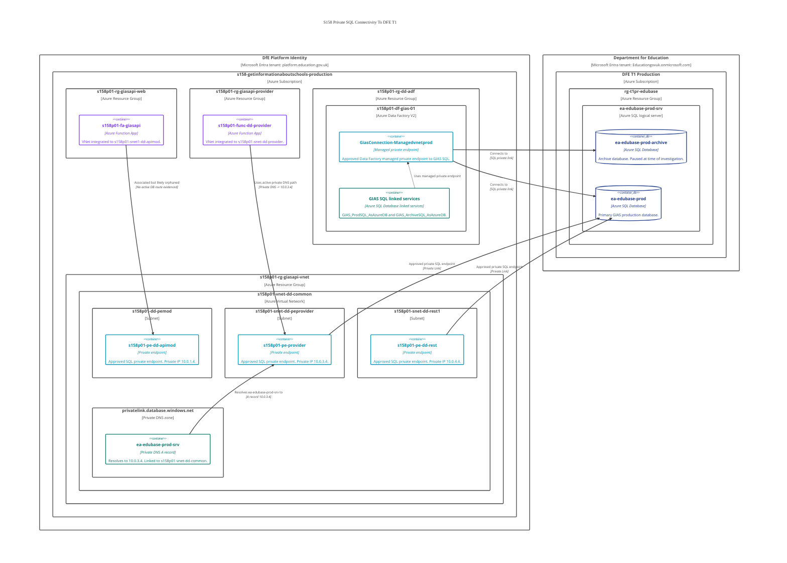

# GIAS Production Deployment Architecture

This document describes the production deployment shape for Get Information about Schools (GIAS) in Azure.

It uses focused C4 deployment diagrams rather than one large diagram. The same core resources appear in more than one view, but each diagram answers a different question:

1. What is deployed in the `DFE T1 Production` subscription and resource groups?
2. How does public traffic enter the DFE T1 GIAS service?
3. How do the DFE T1 App Services and SQL databases relate to the physical network configuration?
4. Which DFE T1 App Services and databases write to each storage account?
5. What is deployed in the `s158-getinformationaboutschools-production` subscription?
6. Which S158 applications have private SQL connectivity back to the DFE T1 production SQL server?

## Scope

The document is split into two subscription views:

- Section 1 covers the `DFE T1 Production` subscription, where the main GIAS production App Services, Azure SQL databases, Redis caches, storage accounts, Front Door and Azure Maps account live.
- Section 2 covers the `s158-getinformationaboutschools-production` subscription, where S158 Data Factory, Function Apps, App Services, supporting storage, monitoring, VNet and private endpoints live.

The diagrams deliberately omit lower-detail supporting resources such as deployment resources, unrelated resource group contents and individual firewall rule IP addresses unless they are needed to explain the deployment shape.

The paused archive database `ea-edubase-prod-archive` exists on `ea-edubase-prod-srv` and is captured in the SQL investigation document. It is omitted from the DFE T1 overview diagrams to keep the views focused on the main production database and its geo-replica. It is referenced in the S158 connectivity view because S158 Data Factory has a linked service for it.

## DFE T1 Production Subscription

### Deployment Overview

#### How To Read This Diagram

This diagram is the high-level deployment inventory for the main GIAS production service.

Read it from the outside in:

- The outer boundary is the `Department for Education` tenant.
- Inside the tenant is the `DFE T1 Production` subscription.
- Inside the subscription is the production GIAS resource group `rg-t1pr-edubase`.
- The resource group contains the Front Door profile, three App Services, two Azure SQL logical servers, two Redis caches and the Azure Maps account used by the C# front end.
- The SQL database on `ea-edubase-prod-rep-srv` is a geo-replica of the primary `ea-edubase-prod` database.
- Redis is split between a front-end cache assumption for `ea-edubase-prod` and a confirmed Java API/backend cache configuration for `rg-t1pr-edubase-redis-api`.
- Azure Maps is used by the C# front end for address/location search.

This diagram is not intended to explain every network rule. It is intended to show the main deployed resources and their broad runtime relationships.

#### Diagram Key

### Storage Account View

#### How To Read This Diagram

This diagram isolates the three production storage accounts and their consumers.

Read it as a storage ownership and diagnostics view:

- `edubasepr` is application blob and table storage used exclusively by the C# front end `ea-edubase-prod`.
- `strgt1predubase` is extract storage used by all three App Services.
- `strgt1prgiasdiagnostics` is diagnostics storage used by all three App Services and the primary SQL database.
- The primary SQL database writes SQL diagnostics to `strgt1prgiasdiagnostics`.
- The SQL geo-replica is shown for deployment context, but no storage account relationship has been confirmed for it in this view.

This diagram excludes Redis, Front Door, Azure Maps and network access rules.

#### Storage Diagram Key

### Network And Database Connectivity View

#### How To Read This Diagram

This diagram explains the network and database shape for DFE T1.

The key points are:

- The three App Services all use the same App Service VNet integration subnet: `vnet2-t1pr/snet-t-t1pr-giasintegration`.
- App Services are not physically deployed into that subnet. App Service is a managed PaaS service. VNet integration gives the apps an outbound route into the VNet.
- `ea-edubase-prod-srv` is the primary SQL logical server in West Europe.
- `ea-edubase-prod-rep-srv` is the SQL logical server in UK South that hosts the geo-replica database.
- Both SQL logical servers have public network access set to selected networks.
- The primary SQL server has selected public firewall rules and four approved private endpoint connections from S158 resources.
- The replica SQL server has selected public firewall rules but no private endpoints.
- The primary database geo-replicates to the database on the replica SQL server.
- The replica SQL server may support read-only, support, reporting, manual failover or disaster recovery scenarios, but active client usage has not been confirmed.

#### Network Diagram Key

```mermaid
%%{init: {'theme': 'base', 'themeVariables': { 'primaryColor': '#ffffff', 'secondaryColor': '#ffffff', 'tertiaryColor': '#ffffff', 'lineColor': '#334155', 'fontFamily': 'Segoe UI, Arial, sans-serif'}, 'themeCSS': 'rect, path { stroke-width: 2.5px; } .relationshipLine { stroke-width: 2px; }'}}%%
C4Deployment

    title DFE T1 Network and Database Connectivity View

    System_Ext(s158Resources, "S158 production resources", "s158-getinformationaboutschools-production subscription resources with approved SQL private endpoints.")
    System_Ext(publicAllowlist, "Approved public IP ranges", "DfE, supplier, Prisma, DOL, IAS and App Service outbound addresses.")

    Deployment_Node(tenant, "Department for Education", "Microsoft Entra tenant") {
        Deployment_Node(subscription, "DFE T1 Production", "Azure Subscription") {
            Deployment_Node(giasRg, "rg-t1pr-edubase", "Azure Resource Group") {
                Deployment_Node(primarySqlServer, "ea-edubase-prod-srv", "Azure SQL logical server") {
                    Container(primarySqlFirewall, "Selected public network access", "SQL firewall rules", "Public network access enabled for selected public IP ranges. Broad Azure services exception disabled.")
                    Container(primaryPrivateEndpoints, "Approved private endpoint connections", "Private Link connections", "Four approved private endpoint connections from S158 resources.")
                    ContainerDb(primaryDb, "ea-edubase-prod", "Azure SQL Database", "Primary production database. PaaS database, not deployed into the App Service subnet. Business Critical Gen5, 8 vCores.")
                }

                Deployment_Node(replicaSqlServer, "ea-edubase-prod-rep-srv", "Azure SQL logical server") {
                    Container(replicaSqlFirewall, "Selected public network access", "SQL firewall rules", "Public network access enabled for selected public IP ranges. No private endpoints.")
                    ContainerDb(replicaDb, "ea-edubase-prod", "Azure SQL Database geo-replica", "Geo-replica in UK South. PaaS database, not deployed into the App Service subnet. Business Critical Gen5, 2 vCores.")
                }

                Deployment_Node(frontendAppService, "ea-edubase-prod", "Azure App Service") {
                    Container(webApp, "GIAS Web Front End", "C# ASP.NET application", "Uses outbound VNet integration to snet-t-t1pr-giasintegration.")
                }

                Deployment_Node(apiAppService, "ea-edubase-api-prod", "Azure App Service") {
                    Container(apiApp, "GIAS API Application", "Java application", "Uses outbound VNet integration to snet-t-t1pr-giasintegration.")
                }

                Deployment_Node(backendAppService, "ea-edubase-backend-prod", "Azure App Service") {
                    Container(adminSoapApp, "GIAS Admin and SOAP Application", "Java application with JSP and SOAP", "Uses outbound VNet integration to snet-t-t1pr-giasintegration.")
                }
            }

            Deployment_Node(networkRg, "rg-t1pr-network", "Azure Resource Group") {
                Deployment_Node(vnet, "vnet2-t1pr", "Azure Virtual Network") {
                    Deployment_Node(appServerSubnet, "snet-t-t1pr-appserver2", "Subnet") {
                        Container(appServerSubnetRule, "SQL VNet rule reference", "SQL service endpoint rule", "Configured on primary SQL server but recorded with No access endpoint status.")
                    }
                    Deployment_Node(gatewaySubnet, "GatewaySubnet", "Subnet") {
                        Container(gatewaySubnetRule, "SQL VNet rule reference", "SQL service endpoint rule", "Configured on primary SQL server but recorded with No access endpoint status.")
                    }
                    Deployment_Node(giasSubnet, "snet-t-t1pr-giasintegration", "Subnet") {
                        Container(vnetIntegration, "Shared App Service VNet integration subnet", "Outbound integration", "All three App Services are integrated to this subnet for outbound traffic.")
                        Container(giasSubnetRule, "SQL VNet rule reference", "SQL service endpoint rule", "Configured on primary SQL server but recorded with No access endpoint status.")
                    }
                }
            }
        }
    }

    Rel(webApp, vnetIntegration, "Uses outbound VNet integration")
    Rel(apiApp, vnetIntegration, "Uses outbound VNet integration")
    Rel(adminSoapApp, vnetIntegration, "Uses outbound VNet integration")
    Rel(publicAllowlist, primarySqlFirewall, "Allowed by public SQL firewall", "TCP/1433")
    Rel(publicAllowlist, replicaSqlFirewall, "Allowed by public SQL firewall", "TCP/1433")
    Rel(s158Resources, primaryPrivateEndpoints, "Connect privately to", "Private Link")
    Rel(primarySqlFirewall, primaryDb, "Allows selected public SQL access")
    Rel(primaryPrivateEndpoints, primaryDb, "Allows private SQL access")
    Rel(replicaSqlFirewall, replicaDb, "Allows selected public SQL access")
    Rel(primaryDb, replicaDb, "Geo-replicates to", "Azure SQL replication")

    UpdateRelStyle(s158Resources, primaryPrivateEndpoints, $offsetX="-20", $offsetY="-250")
    UpdateRelStyle(webApp, vnetIntegration, $offsetX="0", $offsetY="-50")
    UpdateRelStyle(apiApp, vnetIntegration, $offsetX="-400", $offsetY="50")
    UpdateRelStyle(adminSoapApp, vnetIntegration, $offsetX="-650", $offsetY="200")
    UpdateRelStyle(publicAllowlist, primarySqlFirewall, $offsetX="-20", $offsetY="-150")
    UpdateRelStyle(publicAllowlist, replicaSqlFirewall, $offsetX="-120", $offsetY="-140")
    UpdateRelStyle(primarySqlFirewall, primaryDb, $offsetX="-20", $offsetY="-120")
    UpdateRelStyle(primaryPrivateEndpoints, primaryDb, $offsetX="-180", $offsetY="0")
    UpdateRelStyle(replicaSqlFirewall, replicaDb, $offsetX="0", $offsetY="0")
    UpdateRelStyle(primaryDb, replicaDb, $offsetX="-130", $offsetY="30")
  

    UpdateElementStyle(s158Resources, $bgColor="#ffffff", $fontColor="#475569", $borderColor="#475569")
    UpdateElementStyle(publicAllowlist, $bgColor="#ffffff", $fontColor="#475569", $borderColor="#475569")
    UpdateElementStyle(webApp, $bgColor="#ffffff", $fontColor="#1d4ed8", $borderColor="#1d4ed8")
    UpdateElementStyle(apiApp, $bgColor="#ffffff", $fontColor="#1d4ed8", $borderColor="#1d4ed8")
    UpdateElementStyle(adminSoapApp, $bgColor="#ffffff", $fontColor="#1d4ed8", $borderColor="#1d4ed8")
    UpdateElementStyle(primaryDb, $bgColor="#ffffff", $fontColor="#1e3a8a", $borderColor="#1e3a8a")
    UpdateElementStyle(replicaDb, $bgColor="#ffffff", $fontColor="#1e3a8a", $borderColor="#1e3a8a")
    UpdateElementStyle(vnetIntegration, $bgColor="#ffffff", $fontColor="#0f766e", $borderColor="#0f766e")
    UpdateElementStyle(giasSubnetRule, $bgColor="#ffffff", $fontColor="#0f766e", $borderColor="#0f766e")
    UpdateElementStyle(appServerSubnetRule, $bgColor="#ffffff", $fontColor="#0f766e", $borderColor="#0f766e")
    UpdateElementStyle(gatewaySubnetRule, $bgColor="#ffffff", $fontColor="#0f766e", $borderColor="#0f766e")
    UpdateElementStyle(primarySqlFirewall, $bgColor="#ffffff", $fontColor="#dc2626", $borderColor="#dc2626")
    UpdateElementStyle(replicaSqlFirewall, $bgColor="#ffffff", $fontColor="#dc2626", $borderColor="#dc2626")
    UpdateElementStyle(primaryPrivateEndpoints, $bgColor="#ffffff", $fontColor="#0891b2", $borderColor="#0891b2")
```

##  S158 Get Information About Schools Production Subscription

### S158 Application Deployment Overview

#### How To Read This Diagram

This diagram shows the S158 production application estate that relates to GIAS.

- The `s158-getinformationaboutschools-production` subscription contains separate resource groups for the GIAS API web app, provider app, Data Factory integration and monitoring.
- `s158p01-rg-giasapi-web` contains the GIAS API Function App, a Web App named like a webjob host, their shared App Service Plan and runtime storage.
- `s158p01-fa-giasapi` is an API-facing Function App. It has the following HTTP functions
  - `GetAllGeneric`
  - `GetGenericById`
  - `GetSupplementById`
  - `GraphQLEndpoint`
  - `RenderOAuth2Redirect`
  - `RenderOpenApiDocument`
  - `RenderSwaggerDocument`
  - `RenderSwaggerUI`.
  - Timer function: `RefreshCacheTables`.
- `s158p01-rg-giasapi-provider` contains the provider Function App, its dedicated App Service Plan, runtime storage, Application Insights and failure anomaly alerting.
- `s158p01-func-dd-provider` is a provider API Function App. It contains the following HTTP functions
  - `GetProviderByUrn`
  - `GetProviderLinks`
  - `GetProviders`
- `s158p01-ai-dd-provider` is receiving telemetry in the captured last-24-hours App Insights Logs view. It is most likely monitoring `s158p01-func-dd-provider`, based on the shared provider resource group, naming, alert scope and the Function App being the only captured provider application runtime. The exact producer should still be confirmed from `cloud_RoleName` or the Function App's Application Insights app setting names.
- `s158p01-rg-dd-adf` contains the S158 GIAS Data Factory and a failed pipeline alert.
- `s158p01-rg-giasapi-data` contains storage account `s158p01sagiasapid01`, with private blob containers `referencedata` and `submissions`. No file shares, queues or tables were present. Blob contents could not be listed with current portal permissions, so active use is not yet confirmed.
- `s158p01-rg-giasapi-monitoring` contains GIAS API monitoring resources: `s158p01-giasapi-ai`, `s158p01-giasapi-la`, `s158p01-lt-dd-provider`, `s158p01sadiag01`, and a failure anomalies alert. The captured `s158p01-giasapi-ai` Application Insights `Data point volume (Sum)` metric showed no visible data point volume for the last 30 days, which suggests no telemetry ingestion in that window but does not prove permanent non-use.

The diagram separates application hosting, runtime storage and monitoring. It does not show every network path; private SQL connectivity is shown in the next S158 diagram.

#### S158 Application Diagram Key

```mermaid
%%{init: {'theme': 'base', 'themeVariables': { 'primaryColor': '#ffffff', 'secondaryColor': '#ffffff', 'tertiaryColor': '#ffffff', 'lineColor': '#334155', 'fontFamily': 'Segoe UI, Arial, sans-serif'}, 'themeCSS': 'rect, path { stroke-width: 2.5px; } .relationshipLine { stroke-width: 2px; }'}}%%
C4Deployment

    title S158 Production Application Deployment Overview

    UpdateLayoutConfig($c4ShapeInRow="2", $c4BoundaryInRow="2")

    Rel(giasApiFunction, giasApiPlanNode, "Runs on", "App Service Plan")
    Rel(giasWebJobApp, giasApiPlanNode, "Runs on", "App Service Plan")
    Rel(giasApiFunction, giasApiStorage, "Uses runtime storage", "Azure Functions storage")
    Rel(providerFunction, providerPlanNode, "Runs on", "App Service Plan")
    Rel(providerFunction, providerStorage, "Uses runtime storage", "Azure Functions storage")
    Rel(providerFunction, providerInsights, "Likely sends telemetry to", "Application Insights")
    Rel(providerInsights, providerFailureAlert, "Drives smart detection alerting")
    Rel(giasApiFunction, api4xxAlert, "Monitored by", "HTTP 4xx metric")
    Rel(giasApiFunction, api5xxAlert, "Monitored by", "HTTP 5xx metric")
    Rel(dataFactory, adfFailureAlert, "Monitored by", "Pipeline failure metric")

    UpdateRelStyle(giasApiFunction, api5xxAlert, $offsetX="-160", $offsetY="-70")
    UpdateRelStyle(giasWebJobApp, giasApiPlanNode, $offsetX="10", $offsetY="0")
    UpdateRelStyle(providerFunction, providerPlanNode, $offsetX="50", $offsetY="-10")
    UpdateRelStyle(providerFunction, providerStorage, $offsetX="-180", $offsetY="-60")
    UpdateRelStyle(providerFunction, providerInsights, $offsetX="-90", $offsetY="-70")
    UpdateRelStyle(providerInsights, providerFailureAlert, $offsetX="-30", $offsetY="-20")
    UpdateRelStyle(giasApiFunction, giasApiStorage, $offsetX="0", $offsetY="-70")


    Deployment_Node(tenantS158, "DfE Platform Identity", "Microsoft Entra tenant: platform.education.gov.uk") {
        Deployment_Node(subscriptionS158, "s158-getinformationaboutschools-production", "Azure Subscription") {


            Deployment_Node(silverMonitorRg, "s158p01-SilverMonitor", "Azure Resource Group") {
                Container(api4xxAlert, "Silver-AppService400Errorss158p01-fa-giasapi", "Metric alert rule", "HTTP 4xx alert for s158p01-fa-giasapi.")
                
                Container(api5xxAlert, "Silver-AppServiceServerErrorss158p01-fa-giasapi", "Metric alert rule", "HTTP 5xx alert for s158p01-fa-giasapi.")
            }

            Deployment_Node(giasApiWebRg, "s158p01-rg-giasapi-web", "Azure Resource Group") {
                
                Container(giasWebJobApp, "s158p01-as-giaswebjob", "Azure App Service", "Running App Service. No WebJobs configured in the portal and no VNet integration captured.")         
                
                Container(giasApiPlanNode, "s158p01-giasapi-plan", "App Service Plan, Windows P1v2", "Hosting plan for the GIAS API Function App and giaswebjob App Service.")
                

                Container(giasApiFunction, "s158p01-fa-giasapi", "Azure Function App", "GIAS API functions. HTTP endpoints, GraphQL endpoint, Swagger/OpenAPI functions and<br> cache refresh timer.")      

                Deployment_Node(giasApiStorageNode, "s158p01sagiasf01", "Azure Storage account") {
                    Container(giasApiStorage, "GIAS API runtime storage", "StorageV2, LRS", "Azure Functions/WebJobs runtime containers: azure-webjobs-hosts and azure-webjobs-secrets.")
                }
            }

            Deployment_Node(providerRg, "s158p01-rg-giasapi-provider", "Azure Resource Group") {
                Container(providerPlanNode, "s158p01-plan-dd-provider", "App Service Plan, Windows S1", "Hosting plan for the provider Function App.")
                
                Container(providerFunction, "s158p01-func-dd-provider", "Azure Function App", "Provider HTTP functions: GetProviderByUrn, GetProviderLinks and GetProviders.")

                Deployment_Node(providerStorageNode, "s158p01saaiddprovider", "Azure Storage account") {
                    Container(providerStorage, "Provider runtime storage", "StorageV2, LRS", "Azure Functions/WebJobs runtime containers: azure-webjobs-hosts and azure-webjobs-secrets.")
                }

                Deployment_Node(providerMonitoringNode, "s158p01-ai-dd-provider", "Application Insights") {
                    Container(providerInsights, "Provider Application Insights", "Application monitoring", "monitors s158p01-func-dd-provider.")
                    
                    Container(providerFailureAlert, "Failure Anomalies", "Smart detector alert rule", "Failure anomaly detection. Sends notifications to Azure Resource Manager role emails.")
                }
            }

            Deployment_Node(adfRg, "s158p01-rg-dd-adf", "Azure Resource Group") {
                Deployment_Node(dataFactoryNode, "s158p01-df-gias-01", "Azure Data Factory V2") {
                    Container(dataFactory, "GIAS Data Factory", "Data integration", "Data Factory with SQL linked services for GIAS production and archive databases.")
                    
                    Container(adfFailureAlert, "GIAS_ADF_FailedPipelineRuns", "Metric alert rule", "Alert for failed Data Factory pipeline runs.")
                }
            }

            Deployment_Node(giasApiDataRg, "s158p01-rg-giasapi-data", "Azure Resource Group") {
                Deployment_Node(giasApiDataStorageNode, "s158p01sagiasapid01", "Azure Storage account") {
                    Container(giasApiDataStorage, "GIAS API data storage", "StorageV2, LRS", "Private blob containers: referencedata and submissions. No file shares, queues or tables.<br> No active consumer identified from current evidence.")
                }
            }

            Deployment_Node(giasApiMonitoringRg, "s158p01-rg-giasapi-monitoring", "Azure Resource Group") {
                Container(giasApiInsights, "s158p01-giasapi-ai", "Application Insights", "Workspace-based Application Insights for GIAS API monitoring. Uses s158p01-giasapi-la.")
                Container(giasApiLogAnalytics, "s158p01-giasapi-la", "Log Analytics workspace", "Workspace linked from s158p01-giasapi-ai. Data point volume metric showed no visible telemetry for last 30 days.")
                Container(providerLogAnalytics, "s158p01-lt-dd-provider", "Log Analytics workspace", "Provider-related Log Analytics workspace. Consumer relationship not yet confirmed.")
                Deployment_Node(giasApiDiagnosticsStorageNode, "s158p01sadiag01", "Azure Storage account") {
                    Container(giasApiDiagnosticsStorage, "GIAS API diagnostics storage", "Azure Storage", "Diagnostics storage account in monitoring resource group. Container evidence still to be captured.")
                }
                Container(giasApiFailureAlert, "Failure Anomalies - s158p01-giasapi-ai", "Smart detector alert rule", "Failure anomaly detection for s158p01-giasapi-ai.")
            }

        }
    }


    UpdateElementStyle(giasApiFunction, $bgColor="#ffffff", $fontColor="#7c3aed", $borderColor="#7c3aed")
    UpdateElementStyle(providerFunction, $bgColor="#ffffff", $fontColor="#7c3aed", $borderColor="#7c3aed")
    UpdateElementStyle(giasWebJobApp, $bgColor="#ffffff", $fontColor="#1d4ed8", $borderColor="#1d4ed8")
    UpdateElementStyle(giasApiPlanNode, $bgColor="#ffffff", $fontColor="#2563eb", $borderColor="#2563eb")
    UpdateElementStyle(providerPlanNode, $bgColor="#ffffff", $fontColor="#2563eb", $borderColor="#2563eb")
    UpdateElementStyle(giasApiStorage, $bgColor="#ffffff", $fontColor="#b45309", $borderColor="#b45309")
    UpdateElementStyle(providerStorage, $bgColor="#ffffff", $fontColor="#b45309", $borderColor="#b45309")
    UpdateElementStyle(giasApiDataStorage, $bgColor="#ffffff", $fontColor="#b45309", $borderColor="#b45309")
    UpdateElementStyle(dataFactory, $bgColor="#ffffff", $fontColor="#0f766e", $borderColor="#0f766e")
    UpdateElementStyle(adfFailureAlert, $bgColor="#ffffff", $fontColor="#be123c", $borderColor="#be123c")
    UpdateElementStyle(giasApiInsights, $bgColor="#ffffff", $fontColor="#be123c", $borderColor="#be123c")
    UpdateElementStyle(giasApiLogAnalytics, $bgColor="#ffffff", $fontColor="#be123c", $borderColor="#be123c")
    UpdateElementStyle(providerLogAnalytics, $bgColor="#ffffff", $fontColor="#be123c", $borderColor="#be123c")
    UpdateElementStyle(giasApiDiagnosticsStorage, $bgColor="#ffffff", $fontColor="#b45309", $borderColor="#b45309")
    UpdateElementStyle(giasApiFailureAlert, $bgColor="#ffffff", $fontColor="#be123c", $borderColor="#be123c")
    UpdateElementStyle(providerInsights, $bgColor="#ffffff", $fontColor="#be123c", $borderColor="#be123c")
    UpdateElementStyle(providerFailureAlert, $bgColor="#ffffff", $fontColor="#be123c", $borderColor="#be123c")
    UpdateElementStyle(api4xxAlert, $bgColor="#ffffff", $fontColor="#be123c", $borderColor="#be123c")
    UpdateElementStyle(api5xxAlert, $bgColor="#ffffff", $fontColor="#be123c", $borderColor="#be123c")
```

### S158 Private SQL Connectivity View

#### How To Read This Diagram

This diagram isolates the private SQL connectivity from S158 back to the DFE T1 production SQL logical server.

The key points are:

- The `s158-getinformationaboutschools-production` subscription is in the `DfE Platform Identity` tenant (`platform.education.gov.uk`).
- The `DFE T1 Production` subscription is in the `Department for Education` tenant (`Educationgovuk.onmicrosoft.com`).
- `s158p01-df-gias-01` uses a Data Factory managed private endpoint named `GiasConnection-Managedvnetprod`.
- The Data Factory linked services point at `ea-edubase-prod-srv.database.windows.net` and the databases `ea-edubase-prod` and `ea-edubase-prod-archive`.
- `s158p01-fa-giasapi` has outbound VNet integration to `s158p01-snet1-dd-apimod`.
- `s158p01-func-dd-provider` has outbound VNet integration to `s158p01-snet-dd-provider`.
- `s158p01-pe-dd-apimod` is an approved private endpoint to the GIAS production SQL logical server, but it is not an active database route. The associated Function App, `s158p01-fa-giasapi`, may be orphaned.
- When S158 services look up the SQL server name `ea-edubase-prod-srv`, private DNS currently sends them to `10.0.3.4`, which is the provider private endpoint `s158p01-pe-provider`. It does not send them to the APIMOD endpoint `s158p01-pe-dd-apimod`.
- `s158p01-pe-provider` is therefore the private endpoint currently selected by private DNS for `ea-edubase-prod-srv`.
- `s158p01-pe-dd-rest` is also an approved SQL private endpoint to the DFE T1 SQL logical server. No active consumers have been identified
- The private DNS zone `privatelink.database.windows.net` is linked to `s158p01-vnet-dd-common`, with fallback to internet disabled.

#### S158 Connectivity Diagram Key

