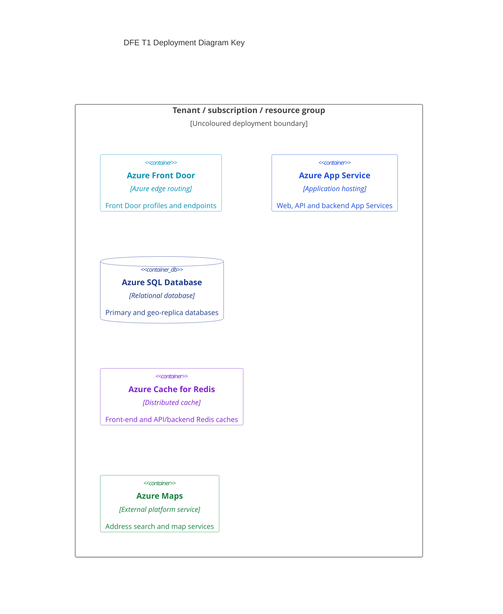
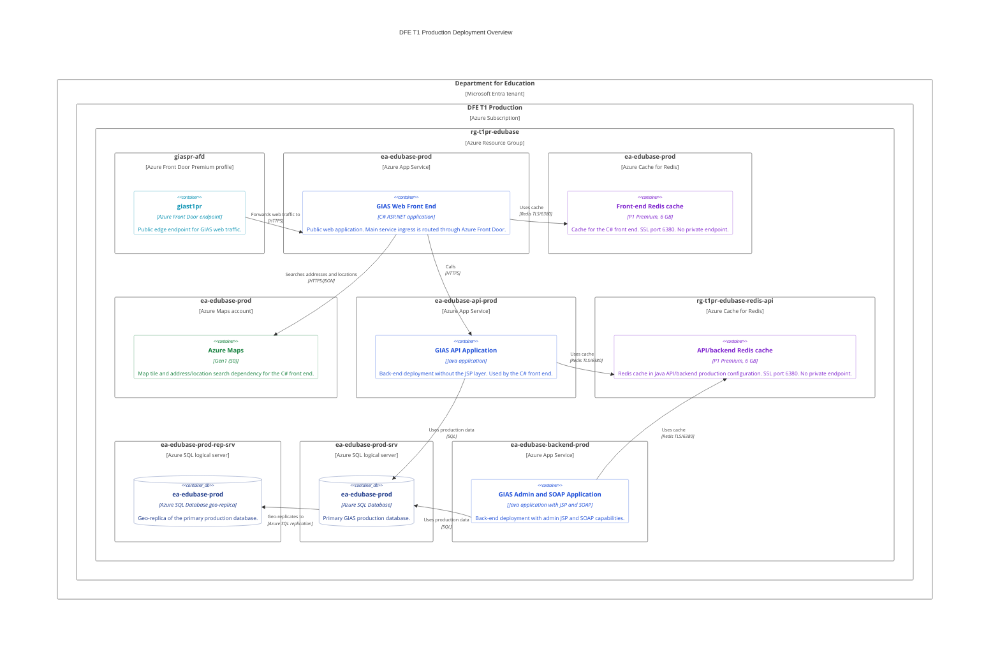
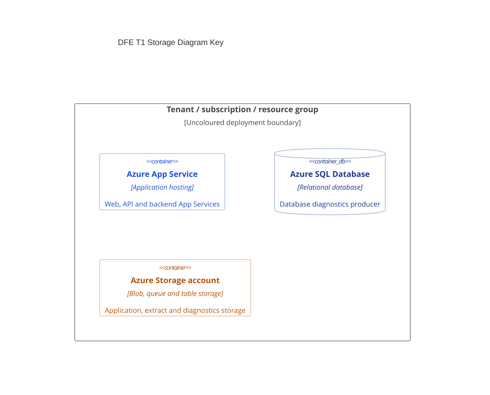
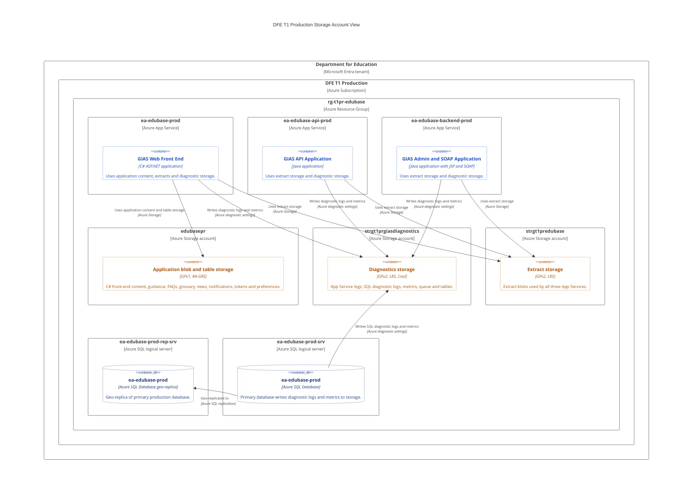
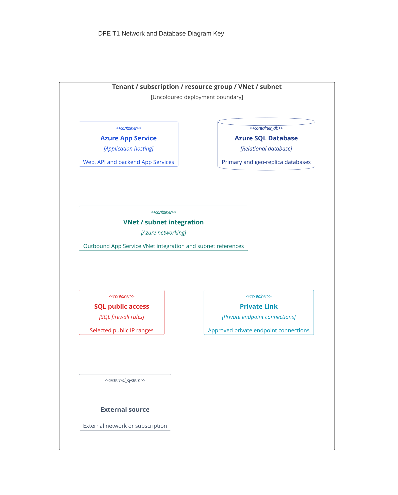
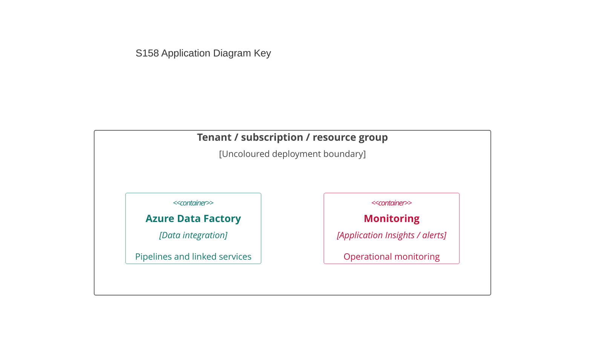
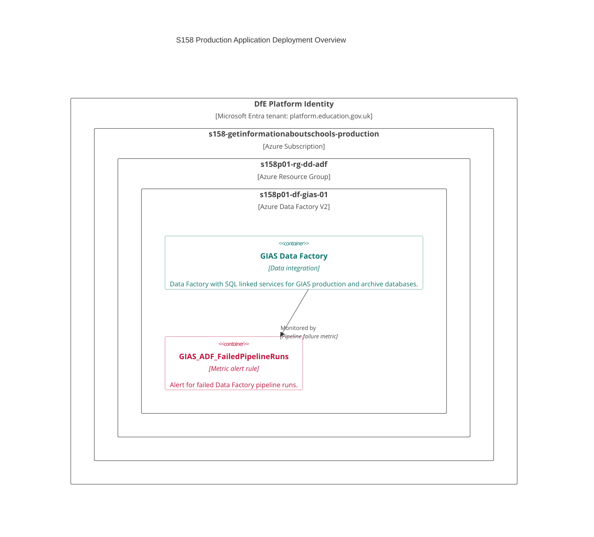
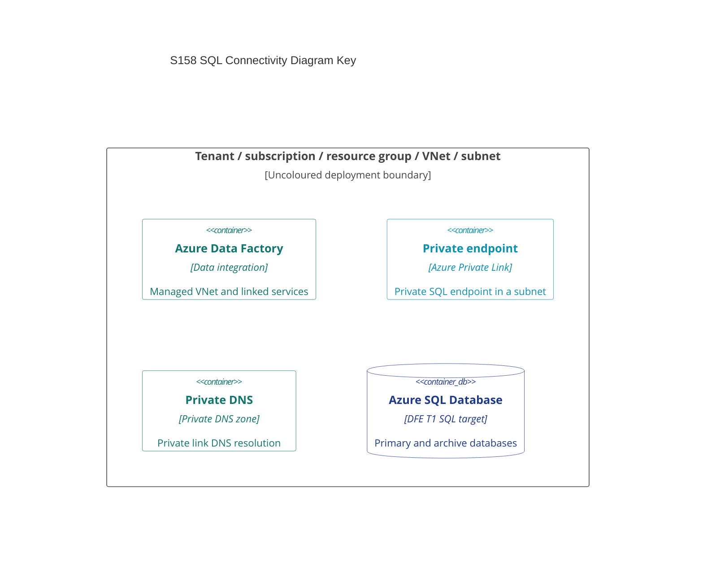

# GIAS Production Deployment Architecture

This document describes the production deployment shape for Get Information about Schools (GIAS) in Azure.

It uses focused C4 deployment diagrams rather than one large diagram. The same core resources appear in more than one view, but each diagram answers a different question:

1. What is deployed in the `DFE T1 Production` subscription and resource groups?
2. How does public traffic enter the DFE T1 GIAS service?
3. How do the DFE T1 App Services and SQL databases relate to the physical network configuration?
4. Which DFE T1 App Services and databases write to each storage account?
5. What is deployed in the `s158-getinformationaboutschools-production` subscription?
6. How do the surviving S158 resources connect privately to the DFE T1 production SQL server?

## Scope

The document is split into two subscription views:

- Section 1 covers the `DFE T1 Production` subscription, where the main GIAS production App Services, Azure SQL databases, Redis caches, storage accounts, Front Door and Azure Maps account live.
- Section 2 covers the `s158-getinformationaboutschools-production` subscription, where S158 Data Factory, its pipeline alert, shared network resources and surviving private SQL connectivity live.

The diagrams deliberately omit lower-detail supporting resources such as deployment resources, unrelated resource group contents and individual firewall rule IP addresses unless they are needed to explain the deployment shape.

The paused archive database `ea-edubase-prod-archive` exists on `ea-edubase-prod-srv` and is captured in the SQL investigation document. It is omitted from the DFE T1 overview diagrams to keep the views focused on the main production database and its geo-replica. It is referenced in the S158 connectivity view because S158 Data Factory has a linked service for it.

## DFE T1 Production Subscription

### Deployment Overview

#### How To Read This Diagram

This diagram is the high-level deployment inventory for the main GIAS production service.

Read it from the outside in:

- The outer boundary is the `Department for Education` tenant.
- Inside the tenant is the `DFE T1 Production` subscription.
- Inside the subscription is the production GIAS resource group `rg-t1pr-edubase`.
- The resource group contains the Front Door profile, three App Services, two Azure SQL logical servers, two Redis caches and the Azure Maps account used by the C# front end.
- The SQL database on `ea-edubase-prod-rep-srv` is a geo-replica of the primary `ea-edubase-prod` database.
- Redis is split between a front-end cache assumption for `ea-edubase-prod` and a confirmed Java API/backend cache configuration for `rg-t1pr-edubase-redis-api`.
- Azure Maps is used by the C# front end for address/location search.

This diagram is not intended to explain every network rule. It is intended to show the main deployed resources and their broad runtime relationships.

#### Diagram Key

```mermaid
%%{init: {'theme': 'base', 'themeVariables': { 'primaryColor': '#ffffff', 'secondaryColor': '#ffffff', 'tertiaryColor': '#ffffff', 'lineColor': '#334155', 'fontFamily': 'Segoe UI, Arial, sans-serif'}, 'themeCSS': 'rect, path { stroke-width: 2.5px; } .relationshipLine { stroke-width: 2px; }'}}%%
C4Deployment

    title DFE T1 Deployment Diagram Key

    UpdateLayoutConfig($c4ShapeInRow="5", $c4BoundaryInRow="3")

    Deployment_Node(keyBoundary, "Tenant / subscription / resource group", "Uncoloured deployment boundary") {
        Container(frontDoorKey, "Azure Front Door", "Azure edge routing", "Front Door profiles and endpoints")
        Container(appServiceKey, "Azure App Service", "Application hosting", "Web, API and backend App Services")
        ContainerDb(sqlKey, "Azure SQL Database", "Relational database", "Primary and geo-replica databases")
        Container(redisKey, "Azure Cache for Redis", "Distributed cache", "Front-end and API/backend Redis caches")
        Container(mapsKey, "Azure Maps", "External platform service", "Address search and map services")
    }

    UpdateElementStyle(frontDoorKey, $bgColor="#ffffff", $fontColor="#0891b2", $borderColor="#0891b2")
    UpdateElementStyle(appServiceKey, $bgColor="#ffffff", $fontColor="#1d4ed8", $borderColor="#1d4ed8")
    UpdateElementStyle(sqlKey, $bgColor="#ffffff", $fontColor="#1e3a8a", $borderColor="#1e3a8a")
    UpdateElementStyle(redisKey, $bgColor="#ffffff", $fontColor="#7e22ce", $borderColor="#7e22ce")
    UpdateElementStyle(mapsKey, $bgColor="#ffffff", $fontColor="#15803d", $borderColor="#15803d")
```

```mermaid
%%{init: {'theme': 'base', 'themeVariables': { 'primaryColor': '#ffffff', 'secondaryColor': '#ffffff', 'tertiaryColor': '#ffffff', 'lineColor': '#334155', 'fontFamily': 'Segoe UI, Arial, sans-serif'}, 'themeCSS': 'rect, path { stroke-width: 2.5px; } .relationshipLine { stroke-width: 2px; }'}}%%
C4Deployment

    title DFE T1 Production Deployment Overview

    UpdateLayoutConfig($c4ShapeInRow="1", $c4BoundaryInRow="3")

    Deployment_Node(tenant, "Department for Education", "Microsoft Entra tenant") {
        Deployment_Node(subscription, "DFE T1 Production", "Azure Subscription") {
            Deployment_Node(giasRg, "rg-t1pr-edubase", "Azure Resource Group") {

                Deployment_Node(frontDoorProfile, "giaspr-afd", "Azure Front Door Premium profile") {
                    Container(frontDoorEndpoint, "giast1pr", "Azure Front Door endpoint", "Public edge endpoint for GIAS web traffic.")
                }

                Deployment_Node(frontendAppService, "ea-edubase-prod", "Azure App Service") {
                    Container(webApp, "GIAS Web Front End", "C# ASP.NET application", "Public web application. Main service ingress is routed through Azure Front Door.")
                }

                Deployment_Node(frontendRedisCache, "ea-edubase-prod", "Azure Cache for Redis") {
                    Container(frontendRedis, "Front-end Redis cache", "P1 Premium, 6 GB", "Cache for the C# front end. SSL port 6380. No private endpoint.")
                }

                Deployment_Node(azureMapsAccount, "ea-edubase-prod", "Azure Maps account") {
                    Container(azureMaps, "Azure Maps", "Gen1 (S0)", "Map tile and address/location search dependency for the C# front end.")
                }

                Deployment_Node(apiAppService, "ea-edubase-api-prod", "Azure App Service") {
                    Container(apiApp, "GIAS API Application", "Java application", "Back-end deployment without the JSP layer. Used by the C# front end.")
                }

                Deployment_Node(apiRedisCache, "rg-t1pr-edubase-redis-api", "Azure Cache for Redis") {
                    Container(apiRedis, "API/backend Redis cache", "P1 Premium, 6 GB", "Redis cache in Java API/backend production configuration. SSL port 6380. No private endpoint.")
                }


                Deployment_Node(replicaSqlServer, "ea-edubase-prod-rep-srv", "Azure SQL logical server") {
                    ContainerDb(replicaDb, "ea-edubase-prod", "Azure SQL Database geo-replica", "Geo-replica of the primary production database.")
                }

                Deployment_Node(primarySqlServer, "ea-edubase-prod-srv", "Azure SQL logical server") {
                    ContainerDb(primaryDb, "ea-edubase-prod", "Azure SQL Database", "Primary GIAS production database.")
                }

                Deployment_Node(backendAppService, "ea-edubase-backend-prod", "Azure App Service") {
                    Container(adminSoapApp, "GIAS Admin and SOAP Application", "Java application with JSP and SOAP", "Back-end deployment with admin JSP and SOAP capabilities.")
                }
            }
        }
    }

    Rel(frontDoorEndpoint, webApp, "Forwards web traffic to", "HTTPS")
    Rel(webApp, apiApp, "Calls", "HTTPS")
    Rel(webApp, frontendRedis, "Uses cache", "Redis TLS/6380")
    Rel(webApp, azureMaps, "Searches addresses and locations", "HTTPS/JSON")
    Rel(apiApp, primaryDb, "Uses production data", "SQL")
    Rel(apiApp, apiRedis, "Uses cache", "Redis TLS/6380")
    Rel(adminSoapApp, primaryDb, "Uses production data", "SQL")
    Rel(adminSoapApp, apiRedis, "Uses cache", "Redis TLS/6380")
    Rel(primaryDb, replicaDb, "Geo-replicates to", "Azure SQL replication")

    UpdateRelStyle(frontDoorEndpoint, webApp, $offsetX="-60", $offsetY="-30")
    UpdateRelStyle(webApp, frontendRedis, $offsetX="-50", $offsetY="-40")
    UpdateRelStyle(webApp, azureMaps, $offsetX="-130", $offsetY="-30")
    UpdateRelStyle(webApp, apiApp, $offsetX="-10", $offsetY="-50")
    UpdateRelStyle(apiApp, apiRedis, $offsetX="-40", $offsetY="-40")
    UpdateRelStyle(primaryDb, replicaDb, $offsetX="-60", $offsetY="20")
    UpdateRelStyle(adminSoapApp, primaryDb, $offsetX="-50", $offsetY="20")
    UpdateRelStyle(x, y, $offsetX="0", $offsetY="0")

    UpdateElementStyle(frontDoorEndpoint, $bgColor="#ffffff", $fontColor="#0891b2", $borderColor="#0891b2")
    UpdateElementStyle(webApp, $bgColor="#ffffff", $fontColor="#1d4ed8", $borderColor="#1d4ed8")
    UpdateElementStyle(apiApp, $bgColor="#ffffff", $fontColor="#1d4ed8", $borderColor="#1d4ed8")
    UpdateElementStyle(adminSoapApp, $bgColor="#ffffff", $fontColor="#1d4ed8", $borderColor="#1d4ed8")
    UpdateElementStyle(primaryDb, $bgColor="#ffffff", $fontColor="#1e3a8a", $borderColor="#1e3a8a")
    UpdateElementStyle(replicaDb, $bgColor="#ffffff", $fontColor="#1e3a8a", $borderColor="#1e3a8a")
    UpdateElementStyle(frontendRedis, $bgColor="#ffffff", $fontColor="#7e22ce", $borderColor="#7e22ce")
    UpdateElementStyle(apiRedis, $bgColor="#ffffff", $fontColor="#7e22ce", $borderColor="#7e22ce")
    UpdateElementStyle(azureMaps, $bgColor="#ffffff", $fontColor="#15803d", $borderColor="#15803d")
```

### Storage Account View

#### How To Read This Diagram

This diagram isolates the three production storage accounts and their consumers.

Read it as a storage ownership and diagnostics view:

- `edubasepr` is application blob and table storage used exclusively by the C# front end `ea-edubase-prod`.
- `strgt1predubase` is extract storage used by all three App Services.
- `strgt1prgiasdiagnostics` is diagnostics storage used by all three App Services and the primary SQL database.
- The primary SQL database writes SQL diagnostics to `strgt1prgiasdiagnostics`.
- The SQL geo-replica is shown for deployment context, but no storage account relationship has been confirmed for it in this view.

This diagram excludes Redis, Front Door, Azure Maps and network access rules.

#### Storage Diagram Key

```mermaid
%%{init: {'theme': 'base', 'themeVariables': { 'primaryColor': '#ffffff', 'secondaryColor': '#ffffff', 'tertiaryColor': '#ffffff', 'lineColor': '#334155', 'fontFamily': 'Segoe UI, Arial, sans-serif'}, 'themeCSS': 'rect, path { stroke-width: 2.5px; } .relationshipLine { stroke-width: 2px; }'}}%%
C4Deployment

    title DFE T1 Storage Diagram Key

    Deployment_Node(keyBoundary, "Tenant / subscription / resource group", "Uncoloured deployment boundary") {
        Container(appServiceKey, "Azure App Service", "Application hosting", "Web, API and backend App Services")
        ContainerDb(sqlKey, "Azure SQL Database", "Relational database", "Database diagnostics producer")
        Container(storageKey, "Azure Storage account", "Blob, queue and table storage", "Application, extract and diagnostics storage")
    }

    UpdateElementStyle(appServiceKey, $bgColor="#ffffff", $fontColor="#1d4ed8", $borderColor="#1d4ed8")
    UpdateElementStyle(sqlKey, $bgColor="#ffffff", $fontColor="#1e3a8a", $borderColor="#1e3a8a")
    UpdateElementStyle(storageKey, $bgColor="#ffffff", $fontColor="#b45309", $borderColor="#b45309")
```

```mermaid
%%{init: {'theme': 'base', 'themeVariables': { 'primaryColor': '#ffffff', 'secondaryColor': '#ffffff', 'tertiaryColor': '#ffffff', 'lineColor': '#334155', 'fontFamily': 'Segoe UI, Arial, sans-serif'}, 'themeCSS': 'rect, path { stroke-width: 2.5px; } .relationshipLine { stroke-width: 2px; }'}}%%
C4Deployment

    title DFE T1 Production Storage Account View

    UpdateLayoutConfig($c4ShapeInRow="1", $c4BoundaryInRow="3")

    Deployment_Node(tenant, "Department for Education", "Microsoft Entra tenant") {
        Deployment_Node(subscription, "DFE T1 Production", "Azure Subscription") {
            Deployment_Node(giasRg, "rg-t1pr-edubase", "Azure Resource Group") {

                Deployment_Node(frontendAppService, "ea-edubase-prod", "Azure App Service") {
                    Container(webApp, "GIAS Web Front End", "C# ASP.NET application", "Uses application content, extracts and diagnostic storage.")
                }

                Deployment_Node(apiAppService, "ea-edubase-api-prod", "Azure App Service") {
                    Container(apiApp, "GIAS API Application", "Java application", "Uses extract storage and diagnostic storage.")
                }

                Deployment_Node(backendAppService, "ea-edubase-backend-prod", "Azure App Service") {
                    Container(adminSoapApp, "GIAS Admin and SOAP Application", "Java application with JSP and SOAP", "Uses extract storage and diagnostic storage.")
                }

                Deployment_Node(applicationStorage, "edubasepr", "Azure Storage account") {
                    Container(blobAndTableStorage, "Application blob and table storage", "GPv1, RA-GRS", "C# front-end content, guidance, FAQs, glossary, news, notifications, tokens and preferences.")
                }


                Deployment_Node(diagnosticsStorage, "strgt1prgiasdiagnostics", "Azure Storage account") {
                    Container(operationalStorage, "Diagnostics storage", "GPv2, LRS, Cool", "App Service logs, SQL diagnostic logs, metrics, queue and tables.")
                }

                Deployment_Node(exportStorage, "strgt1predubase", "Azure Storage account") {
                    Container(extractStorage, "Extract storage", "GPv2, LRS", "Extract blobs used by all three App Services.")
                }

                Deployment_Node(replicaSqlServer, "ea-edubase-prod-rep-srv", "Azure SQL logical server") {
                    ContainerDb(replicaDb, "ea-edubase-prod", "Azure SQL Database geo-replica", "Geo-replica of primary production database.")
                }

                Deployment_Node(primarySqlServer, "ea-edubase-prod-srv", "Azure SQL logical server") {
                    ContainerDb(primaryDb, "ea-edubase-prod", "Azure SQL Database", "Primary database writes diagnostic logs and metrics to storage.")
                }


            }
        }
    }

    Rel(webApp, blobAndTableStorage, "Uses application content and table storage", "Azure Storage")
    Rel(webApp, extractStorage, "Uses extract storage", "Azure Storage")
    Rel(apiApp, extractStorage, "Uses extract storage", "Azure Storage")
    Rel(adminSoapApp, extractStorage, "Uses extract storage", "Azure Storage")
    Rel(webApp, operationalStorage, "Writes diagnostic logs and metrics", "Azure diagnostic settings")
    Rel(apiApp, operationalStorage, "Writes diagnostic logs and metrics", "Azure diagnostic settings")
    Rel(adminSoapApp, operationalStorage, "Writes diagnostic logs and metrics", "Azure diagnostic settings")
    Rel(primaryDb, operationalStorage, "Writes SQL diagnostic logs and metrics", "Azure diagnostic settings")
    Rel(primaryDb, replicaDb, "Geo-replicates to", "Azure SQL replication")

    UpdateRelStyle(webApp, blobAndTableStorage, $offsetX="-250", $offsetY="-30")
    UpdateRelStyle(webApp, operationalStorage, $offsetX="-250", $offsetY="-30")
    UpdateRelStyle(apiApp, operationalStorage, $offsetX="-160", $offsetY="-60")
    UpdateRelStyle(adminSoapApp, operationalStorage, $offsetX="-70", $offsetY="-60")
    UpdateRelStyle(adminSoapApp, extractStorage, $offsetX="-60", $offsetY="-60")
    UpdateRelStyle(apiApp, extractStorage, $offsetX="-180", $offsetY="-40")
    UpdateRelStyle(webApp, extractStorage, $offsetX="-310", $offsetY="-50")
    UpdateRelStyle(primaryDb, operationalStorage, $offsetX="-10", $offsetY="-10")
    UpdateRelStyle(primaryDb, replicaDb, $offsetX="-50", $offsetY="20")

    UpdateElementStyle(webApp, $bgColor="#ffffff", $fontColor="#1d4ed8", $borderColor="#1d4ed8")
    UpdateElementStyle(apiApp, $bgColor="#ffffff", $fontColor="#1d4ed8", $borderColor="#1d4ed8")
    UpdateElementStyle(adminSoapApp, $bgColor="#ffffff", $fontColor="#1d4ed8", $borderColor="#1d4ed8")
    UpdateElementStyle(primaryDb, $bgColor="#ffffff", $fontColor="#1e3a8a", $borderColor="#1e3a8a")
    UpdateElementStyle(replicaDb, $bgColor="#ffffff", $fontColor="#1e3a8a", $borderColor="#1e3a8a")
    UpdateElementStyle(blobAndTableStorage, $bgColor="#ffffff", $fontColor="#b45309", $borderColor="#b45309")
    UpdateElementStyle(extractStorage, $bgColor="#ffffff", $fontColor="#b45309", $borderColor="#b45309")
    UpdateElementStyle(operationalStorage, $bgColor="#ffffff", $fontColor="#b45309", $borderColor="#b45309")
```

### Network And Database Connectivity View

#### How To Read This Diagram

This diagram explains the network and database shape for DFE T1.

The key points are:

- The three App Services all use the same App Service VNet integration subnet: `vnet2-t1pr/snet-t-t1pr-giasintegration`.
- App Services are not physically deployed into that subnet. App Service is a managed PaaS service. VNet integration gives the apps an outbound route into the VNet.
- `ea-edubase-prod-srv` is the primary SQL logical server in West Europe.
- `ea-edubase-prod-rep-srv` is the SQL logical server in UK South that hosts the geo-replica database.
- Both SQL logical servers have public network access set to selected networks.
- The primary SQL server has selected public firewall rules and two approved private endpoint connections from surviving S158 resources.
- The replica SQL server has selected public firewall rules but no private endpoints.
- The primary database geo-replicates to the database on the replica SQL server.
- The replica SQL server may support read-only, support, reporting, manual failover or disaster recovery scenarios, but active client usage has not been confirmed.

#### Network Diagram Key

```mermaid
%%{init: {'theme': 'base', 'themeVariables': { 'primaryColor': '#ffffff', 'secondaryColor': '#ffffff', 'tertiaryColor': '#ffffff', 'lineColor': '#334155', 'fontFamily': 'Segoe UI, Arial, sans-serif'}, 'themeCSS': 'rect, path { stroke-width: 2.5px; } .relationshipLine { stroke-width: 2px; }'}}%%
C4Deployment

    title DFE T1 Network and Database Diagram Key

    UpdateLayoutConfig($c4ShapeInRow="6", $c4BoundaryInRow="3")

    Deployment_Node(keyBoundary, "Tenant / subscription / resource group / VNet / subnet", "Uncoloured deployment boundary") {
        Container(appServiceKey, "Azure App Service", "Application hosting", "Web, API and backend App Services")
        ContainerDb(sqlKey, "Azure SQL Database", "Relational database", "Primary and geo-replica databases")
        Container(networkKey, "VNet / subnet integration", "Azure networking", "Outbound App Service VNet integration and subnet references")
        Container(sqlAccessKey, "SQL public access", "SQL firewall rules", "Selected public IP ranges")
        Container(privateLinkKey, "Private Link", "Private endpoint connections", "Approved private endpoint connections")
        System_Ext(externalKey, "External source", "External network or subscription", "Approved public IP ranges or S158 resources")
    }

    UpdateElementStyle(appServiceKey, $bgColor="#ffffff", $fontColor="#1d4ed8", $borderColor="#1d4ed8")
    UpdateElementStyle(sqlKey, $bgColor="#ffffff", $fontColor="#1e3a8a", $borderColor="#1e3a8a")
    UpdateElementStyle(networkKey, $bgColor="#ffffff", $fontColor="#0f766e", $borderColor="#0f766e")
    UpdateElementStyle(sqlAccessKey, $bgColor="#ffffff", $fontColor="#dc2626", $borderColor="#dc2626")
    UpdateElementStyle(privateLinkKey, $bgColor="#ffffff", $fontColor="#0891b2", $borderColor="#0891b2")
    UpdateElementStyle(externalKey, $bgColor="#ffffff", $fontColor="#475569", $borderColor="#475569")
```

```mermaid
%%{init: {'theme': 'base', 'themeVariables': { 'primaryColor': '#ffffff', 'secondaryColor': '#ffffff', 'tertiaryColor': '#ffffff', 'lineColor': '#334155', 'fontFamily': 'Segoe UI, Arial, sans-serif'}, 'themeCSS': 'rect, path { stroke-width: 2.5px; } .relationshipLine { stroke-width: 2px; }'}}%%
C4Deployment

    title DFE T1 Network and Database Connectivity View

    System_Ext(s158Resources, "S158 production resources", "s158-getinformationaboutschools-production subscription resources with approved SQL private endpoints.")
    System_Ext(publicAllowlist, "Approved public IP ranges", "DfE, supplier, Prisma, DOL, IAS and App Service outbound addresses.")

    Deployment_Node(tenant, "Department for Education", "Microsoft Entra tenant") {
        Deployment_Node(subscription, "DFE T1 Production", "Azure Subscription") {
            Deployment_Node(giasRg, "rg-t1pr-edubase", "Azure Resource Group") {
                Deployment_Node(primarySqlServer, "ea-edubase-prod-srv", "Azure SQL logical server") {
                    Container(primarySqlFirewall, "Selected public network access", "SQL firewall rules", "Public network access enabled for selected public IP ranges. Broad Azure services exception disabled.")
                    Container(primaryPrivateEndpoints, "Approved private endpoint connections", "Private Link connections", "Two approved private endpoint connections from surviving S158 resources.")
                    ContainerDb(primaryDb, "ea-edubase-prod", "Azure SQL Database", "Primary production database. PaaS database, not deployed into the App Service subnet. Business Critical Gen5, 8 vCores.")
                }

                Deployment_Node(replicaSqlServer, "ea-edubase-prod-rep-srv", "Azure SQL logical server") {
                    Container(replicaSqlFirewall, "Selected public network access", "SQL firewall rules", "Public network access enabled for selected public IP ranges. No private endpoints.")
                    ContainerDb(replicaDb, "ea-edubase-prod", "Azure SQL Database geo-replica", "Geo-replica in UK South. PaaS database, not deployed into the App Service subnet. Business Critical Gen5, 2 vCores.")
                }

                Deployment_Node(frontendAppService, "ea-edubase-prod", "Azure App Service") {
                    Container(webApp, "GIAS Web Front End", "C# ASP.NET application", "Uses outbound VNet integration to snet-t-t1pr-giasintegration.")
                }

                Deployment_Node(apiAppService, "ea-edubase-api-prod", "Azure App Service") {
                    Container(apiApp, "GIAS API Application", "Java application", "Uses outbound VNet integration to snet-t-t1pr-giasintegration.")
                }

                Deployment_Node(backendAppService, "ea-edubase-backend-prod", "Azure App Service") {
                    Container(adminSoapApp, "GIAS Admin and SOAP Application", "Java application with JSP and SOAP", "Uses outbound VNet integration to snet-t-t1pr-giasintegration.")
                }
            }

            Deployment_Node(networkRg, "rg-t1pr-network", "Azure Resource Group") {
                Deployment_Node(vnet, "vnet2-t1pr", "Azure Virtual Network") {
                    Deployment_Node(appServerSubnet, "snet-t-t1pr-appserver2", "Subnet") {
                        Container(appServerSubnetRule, "SQL VNet rule reference", "SQL service endpoint rule", "Configured on primary SQL server but recorded with No access endpoint status.")
                    }
                    Deployment_Node(gatewaySubnet, "GatewaySubnet", "Subnet") {
                        Container(gatewaySubnetRule, "SQL VNet rule reference", "SQL service endpoint rule", "Configured on primary SQL server but recorded with No access endpoint status.")
                    }
                    Deployment_Node(giasSubnet, "snet-t-t1pr-giasintegration", "Subnet") {
                        Container(vnetIntegration, "Shared App Service VNet integration subnet", "Outbound integration", "All three App Services are integrated to this subnet for outbound traffic.")
                        Container(giasSubnetRule, "SQL VNet rule reference", "SQL service endpoint rule", "Configured on primary SQL server but recorded with No access endpoint status.")
                    }
                }
            }
        }
    }

    Rel(webApp, vnetIntegration, "Uses outbound VNet integration")
    Rel(apiApp, vnetIntegration, "Uses outbound VNet integration")
    Rel(adminSoapApp, vnetIntegration, "Uses outbound VNet integration")
    Rel(publicAllowlist, primarySqlFirewall, "Allowed by public SQL firewall", "TCP/1433")
    Rel(publicAllowlist, replicaSqlFirewall, "Allowed by public SQL firewall", "TCP/1433")
    Rel(s158Resources, primaryPrivateEndpoints, "Connect privately to", "Private Link")
    Rel(primarySqlFirewall, primaryDb, "Allows selected public SQL access")
    Rel(primaryPrivateEndpoints, primaryDb, "Allows private SQL access")
    Rel(replicaSqlFirewall, replicaDb, "Allows selected public SQL access")
    Rel(primaryDb, replicaDb, "Geo-replicates to", "Azure SQL replication")

    UpdateRelStyle(s158Resources, primaryPrivateEndpoints, $offsetX="-20", $offsetY="-250")
    UpdateRelStyle(webApp, vnetIntegration, $offsetX="0", $offsetY="-50")
    UpdateRelStyle(apiApp, vnetIntegration, $offsetX="-400", $offsetY="50")
    UpdateRelStyle(adminSoapApp, vnetIntegration, $offsetX="-650", $offsetY="200")
    UpdateRelStyle(publicAllowlist, primarySqlFirewall, $offsetX="-20", $offsetY="-150")
    UpdateRelStyle(publicAllowlist, replicaSqlFirewall, $offsetX="-120", $offsetY="-140")
    UpdateRelStyle(primarySqlFirewall, primaryDb, $offsetX="-20", $offsetY="-120")
    UpdateRelStyle(primaryPrivateEndpoints, primaryDb, $offsetX="-180", $offsetY="0")
    UpdateRelStyle(replicaSqlFirewall, replicaDb, $offsetX="0", $offsetY="0")
    UpdateRelStyle(primaryDb, replicaDb, $offsetX="-130", $offsetY="30")
  

    UpdateElementStyle(s158Resources, $bgColor="#ffffff", $fontColor="#475569", $borderColor="#475569")
    UpdateElementStyle(publicAllowlist, $bgColor="#ffffff", $fontColor="#475569", $borderColor="#475569")
    UpdateElementStyle(webApp, $bgColor="#ffffff", $fontColor="#1d4ed8", $borderColor="#1d4ed8")
    UpdateElementStyle(apiApp, $bgColor="#ffffff", $fontColor="#1d4ed8", $borderColor="#1d4ed8")
    UpdateElementStyle(adminSoapApp, $bgColor="#ffffff", $fontColor="#1d4ed8", $borderColor="#1d4ed8")
    UpdateElementStyle(primaryDb, $bgColor="#ffffff", $fontColor="#1e3a8a", $borderColor="#1e3a8a")
    UpdateElementStyle(replicaDb, $bgColor="#ffffff", $fontColor="#1e3a8a", $borderColor="#1e3a8a")
    UpdateElementStyle(vnetIntegration, $bgColor="#ffffff", $fontColor="#0f766e", $borderColor="#0f766e")
    UpdateElementStyle(giasSubnetRule, $bgColor="#ffffff", $fontColor="#0f766e", $borderColor="#0f766e")
    UpdateElementStyle(appServerSubnetRule, $bgColor="#ffffff", $fontColor="#0f766e", $borderColor="#0f766e")
    UpdateElementStyle(gatewaySubnetRule, $bgColor="#ffffff", $fontColor="#0f766e", $borderColor="#0f766e")
    UpdateElementStyle(primarySqlFirewall, $bgColor="#ffffff", $fontColor="#dc2626", $borderColor="#dc2626")
    UpdateElementStyle(replicaSqlFirewall, $bgColor="#ffffff", $fontColor="#dc2626", $borderColor="#dc2626")
    UpdateElementStyle(primaryPrivateEndpoints, $bgColor="#ffffff", $fontColor="#0891b2", $borderColor="#0891b2")
```

##  S158 Get Information About Schools Production Subscription

### S158 Application Deployment Overview

#### How To Read This Diagram

This diagram shows the S158 production application estate that relates to GIAS.

- The `s158-getinformationaboutschools-production` subscription contains the surviving GIAS Data Factory workload and its supporting network resources.
- `s158p01-rg-dd-adf` contains the S158 GIAS Data Factory and a failed pipeline alert.

The diagram shows the remaining application workload and its monitoring alert. It does not show every network path; private SQL connectivity is shown in the next S158 diagram.

#### S158 Application Diagram Key

```mermaid
%%{init: {'theme': 'base', 'themeVariables': { 'primaryColor': '#ffffff', 'secondaryColor': '#ffffff', 'tertiaryColor': '#ffffff', 'lineColor': '#334155', 'fontFamily': 'Segoe UI, Arial, sans-serif'}, 'themeCSS': 'rect, path { stroke-width: 2.5px; } .relationshipLine { stroke-width: 2px; }'}}%%
C4Deployment

    title S158 Application Diagram Key

    UpdateLayoutConfig($c4ShapeInRow="6", $c4BoundaryInRow="3")

    Deployment_Node(keyBoundary, "Tenant / subscription / resource group", "Uncoloured deployment boundary") {
        Container(dataFactoryKey, "Azure Data Factory", "Data integration", "Pipelines and linked services")
        Container(monitoringKey, "Monitoring", "Application Insights / alerts", "Operational monitoring")
    }

    UpdateElementStyle(dataFactoryKey, $bgColor="#ffffff", $fontColor="#0f766e", $borderColor="#0f766e")
    UpdateElementStyle(monitoringKey, $bgColor="#ffffff", $fontColor="#be123c", $borderColor="#be123c")
```

```mermaid
%%{init: {'theme': 'base', 'themeVariables': { 'primaryColor': '#ffffff', 'secondaryColor': '#ffffff', 'tertiaryColor': '#ffffff', 'lineColor': '#334155', 'fontFamily': 'Segoe UI, Arial, sans-serif'}, 'themeCSS': 'rect, path { stroke-width: 2.5px; } .relationshipLine { stroke-width: 2px; }'}}%%
C4Deployment

    title S158 Production Application Deployment Overview

    UpdateLayoutConfig($c4ShapeInRow="2", $c4BoundaryInRow="2")

    Rel(dataFactory, adfFailureAlert, "Monitored by", "Pipeline failure metric")

    UpdateRelStyle(dataFactory, adfFailureAlert, $offsetX="-30", $offsetY="30")

    Deployment_Node(tenantS158, "DfE Platform Identity", "Microsoft Entra tenant: platform.education.gov.uk") {
        Deployment_Node(subscriptionS158, "s158-getinformationaboutschools-production", "Azure Subscription") {


            Deployment_Node(adfRg, "s158p01-rg-dd-adf", "Azure Resource Group") {
                Deployment_Node(dataFactoryNode, "s158p01-df-gias-01", "Azure Data Factory V2") {
                    Container(dataFactory, "GIAS Data Factory", "Data integration", "Data Factory with SQL linked services for GIAS production and archive databases.")
                    
                    Container(adfFailureAlert, "GIAS_ADF_FailedPipelineRuns", "Metric alert rule", "Alert for failed Data Factory pipeline runs.")
                }
            }

        }
    }


    UpdateElementStyle(dataFactory, $bgColor="#ffffff", $fontColor="#0f766e", $borderColor="#0f766e")
    UpdateElementStyle(adfFailureAlert, $bgColor="#ffffff", $fontColor="#be123c", $borderColor="#be123c")
```

### S158 Private SQL Connectivity View

#### How To Read This Diagram

This diagram isolates the private SQL connectivity from S158 back to the DFE T1 production SQL logical server.

The key points are:

- The `s158-getinformationaboutschools-production` subscription is in the `DfE Platform Identity` tenant (`platform.education.gov.uk`).
- The `DFE T1 Production` subscription is in the `Department for Education` tenant (`Educationgovuk.onmicrosoft.com`).
- `s158p01-df-gias-01` uses a Data Factory managed private endpoint named `GiasConnection-Managedvnetprod`.
- The Data Factory linked services point at `ea-edubase-prod-srv.database.windows.net` and the databases `ea-edubase-prod` and `ea-edubase-prod-archive`.
- `s158p01-pe-dd-rest` is also an approved SQL private endpoint to the DFE T1 SQL logical server. No active consumers have been identified
- The private DNS zone `privatelink.database.windows.net` is linked to `s158p01-vnet-dd-common`, with fallback to internet disabled.

#### S158 Connectivity Diagram Key

```mermaid
%%{init: {'theme': 'base', 'themeVariables': { 'primaryColor': '#ffffff', 'secondaryColor': '#ffffff', 'tertiaryColor': '#ffffff', 'lineColor': '#334155', 'fontFamily': 'Segoe UI, Arial, sans-serif'}, 'themeCSS': 'rect, path { stroke-width: 2.5px; } .relationshipLine { stroke-width: 2px; }'}}%%
C4Deployment

    title S158 SQL Connectivity Diagram Key

    UpdateLayoutConfig($c4ShapeInRow="6", $c4BoundaryInRow="3")

    Deployment_Node(keyBoundary, "Tenant / subscription / resource group / VNet / subnet", "Uncoloured deployment boundary") {
        Container(dataFactoryKey, "Azure Data Factory", "Data integration", "Managed VNet and linked services")
        Container(privateEndpointKey, "Private endpoint", "Azure Private Link", "Private SQL endpoint in a subnet")
        Container(privateDnsKey, "Private DNS", "Private DNS zone", "Private link DNS resolution")
        ContainerDb(sqlKey, "Azure SQL Database", "DFE T1 SQL target", "Primary and archive databases")
    }

    UpdateElementStyle(dataFactoryKey, $bgColor="#ffffff", $fontColor="#0f766e", $borderColor="#0f766e")
    UpdateElementStyle(privateEndpointKey, $bgColor="#ffffff", $fontColor="#0891b2", $borderColor="#0891b2")
    UpdateElementStyle(privateDnsKey, $bgColor="#ffffff", $fontColor="#0f766e", $borderColor="#0f766e")
    UpdateElementStyle(sqlKey, $bgColor="#ffffff", $fontColor="#1e3a8a", $borderColor="#1e3a8a")
```

```mermaid
%%{init: {'theme': 'base', 'themeVariables': { 'primaryColor': '#ffffff', 'secondaryColor': '#ffffff', 'tertiaryColor': '#ffffff', 'lineColor': '#334155', 'fontFamily': 'Segoe UI, Arial, sans-serif'}, 'themeCSS': 'rect, path { stroke-width: 2.5px; } .relationshipLine { stroke-width: 2px; }'}}%%
C4Deployment

    title S158 Private SQL Connectivity To DFE T1

    UpdateLayoutConfig($c4ShapeInRow="1", $c4BoundaryInRow="2")

    Deployment_Node(platformIdentityTenant, "DfE Platform Identity", "Microsoft Entra tenant: platform.education.gov.uk") {
        Deployment_Node(s158Subscription, "s158-getinformationaboutschools-production", "Azure Subscription") {


            Deployment_Node(s158NetworkRg, "s158p01-rg-giasapi-vnet", "Azure Resource Group") {
                Deployment_Node(s158Vnet, "s158p01-vnet-dd-common", "Azure Virtual Network") {

                     Deployment_Node(privateDnsZoneNode, "privatelink.database.windows.net", "Private DNS zone") {
                        Container(privateDns, "ea-edubase-prod-srv", "Private DNS A record", "SQL private-link record. Target address requires post-retirement validation.")
                    }                   
                    Deployment_Node(restSubnet, "s158p01-snet-dd-rest1", "Subnet") {
                        Container(peRest, "s158p01-pe-dd-rest", "Private endpoint", "Approved SQL private endpoint. Private IP 10.0.4.4.")
                    }
                }
            }

             Deployment_Node(s158AdfRg, "s158p01-rg-dd-adf", "Azure Resource Group") {
                Deployment_Node(s158Adf, "s158p01-df-gias-01", "Azure Data Factory V2") {
                    Container(adfManagedPe, "GiasConnection-Managedvnetprod", "Managed private endpoint", "Approved Data Factory managed private endpoint to GIAS SQL.")

                    Container(adfLinkedServices, "GIAS SQL linked services", "Azure SQL Database linked services", "GIAS_ProdSQL_AsAzureDB and GIAS_ArchiveSQL_AsAzureDB.")

                }
            }           
        }
    }

    Deployment_Node(departmentForEducationTenant, "Department for Education", "Microsoft Entra tenant: Educationgovuk.onmicrosoft.com") {
        Deployment_Node(dfeT1Subscription, "DFE T1 Production", "Azure Subscription") {
            Deployment_Node(dfeGiasRg, "rg-t1pr-edubase", "Azure Resource Group") {
                Deployment_Node(dfeSqlServer, "ea-edubase-prod-srv", "Azure SQL logical server") {

                    ContainerDb(dfeArchiveDb, "ea-edubase-prod-archive", "Azure SQL Database", "Archive database. Paused at time of investigation.")
                    
                    ContainerDb(dfePrimaryDb, "ea-edubase-prod", "Azure SQL Database", "Primary GIAS production database.")

                }
            }
        }
    }

    Rel(adfLinkedServices, adfManagedPe, "Uses managed private endpoint")
    Rel(adfManagedPe, dfePrimaryDb, "Connects to", "SQL private link")
    Rel(adfManagedPe, dfeArchiveDb, "Connects to", "SQL private link")
    Rel(peRest, dfePrimaryDb, "Approved private SQL endpoint", "Private Link")

    UpdateRelStyle(adfLinkedServices, adfManagedPe, $offsetX="10", $offsetY="0")
    UpdateRelStyle(adfManagedPe, dfePrimaryDb, $offsetX="-130", $offsetY="20")
    UpdateRelStyle(adfManagedPe, dfeArchiveDb, $offsetX="-130", $offsetY="10")
    UpdateRelStyle(peRest, dfePrimaryDb, $offsetX="-430", $offsetY="-60")

    UpdateElementStyle(adfLinkedServices, $bgColor="#ffffff", $fontColor="#0f766e", $borderColor="#0f766e")
    UpdateElementStyle(adfManagedPe, $bgColor="#ffffff", $fontColor="#0891b2", $borderColor="#0891b2")
    UpdateElementStyle(peRest, $bgColor="#ffffff", $fontColor="#0891b2", $borderColor="#0891b2")
    UpdateElementStyle(privateDns, $bgColor="#ffffff", $fontColor="#0f766e", $borderColor="#0f766e")
    UpdateElementStyle(dfePrimaryDb, $bgColor="#ffffff", $fontColor="#1e3a8a", $borderColor="#1e3a8a")
    UpdateElementStyle(dfeArchiveDb, $bgColor="#ffffff", $fontColor="#1e3a8a", $borderColor="#1e3a8a")
```
