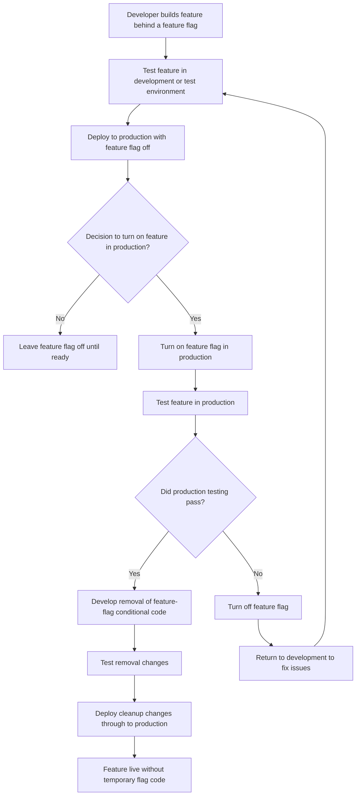

# Feature Flag Process

This diagram shows the delivery and production enablement flow for a feature behind a feature flag.

```mermaid
flowchart TD
    A[Developer builds feature behind a feature flag] --> B[Test feature in development or test environment]
    B --> C[Deploy to production with feature flag off]
    C --> D{Decision to turn on feature in production?}
    D -- No --> E[Leave feature flag off until ready]
    D -- Yes --> F[Turn on feature flag in production]
    F --> G[Test feature in production]
    G --> H{Did production testing pass?}
    H -- Yes --> K[Develop removal of feature-flag conditional code]
    K --> L[Test removal changes]
    L --> M[Deploy cleanup changes through to production]
    M --> N[Feature live without temporary flag code]
    H -- No --> I[Turn off feature flag]
    I --> J[Return to development to fix issues]
    J --> B

```
