# C4 Component Diagram for the GIAS backend Java component

- the WAR-based Edubase application declared in [pom.xml](/C:/code/gias-dd-backend-from-zip/pom.xml)
- public and lookup APIs described in [Texuna Edubase API (functional).yaml](/C:/code/gias-dd-backend-from-zip/Texuna%20Edubase%20API%20(functional).yaml) and [Texuna Edubase Dictionary Lookups API.yaml](/C:/code/gias-dd-backend-from-zip/Texuna%20Edubase%20Dictionary%20Lookups%20API.yaml)
- OLAP analysis servlets in [src/main/java/com/texunatech/edubase/analysis/servlet/AnalysisEngineSchemaServlet.java](/C:/code/gias-dd-backend-from-zip/src/main/java/com/texunatech/edubase/analysis/servlet/AnalysisEngineSchemaServlet.java)
- persistence and SQL Server integration in [src/main/java/com/texunatech/edubase/dao](/C:/code/gias-dd-backend-from-zip/src/main/java/com/texunatech/edubase/dao) and [src/main/java/com/texunatech/edubase/dao/hibernate/EdubaseSQLServerDialect.java](/C:/code/gias-dd-backend-from-zip/src/main/java/com/texunatech/edubase/dao/hibernate/EdubaseSQLServerDialect.java)
- batch/import assets in [jobs](/C:/code/gias-dd-backend-from-zip/jobs), [addressLayer](/C:/code/gias-dd-backend-from-zip/addressLayer), and [sql](/C:/code/gias-dd-backend-from-zip/sql)

Questions

- Where is the JSPX front end
- Where is the permissions engine, ABAC and RBAC
- What is the address layer import
- Why do we have 2 APIs, Texuna Edubase API (functional).yaml and Texuna Edubase Dictionary Lookups API.yaml. Do we have 2 distinct use cases ? eg internal, external ?
- Where is the SOAP layer implemented
- How/When do we run the .php scripts in /scripts
- What is the Analysis / OLAP engine, src/main/java/com/texunatech/edubase/analysis/mdx/MDXQueryBuilder.java
- When are all the jobs ran under src/main/java/com/texunatech/edubase/service/quartz/
- What is the role of flyway, its seems to have an operational role
  - are the old flyway scripts in sql_archive, what is the process to running flyway
  - what is done through flyway, what is done through the front end support section of the tools area
- When do we run sql/Db maintenance sql scripts
- When do we run sql/snapshot_tests 

```mermaid
C4Component
title GIAS Backend - C4 Component Diagram

    UpdateLayoutConfig($c4ShapeInRow="4", $c4BoundaryInRow="1")

Person(ops_user, "Operations User", "Runs deployments, DB patches, and batch processes")

Container_Ext(giasFE, "GIAS Front End Web Application", "C#/ASP.Net")

System_Ext(ref_data, "Reference Data Providers", "Companies House, Ofsted, SAFE/SA,<br>Address Layer, other upstream feeds")

Container_Ext(object_store, "Object Storage, stores data extracts", "Azure Blob storage")

Container_Boundary(edubase, "Edubase Java Application") {

    Component(web_mvc, "Web MVC Controllers", "Spring MVC", "Back-office UI, establishment/group/staff workflows search,<br> content and admin screens")

    Component(rest_api, "REST API Controllers", "Spring MVC REST", "REST endpoints for establishments, groups, users, downloads, lookups and approvals")

    Component(auth, "Authentication & Security", "Spring Security + SAML", "SAFE/SA SSO, role-based access control, REST basic auth")

    Component(domain_services, "Domain Services", "Spring Services", "Core business logic for establishments, groups, staff, users, validation, approvals and reporting")

    Component(search_lookup, "Search & Lookup Services", "Search/Dictionary Services", "Filtering, lookup dictionaries, data dictionary, geo and query support")

    Component(extracts, "Extract & Download Services", "Extract Managers/Renderers", "Generates CSV/XLS/XLSX/XML extracts, scheduled downloads and callbacks")

    Component(batch_jobs, "Batch & Scheduled Jobs", "Spring Batch + Quartz", "Bulk update/create, scheduled extracts, sync and maintenance jobs")

    Component(integrations, "Integration Adapters", "Integration/WS Clients", "Adapters for Companies House, Ofsted/SAFE sync, CRM and reference-data ingestion")

    Component(persistence, "Persistence Layer", "DAO + Hibernate/JDBC", "Reads and writes application, audit, lookup, callback and job state data")
}



Container_Boundary(gias_db, "GIAS Data") {
  ContainerDb_Ext(sql_server, "GIAS Data database", "MS SQL Server")
}





Rel(giasFE, rest_api, "Uses", "HTTPS/JSON")
Rel(ops_user, web_mvc, "Operates through admin and back-office screens", "HTTPS")
Rel(ops_user, batch_jobs, "Triggers/runs operational processes", "Batch/Admin")

Rel(web_mvc, auth, "Authenticates and authorises via")
Rel(rest_api, auth, "Authorises via")
Rel(web_mvc, domain_services, "Invokes")
Rel(rest_api, domain_services, "Invokes")
Rel(domain_services, search_lookup, "Uses")
Rel(domain_services, extracts, "Uses for exports/downloads")
Rel(domain_services, integrations, "Uses")
Rel(domain_services, persistence, "Reads/writes")
Rel(search_lookup, persistence, "Reads/writes")
Rel(extracts, persistence, "Reads source data and callback metadata")
Rel(extracts, object_store, "Publishes extract files to", "Azure Blob")
Rel(batch_jobs, domain_services, "Executes")
Rel(batch_jobs, extracts, "Schedules and generates")
Rel(batch_jobs, integrations, "Runs sync/import jobs against")
Rel(batch_jobs, persistence, "Stores job state and updates data in")
Rel(integrations, ref_data, "Consumes reference/sync feeds from", "HTTP/SOAP/SAML/files")
Rel(auth, ref_data, "Authenticates users with SAFE/SA", "SAML")
Rel(persistence, sql_server, "Reads/writes", "JDBC/Hibernate")
```

