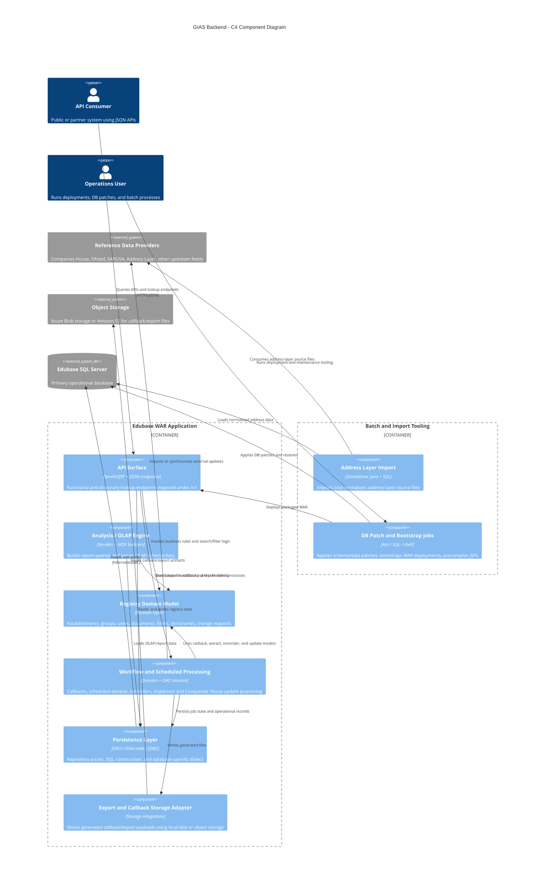

# GIAS Backend Component Diagram

- the WAR-based Edubase application declared in [pom.xml](/C:/code/gias-dd-backend-from-zip/pom.xml)
- public and lookup APIs described in [Texuna Edubase API (functional).yaml](/C:/code/gias-dd-backend-from-zip/Texuna%20Edubase%20API%20(functional).yaml) and [Texuna Edubase Dictionary Lookups API.yaml](/C:/code/gias-dd-backend-from-zip/Texuna%20Edubase%20Dictionary%20Lookups%20API.yaml)
- OLAP analysis servlets in [src/main/java/com/texunatech/edubase/analysis/servlet/AnalysisEngineSchemaServlet.java](/C:/code/gias-dd-backend-from-zip/src/main/java/com/texunatech/edubase/analysis/servlet/AnalysisEngineSchemaServlet.java)
- persistence and SQL Server integration in [src/main/java/com/texunatech/edubase/dao](/C:/code/gias-dd-backend-from-zip/src/main/java/com/texunatech/edubase/dao) and [src/main/java/com/texunatech/edubase/dao/hibernate/EdubaseSQLServerDialect.java](/C:/code/gias-dd-backend-from-zip/src/main/java/com/texunatech/edubase/dao/hibernate/EdubaseSQLServerDialect.java)
- batch/import assets in [jobs](/C:/code/gias-dd-backend-from-zip/jobs), [addressLayer](/C:/code/gias-dd-backend-from-zip/addressLayer), and [sql](/C:/code/gias-dd-backend-from-zip/sql)

