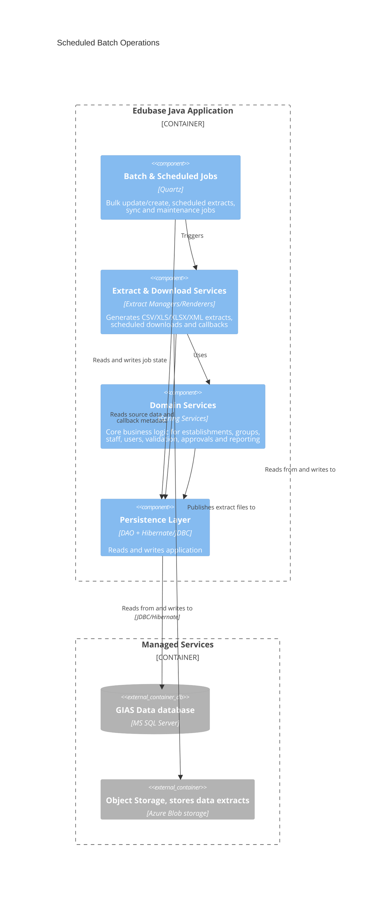
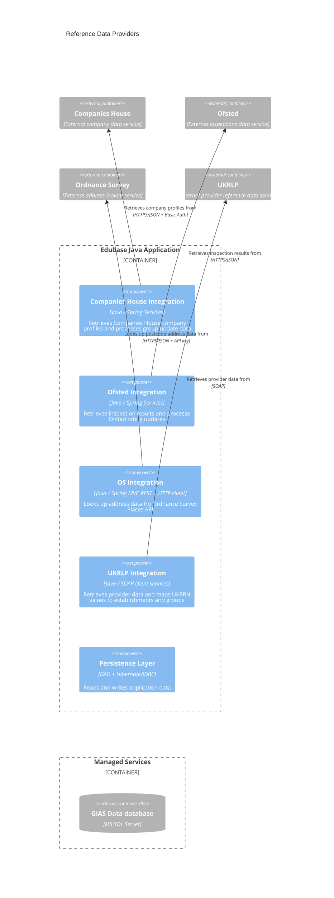
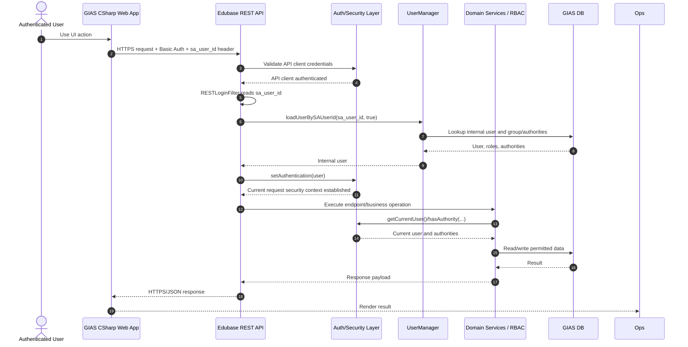

# C4 Component Diagrams for the GIAS backend Java component

## Client interaction components
This component diagram captures the subset of components focused on client interactions.

```mermaid
C4Component
title GIAS Backend - C4 Component Diagram

UpdateLayoutConfig($c4ShapeInRow="4", $c4BoundaryInRow="1")

System_Ext(dsi, "DfE Sign-in (DSI", "Authentication and identity service")

Person(ops_user, "Operational User", "Runs deployments, DB patches,<br>and batch processes")

Container_Ext(giasFE, "GIAS Front End Web Application", "C#/ASP.Net")

Container_Ext(internalDfE, "Internal DfE Services", "")

Container_Boundary(edubase, "Edubase Java Application") {


    Component(auth, "Authentication & Security", "Spring Security + SAML", "SAFE/SA SSO, role-based access control")

    Component(web_mvc, "Web MVC Controllers", "Spring MVC", "Back-office UI, establishment/group/staff workflows <br>search, content and admin screens")

    Component(rest_api, "REST API Controllers", "Spring MVC REST", "REST endpoints for establishments, groups, users,<br> downloads, lookups and approvals")

    Component(soap_ws, "SOAP Web Services", "Spring-WS / SOAP", "SOAP endpoints for data extracts, establishment searc<br> and legacy system integrations")


    Component(flyway, "Flyway DB Migration Scripts", "Flyway + T-SQL", "Versioned DB schema, config, and data update scripts")

    Component(domain_services, "Domain Services", "Spring Services", "Core business logic for establishments, groups,staff, users,<br> validation, approvals and reporting")

    Component(search_lookup, "Search & Lookup Services", "Search/Dictionary Services", "Filtering, lookup dictionaries, data dictionary, geo<br> and query support")

    Component(extracts, "Extract & Download Services", "Extract Managers/Renderers", "Generates extracts, manages callbacks, and prepares<br>download metadata")

    Component(persistence, "Persistence Layer", "DAO + Hibernate/JDBC", "Reads and writes application")
}


Container_Boundary(managedServices, "Managed Services") {

  ContainerDb_Ext(sql_server, "GIAS Data database", "MS SQL Server")
  Container_Ext(object_store, "Object Storage, stores data extracts", "Azure Blob storage")
}


Rel(giasFE, rest_api, "Uses<br>", "HTTPS/JSON<br>Basic Auth")
Rel(internalDfE, rest_api, "Uses<br>", "HTTPS/JSON<br>Basic Auth")
Rel(internalDfE, soap_ws, "Uses<br>", "HTTPS/SOAP<br>Baic Auth")


Rel(ops_user, dsi, "Authenticates via", "SAML")
Rel(ops_user, web_mvc, "Operates through admin and<br>back-office screens", "HTTPS")
Rel(ops_user, flyway, "Operates via<br>deploymet pipeline")
Rel(dsi, auth, "Authenticates via", "SAML")

Rel(web_mvc, auth, "Authenticates via")
Rel(web_mvc, domain_services, "Uses")
Rel(rest_api, domain_services, "Uses")
Rel(soap_ws, domain_services, "Uses")
Rel(rest_api, extracts, "Triggers and queries")
Rel(soap_ws, extracts, "Retrieves extract content via")

Rel(domain_services, search_lookup, "Uses")
Rel(search_lookup, persistence, "Reads")
Rel(extracts, persistence, "Reads metadata and callback state")
Rel(extracts, object_store, "Stores and retrieves extract files")
Rel(flyway, sql_server, "Applies migrations to", "T-SQL")
Rel(persistence, sql_server, "Read, writes to", "T-SQL")
Rel(domain_services, persistence, "Uses")

UpdateRelStyle(giasFE, rest_api, $offsetX="-50", $offsetY="-100") 
UpdateRelStyle(internalDfE, rest_api, $offsetX="-70", $offsetY="-100")
UpdateRelStyle(internalDfE, soap_ws, $offsetX="-100", $offsetY="-100")
UpdateRelStyle(ops_user, dsi, $offsetX="-47", $offsetY="-50")
UpdateRelStyle(ops_user, web_mvc, $offsetX="-40", $offsetY="-70")
UpdateRelStyle(ops_user, flyway, $offsetX="-35", $offsetY="-180")
UpdateRelStyle(dsi, auth, $offsetX="-130", $offsetY="-100")
UpdateRelStyle(web_mvc, auth, $offsetX="-45", $offsetY="20")
UpdateRelStyle(web_mvc, domain_services, $offsetX="0", $offsetY="0")
UpdateRelStyle(rest_api, domain_services, $offsetX="-10", $offsetY="-20")
UpdateRelStyle(soap_ws, domain_services, $offsetX="0", $offsetY="0")
UpdateRelStyle(rest_api, extracts, $offsetX="0", $offsetY="0")
UpdateRelStyle(soap_ws, extracts, $offsetX="0", $offsetY="0")
UpdateRelStyle(domain_services, search_lookup, $offsetX="-10", $offsetY="-10")
UpdateRelStyle(search_lookup, persistence, $offsetX="0", $offsetY="0")
UpdateRelStyle(extracts, persistence, $offsetX="150", $offsetY="10")
UpdateRelStyle(extracts, object_store, $offsetX="230", $offsetY="-50")
UpdateRelStyle(flyway, sql_server, $offsetX="-90", $offsetY="-200")
UpdateRelStyle(persistence, sql_server, $offsetX="-85", $offsetY="-40")
UpdateRelStyle(domain_services, persistence, $offsetX="-20", $offsetY="0")

```

## Scheduled batch operation components

This component diagram shows the subset of components involved in scheduled batch processing and extract generation.

## Reference data provider components

This component diagram focuses on the subset of components that integrates with external reference data providers.

## Component Notes

Link to integration documents

## GIAS front end authentication flow
