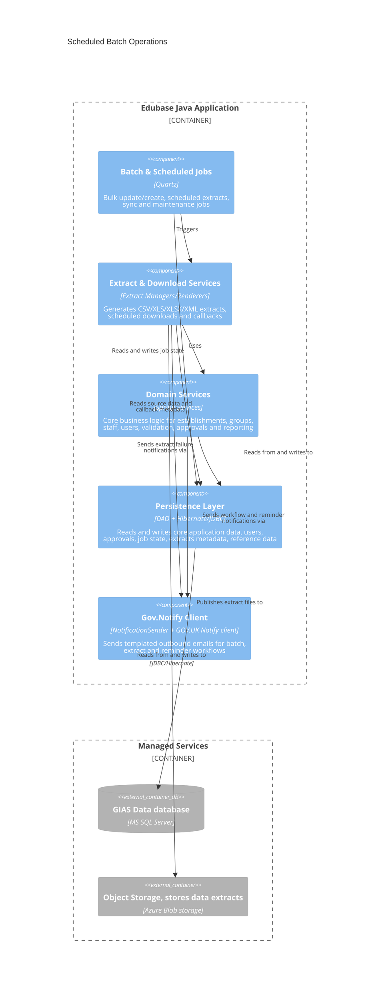
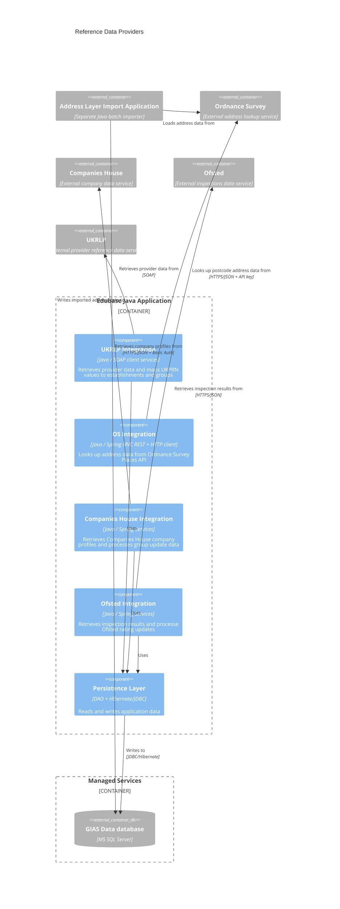
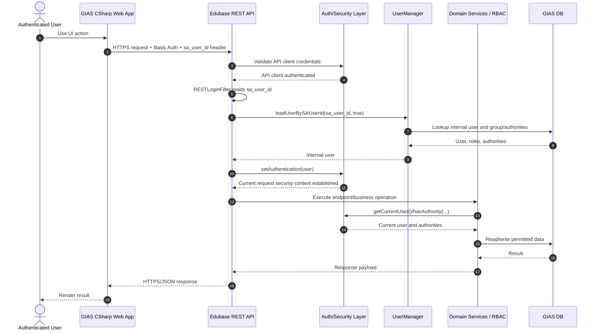

# C4 Component Diagrams for the GIAS backend Java component

## Introduction

This document provides a set of C4 component views for the GIAS back-end Java application. This system is sometimes refered to using its legacy name of Edubase. Its purpose is to describe the main runtime components of the back end, the responsibilities those components hold, and the key relationships between them and external systems.

It shows the application from several focused perspectives rather than trying to capture the entire system in a single diagram. Together, these views explain how client-facing interactions enter the application, how scheduled and background processing is structured, how external reference-data integrations are handled, and how selected supporting flows such as authentication operate.

The sections in this document are:

- **Client interaction components :** 
Shows the main components involved when users or client systems interact with the back end through MVC, REST, or SOAP interfaces.

- **Scheduled batch operation components :** 
Shows the components involved in scheduled jobs, background processing, extract generation, and related operational notifications.

- **Reference data provider components :** 
Shows the components responsible for integrating with upstream reference-data providers such as Companies House, Ofsted, UKRLP, and address data sources.

- **GIAS front end authentication flow :** 
Provides a sequence view of the authenticated request path used when the GIAS front-end application calls the back-end REST API.

## Client interaction components
This component diagram captures the subset of components focused on client interactions.

```mermaid
C4Component
title GIAS Backend - C4 Component Diagram

UpdateLayoutConfig($c4ShapeInRow="4", $c4BoundaryInRow="1")

System_Ext(dsi, "DfE Sign-in (DSI)", "Authentication and identity service")

Person(ops_user, "Operational User", "Runs deployments, DB patches,<br>and batch processes")

Container_Ext(giasFE, "GIAS Front End Web Application", "C#/ASP.Net")

Container_Ext(internalDfE, "Internal DfE Services", "")

Container_Boundary(edubase, "Edubase Java Application") {


    Component(auth, "Authentication & Security", "Spring Security + SAML", "SAFE/SA SSO, role-based access control")

    Component(web_mvc, "Web MVC Controllers", "Spring MVC", "Back-office UI, establishment/group/staff workflows <br>search, content and admin screens")

    Component(rest_api, "REST API Controllers", "Spring MVC REST", "REST endpoints for establishments, groups, users,<br> downloads, lookups and approvals")

    Component(soap_ws, "SOAP Web Services", "Spring-WS / SOAP", "SOAP endpoints for data extracts, establishment search<br> and legacy system integrations")


    Component(flyway, "Flyway DB Migration Scripts", "Flyway + T-SQL", "Versioned DB schema, config, and data update scripts")

    Component(domain_services, "Domain Services", "Spring Services", "Core business logic for establishments, groups,staff, users,<br> validation, approvals and reporting")

    Component(search_lookup, "Search & Lookup Services", "Search/Dictionary Services", "Filtering, lookup dictionaries, data dictionary, geo<br> and query support")

    Component(extracts, "Extract & Download Services", "Extract Managers/Renderers", "Generates extracts, manages callbacks, and prepares<br>download metadata")


    Component(gov_notify, "Gov.Notify Client", "NotificationSender + GOV.UK Notify client", "Sends templated outbound emails for user,<br>workflow and operational notifications")

    Component(persistence, "Persistence Layer", "DAO + Hibernate/JDBC", "Reads and writes core application data, users,<br> approvals, job state, extracts metadata, reference data")
}


Container_Boundary(managedServices, "Managed Services") {

  ContainerDb_Ext(sql_server, "GIAS Data database", "MS SQL Server")
  Container_Ext(object_store, "Object Storage, stores data extracts", "Azure Blob storage")
}


Rel(giasFE, rest_api, "Uses<br>", "HTTPS/JSON<br>Basic Auth")
Rel(internalDfE, rest_api, "Uses<br>", "HTTPS/JSON<br>Basic Auth")
Rel(internalDfE, soap_ws, "Uses<br>", "HTTPS/SOAP<br>Baic Auth")


Rel(ops_user, dsi, "Authenticates via", "SAML")
Rel(ops_user, web_mvc, "Operates through admin and<br>back-office screens", "HTTPS")
Rel(ops_user, flyway, "Operates via<br>deploymet pipeline")
Rel(dsi, auth, "Authenticates via", "SAML")

Rel(web_mvc, auth, "Authenticates via")
Rel(web_mvc, domain_services, "Uses")
Rel(rest_api, domain_services, "Uses")
Rel(soap_ws, domain_services, "Uses")
Rel(rest_api, extracts, "Triggers and queries")
Rel(soap_ws, extracts, "Retrieves extract content via")

Rel(domain_services, search_lookup, "Uses")
Rel(domain_services, gov_notify, "Sends notifications via")
Rel(search_lookup, persistence, "Reads")
Rel(extracts, persistence, "Reads metadata and callback state")
Rel(extracts, gov_notify, "Sends extract and failure<br>notifications via")
Rel(extracts, object_store, "Stores and retrieves extract files")
Rel(flyway, sql_server, "Applies migrations to", "T-SQL")
Rel(persistence, sql_server, "Reads and writes to", "T-SQL")
Rel(domain_services, persistence, "Uses")

UpdateRelStyle(giasFE, rest_api, $offsetX="-50", $offsetY="-100") 
UpdateRelStyle(internalDfE, rest_api, $offsetX="-70", $offsetY="-100")
UpdateRelStyle(internalDfE, soap_ws, $offsetX="-100", $offsetY="-100")
UpdateRelStyle(ops_user, dsi, $offsetX="-47", $offsetY="-50")
UpdateRelStyle(ops_user, web_mvc, $offsetX="-40", $offsetY="-70")
UpdateRelStyle(ops_user, flyway, $offsetX="-35", $offsetY="-180")
UpdateRelStyle(dsi, auth, $offsetX="-130", $offsetY="-100")
UpdateRelStyle(web_mvc, auth, $offsetX="-45", $offsetY="20")
UpdateRelStyle(web_mvc, domain_services, $offsetX="0", $offsetY="0")
UpdateRelStyle(rest_api, domain_services, $offsetX="-10", $offsetY="-20")
UpdateRelStyle(soap_ws, domain_services, $offsetX="0", $offsetY="0")
UpdateRelStyle(rest_api, extracts, $offsetX="0", $offsetY="0")
UpdateRelStyle(soap_ws, extracts, $offsetX="0", $offsetY="0")
UpdateRelStyle(domain_services, search_lookup, $offsetX="-10", $offsetY="-10")
UpdateRelStyle(search_lookup, persistence, $offsetX="40", $offsetY="-30")
UpdateRelStyle(extracts, persistence, $offsetX="100", $offsetY="0")
UpdateRelStyle(extracts, object_store, $offsetX="230", $offsetY="-50")
UpdateRelStyle(flyway, sql_server, $offsetX="-90", $offsetY="-200")
UpdateRelStyle(persistence, sql_server, $offsetX="-45", $offsetY="-40")
UpdateRelStyle(domain_services, persistence, $offsetX="10", $offsetY="0")
UpdateRelStyle(extracts, gov_notify, $offsetX="180", $offsetY="-30")
UpdateRelStyle(domain_services, gov_notify, $offsetX="-40", $offsetY="-30")
```

### How to read this diagram

- This view is intentionally client-facing. It shows the application surfaces used by external or operational clients: MVC screens, REST endpoints, SOAP services, and Flyway as part of the deployment/startup path.
- `Authentication & Security` represents the cross-cutting Spring Security layer rather than a business capability. It is responsible for browser SSO and request authorisation, not domain logic.
- `Domain Services` is the main business layer. The MVC, REST, and SOAP components all delegate into it rather than accessing persistence directly.
- `Extract & Download Services` is separated from `Domain Services` because extract generation and retrieval is a distinct concern. The REST API mostly triggers generation and returns download metadata, while SOAP endpoints can return extract content directly.
- `Gov.Notify Client` represents the central outbound email integration used by business and operational flows.
- `Search & Lookup Services` is shown as a separate component to make explicit that search/filtering and dictionary lookups are not just generic DAO calls. They are a distinct set of services used by the business layer.
- `Flyway DB Migration Scripts` is included because, in this system, schema and configuration changes are applied operationally as part of deployment/startup rather than being an invisible implementation detail. See [`database/flyway-migrations.md`](./database/flyway-migrations.md).

### Scope and assumptions

- This is not a full component map of the whole application. It excludes scheduled batch jobs and the external reference-data provider integrations, which are shown in separate diagrams below.
- `Internal DfE Services -> SOAP Web Services` is included because the application exposes a separate SOAP service surface for legacy/system-to-system access.
- `Gov.Notify Client` is included in this client-focused view because user-facing and operational actions can trigger outbound notifications as part of normal request processing.
- `Managed Services` contains infrastructure used by this view. SQL Server is the primary operational data store, and Azure Blob Storage holds generated extract content. See [`database/sql-server.md`](./database/sql-server.md) and [`storage/azure-blob-storage.md`](./storage/azure-blob-storage.md).

## Scheduled batch operation components

This component diagram shows the subset of components involved in scheduled batch processing and extract generation.

### How to read this diagram

- This view isolates the parts of the backend involved in scheduled and background processing. It deliberately leaves out MVC, REST, SOAP, and authentication because they are not the entry points for these flows.
- `Batch & Scheduled Jobs` is the orchestration layer. It represents Quartz-triggered execution and job coordination rather than the business rules themselves.
- `Domain Services` still owns the business behaviour. Scheduled jobs call into the same service layer used elsewhere in the application.
- `Extract & Download Services` this component generates extracts, prepares downloadable output, and handles extract-related operational tasks.
- `Gov.Notify Client` is the scheduled and background processes also send emails, for example reminders, workflow notifications, and extract failure alerts.
- `Azure Blob Storage` is where extract generation publishes output once local file creation is complete. See [`storage/azure-blob-storage.md`](./storage/azure-blob-storage.md).

### Scope and assumptions

- This diagram excludes external sync integrations such as Companies House, Ofsted, and UKRLP. Those are operational jobs in the codebase, but they are intentionally not part of this focused view.
- The main purpose of this diagram is to show the internal flow: schedule/orchestrate, execute business logic, persist state, generate output, publish files.
- SQL Server underpins the job state, callback metadata, and source data shown here, while Flyway governs the evolution of that database platform. See [`database/sql-server.md`](./database/sql-server.md) and [`database/flyway-migrations.md`](./database/flyway-migrations.md).

## Reference data provider components

This component diagram focuses on the subset of components that integrates with external reference data providers.

### How to read this diagram

- This view isolates the integrations whose primary role is to bring external reference data into GIAS.
- The diagram now shows two kinds of integration path:
  - provider-specific components that are part of the Edubase Java application
  - a separate external importer for Address Layer / Ordnance Survey data
- Each integration component inside the `Edubase Java Application` boundary represents application-side logic owned by that application, not the upstream system itself.
- The purpose of this diagram is to make the external dependencies explicit. In the larger component diagrams, these responsibilities would otherwise be hidden inside the general service layer.
- `Persistence Layer` Retrieved data is compared against, mapped onto, or persisted into the application data model.
- Companies House and Ofsted are HTTP-based integrations, and UKRLP is SOAP-based.
- `Address Layer Import Application` is outside the Edubase boundary because the batch address import is a separate Java process, even though it ultimately writes data into the same SQL Server database used by Edubase.

### Scope and assumptions

- This view is intentionally limited to reference-data providers. It excludes other external integrations such as CRM, GOV.UK Notify, Azure Blob Storage, and DfE Sign-in.
- The on-demand OS address lookup exposed via the REST layer is intentionally excluded from this diagram.
- The OS-related batch load is shown as a separate `Address Layer Import Application` because that import path is not part of the Edubase Java application itself.

## Component Notes

The diagrams above are intended to be read together rather than as alternatives:

- The client interaction diagram shows how users and client systems enter the backend, including where outbound notifications are triggered during interactive flows.
- The scheduled batch diagram shows how background processing, extract publication, and operational notifications work internally.
- The reference-data provider diagram shows which components depend on upstream data services.

Related notes in this repository:

- [`integrations/companies-house-integration.md`](./integrations/companies-house-integration.md)
- [`integrations/ofsted-integration.md`](./integrations/ofsted-integration.md)
- [`integrations/ukrlp-integration.md`](./integrations/ukrlp-integration.md)
- [`integrations/ordnance-survey-integration.md`](./integrations/ordnance-survey-integration.md)
- [`integrations/govuk-notify-integration.md`](./integrations/govuk-notify-integration.md)
- [`database/sql-server.md`](./database/sql-server.md)
- [`database/flyway-migrations.md`](./database/flyway-migrations.md)
- [`storage/azure-blob-storage.md`](./storage/azure-blob-storage.md)

## GIAS front end authentication flow

### How to read this flow

- This sequence describes the authenticated request path used when the GIAS front-end web application calls the backend REST API on behalf of a signed-in user.
- Two different identities are involved in the same request:
  - the client application identity, authenticated with REST API Basic Auth
  - the end-user identity, passed as `sa_user_id` and resolved to an internal GIAS user
- The Basic Auth step answers "is this calling application trusted to use the REST API?".
- The `sa_user_id` resolution step answers "which user should this request run as inside GIAS?".
- RBAC is applied inside the backend after the internal user has been loaded and placed into the Spring Security context.

### Scope and assumptions

- This is not the browser SAML login flow for the Java MVC application. It is the system-to-system REST flow used by the separate GIAS front-end application.
- The front-end does not send a full set of user roles or claims to the backend. It sends a user identifier, and the backend derives permissions from its own user and authority data.
- The flow assumes the calling application is trusted to assert the correct `sa_user_id`. That trust is protected by the API credentials and any configured IP restrictions.
- The database appears in this diagram because user lookup and authority resolution are data-driven, not hardcoded in the API layer.

