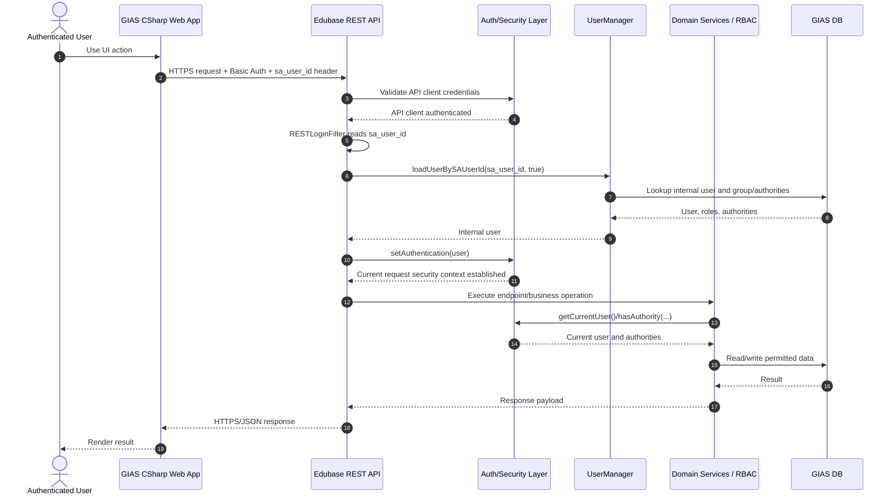

# GIAS Front End Authentication Flow

This document describes the authenticated request path used when the GIAS front-end web application calls the back-end REST API on behalf of a signed-in user.

## How to read this flow

- This sequence describes the authenticated request path used when the GIAS front-end web application calls the back-end REST API on behalf of a signed-in user.
- Two different identities are involved in the same request: the client application identity, authenticated with REST API Basic Auth.
- A second identity is the end-user identity, passed as `sa_user_id` and resolved to an internal GIAS user.
- The Basic Auth step answers "is this calling application trusted to use the REST API?".
- The `sa_user_id` resolution step answers "which user should this request run as inside GIAS?".
- RBAC is applied inside the backend after the internal user has been loaded and placed into the Spring Security context.

## Scope and assumptions

- This is not the browser SAML login flow for the Java MVC application. It is the system-to-system REST flow used by the separate GIAS front-end application.
- The front-end does not send a full set of user roles or claims to the backend. It sends a user identifier, and the backend derives permissions from its own user and authority data.
- The flow assumes the calling application is trusted to assert the correct `sa_user_id`. That trust is protected by the API credentials and any configured IP restrictions.
- The database appears in this diagram because user lookup and authority resolution are data-driven, not hardcoded in the API layer.
