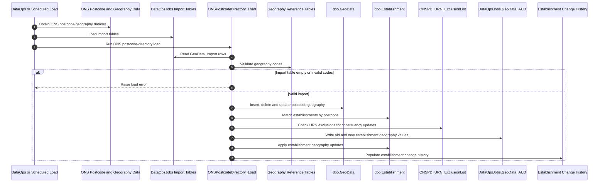

# ONS Geography Integration

## Overview

The GIAS back end has an Office for National Statistics (ONS) geography integration. This is not implemented as a live Java API client in the same way as Companies House, UKRLP or the Ordnance Survey postcode lookup.

The evidence we have points to a batch import path:

- ONS postcode-directory and geography data is loaded into `DataOpsJobs` import tables.
- SQL procedures validate the imported geography codes.
- `dbo.GeoData` is updated by postcode.
- Establishment geography fields are updated by joining establishment postcode to the imported postcode data.
- Establishment-level audit and change-history records are written when geography values change.

The import supports geography and reporting fields such as:

- Administrative ward
- District administrative area
- LSOA
- MSOA
- Parliamentary constituency
- Urban/rural classification

## Main Tables and Procedures

### Import and staging tables

The main import tables are:

- `DataOpsJobs.GeoData_Import`
- `DataOpsJobs.AdministrativeWard_Import`
- `DataOpsJobs.DistrictAdministrative_Import`
- `DataOpsJobs.LSOA_Import`
- `DataOpsJobs.MSOA_Import`
- `DataOpsJobs.ParliamentaryConstituency_Import`
- `DataOpsJobs.pcd_pcon_uk_Import`

`DataOpsJobs.GeoData_Import` is the central postcode-level staging table. It holds the postcode and imported geography codes that are later applied to `dbo.GeoData` and to establishment records.

### Target tables

The import updates or supports these target tables:

- `dbo.GeoData`
- `dbo.Establishment`
- `dbo.AdministrativeWard`
- `dbo.DistrictAdministrative`
- `dbo.LSOA`
- `dbo.MSOA`
- `dbo.ParliamentaryConstituency`

`dbo.GeoData` holds the current postcode-derived geography values. Establishment records then carry selected geography fields derived from their postcode.

### Audit and control tables

The main audit and control tables are:

- `DataOpsJobs.GeoData_AUD`
- `DataOpsJobs.ONSPD_URN_ExclusionList`
- `DataOpsJobs.GIAS_UpdatedExclusionList_2024_Nov`

`DataOpsJobs.GeoData_AUD` records old and new establishment geography values for an import run.

`DataOpsJobs.ONSPD_URN_ExclusionList` is an establishment-level exclusion list. The exclusion-aware procedure uses it to suppress parliamentary constituency updates for listed URNs.

### SQL procedures

The main procedures identified are:

- `DataOpsJobs.ONSPostcodeDirectory_Load`
- `DataOpsJobs.ONSPostcodeDirectory_PC_NoExclusions`
- `DataOpsJobs.ONSGeographyUpdate_PopulateEstablishmentChangeHistory`

`DataOpsJobs.ONSPostcodeDirectory_Load` is the main ONS postcode-directory load procedure. It:

- Requires `DataOpsJobs.GeoData_Import` to be populated before it runs.
- Validates imported geography codes against reference tables.
- Inserts new postcodes into `dbo.GeoData`.
- Deletes postcodes from `dbo.GeoData` when they are no longer present in the import.
- Updates changed postcode geography values in `dbo.GeoData`.
- Updates establishment geography fields by joining `Establishment.Postcode` to `GeoData_Import.postcode`.
- Writes old and new values to `DataOpsJobs.GeoData_AUD`.
- Applies `DataOpsJobs.ONSPD_URN_ExclusionList` for parliamentary constituency updates.

`DataOpsJobs.ONSPostcodeDirectory_PC_NoExclusions` follows a similar postcode and parliamentary constituency update path, but without the URN exclusion behaviour.

`DataOpsJobs.ONSGeographyUpdate_PopulateEstablishmentChangeHistory` reads the geography import audit rows and creates establishment change-history records.

## Import Flow

The procedure text says `DataOpsJobs.GeoData_Import` is loaded by an SSIS package. The current operational load mechanism should be confirmed, but the code-level flow is:

1. ONS postcode-directory and geography data is loaded into `DataOpsJobs` import tables.
2. The ONS postcode-directory load procedure validates imported geography codes against lookup/reference tables.
3. `dbo.GeoData` is brought into line with the imported postcode data.
4. Establishments are matched by postcode and selected geography fields are updated.
5. Old and new values are written to `DataOpsJobs.GeoData_AUD`.
6. Establishment change history is populated from the audit rows.

## What Data Is Updated

The ONS import can update postcode-derived geography values including:

- `administrativeWard_code`
- `districtAdministrative_code`
- `lsoa_code`
- `msoa_code`
- `parliamentaryConstituency_code`
- `urbanRural_code`

The import also carries 2021 geography variants in staging, including:

- `lsoa_code2021`
- `msoa_code2021`
- `urbanRural_code2021`

These values should be treated as externally sourced geography data. They are not user-entered establishment attributes, although they may be copied onto establishment records for search, reporting and display.

## Validation and Exclusions

Before applying updates, the ONS postcode-directory procedure validates imported geography codes against the relevant reference tables. This means the load is not a blind overwrite from source data; imported codes must reconcile to the geography classifications already held by GIAS.

The procedure also contains exclusion behaviour for parliamentary constituency updates:

- `DataOpsJobs.ONSPD_URN_ExclusionList` identifies establishments that should not receive the standard constituency update.
- `DataOpsJobs.ONSPostcodeDirectory_PC_NoExclusions` exists as a separate path without that exclusion behaviour.

This is an important modelling point. The integration is not only a reference-data refresh; it also contains operational rules about when imported geography should or should not mutate establishment records.

## Sequence Diagram

## Boundary Notes

This integration sits close to the boundary between external data ingest, reference data and the establishment registry:

- ONS is the external source of postcode and geography data.
- GIAS holds imported geography classifications and postcode-derived values for operational use.
- Establishment records can be updated as a result of the import.
- Exclusion and audit behaviour means the import has business rules, not just file movement.

For target design, we should avoid hiding this inside generic reference data. The ingestion process, validation rules, exclusions, audit trail and establishment mutation behaviour should be explicit.

