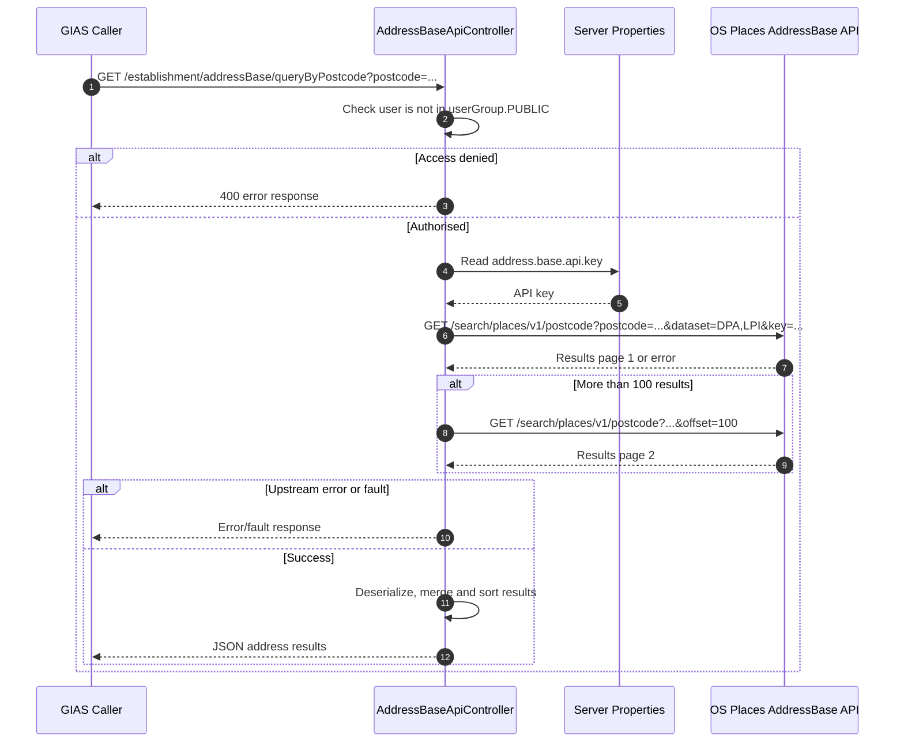
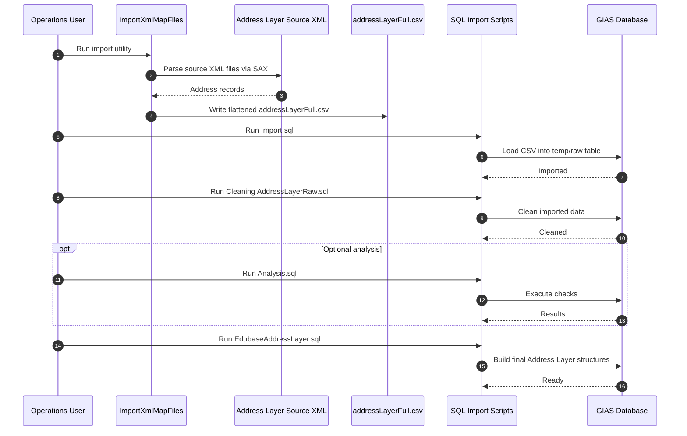

# Ordnance Survay Integration

## Overview

Two related address integration paths exist:

1. **Offline import pipeline that converts source XML into CSV and then into database address structures**
   - Batch-style local data import process under `addressLayer`
   - Builds a local address dataset from source XML and supporting files
   - Imports and transforms that data into database tables

2. **Runtime postcode lookup against the OS Places AddressBase API**
   - Live API integration in `AddressBaseApiController`
   - Exposes a REST endpoint for postcode-based address lookup
   - Calls the Ordnance Survey AddressBase Places API at runtime

## Main Classes and Files

### Runtime API integration

This is the application-facing integration used to query addresses by postcode.

Main classes :

- `AddressBaseApi`
- `AddressBaseApiController`
- `AddressBaseResultsDeserializer`

### Offline import module

This module is used to turn source address XML into a CSV and then into database structures used by the wider application.

Main classes :
- `addressLayer/Import Sequence.txt`
- `ImportXmlMapFiles`
- `XmlMapSaxHandler`
- `LocationNameFormatter`
- `Import.sql`
- `Cleaning AddressLayerRaw.sql`
- `Analysis.sql`
- `EdubaseAddressLayer.sql`

## Runtime Address Lookup Flow

The live API endpoint is:

- `GET /establishment/addressBase/queryByPostcode`

defined in `AddressBaseApi`

The controller then calls:

- `https://api.os.uk/search/places/v1/postcode`

from [`AddressBaseApiController`].

It sends these request parameters:

- `postcode`
- `dataset=DPA,LPI`
- `key=<address.base.api.key>`
- `offset=100` on the second request if more than 100 results are returned

The controller:

- Rejects any uses in the `PUBLIC` UserGroup
- Calls the external API
- Handles error and fault responses
- Deserializes successful responses
- Merges up to two pages of results
- Sorts the results by match score and address
- Returns JSON to the caller

## Authentication

The runtime address lookup authenticates using an API key passed as a query parameter:

- `key=<address.base.api.key>`

This is loaded in `AddressBaseApiController` via:

- `messageManager.getServerProperty("address.base.api.key")`

The runtime integration uses:

- API key authentication
- passed as a request parameter, not an HTTP header

## Runtime Sequence Diagram

## Offline Import Flow

Process steps

1. Run `ImportXmlMapFiles.main()` to create `addressLayerFull.csv`
2. Run [`Import.sql`]to load the CSV into a temporary table
3. Run [`Cleaning AddressLayerRaw.sql`] to fix data
4. Optionally run [`Analysis.sql`] for checks
5. Run [`EdubaseAddressLayer.sql`] to build the final database structures

The import step also requires supporting source files, including:

- `addressLayerFull.csv`
- `Scottish_Postcodes.dat`
- `townToCounty.csv`

## Offline Import Sequence Diagram

