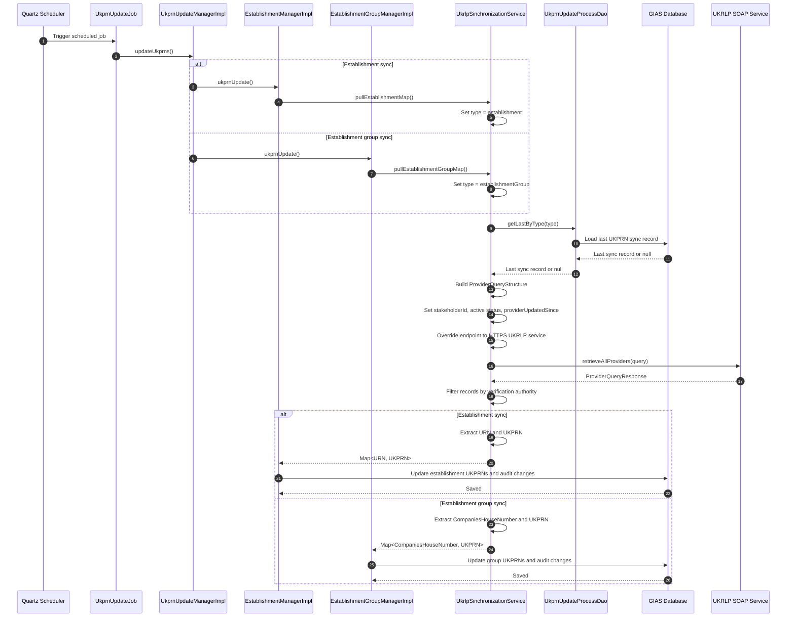

# UK Register of Learning Providers (UKRLP) Integration

## Overview

This system integrates with UKRLP to retrieve UK Provider Reference Number (UKPRN) mappings for:

- Establishments
- Establishment groups

The integration is implemented as a SOAP client and is used to pull provider records from UKRLP

It links:

- Estblishments URNs to UKPRNs
- Companies House numbers to UKPRNs

## Main Classes

### Scheduled job orchestration

- `UkprnUpdateJob`
- `applicationContext-quartz.xml`

In production, the job runs daily at 01:15 in the scheduler's timezone. The schedule is configured by the `scheduled.ukprn.update` property using the Quartz cron expression `0 15 1 * * ?`.

### Production configuration location

The deployment pipeline places the production `server.properties` file in the WAR at `WEB-INF/classes/server.properties`. This WAR-relative location is confirmed by the deployment configuration.

In the Azure portal, navigate to:

1. Resource group `rg-t1pr-edubase`.
2. App Service `ea-edubase-backend-prod`.
3. **Advanced Tools (Kudu)**.
4. **Debug console**.

The expected expanded Windows App Service path is `D:\home\site\wwwroot\webapps\edubase\WEB-INF\classes\server.properties`. This absolute path is inferred from the deployment structure and has not been directly verified in the production Kudu console.

The API App Service, `ea-edubase-api-prod`, is deployed with its own production `server.properties` file using the same WAR-relative location.

### SOAP synchronization service

- `UkrlpSinchronizationService`

This is the main integration class. It:

- Connects to the UKRLP SOAP service
- No application level authentication
- Requests provider records updated since the last sync point
- Filters records by verification authority
- Builds internal maps for establishments and establishment groups

### Base SOAP client support

- `BaseWebServiceSynchronizationService`

This provides the shared SOAP client setup used by the synchronization service.

### Sync tracking

- `UkprnUpdateProcessDao`
- `UkprnUpdateProcess`

These are used to determine the last sync point for each sync type.

## Upstream Service

The integration uses the UKRLP SOAP service defined by:

- `${ukrlp.ws.wsdl.address}`

and forces the runtime endpoint to:

- `${ukrlp.ws.endpoint}`

with a default of:

- `https://webservices.ukrlp.co.uk/UkrlpProviderQueryWS6/ProviderQueryServiceV6`

This is configured and used in `UkrlpSinchronizationService`

## What the Service Pulls

The service supports two main pull modes:

- `pullEstablishmentMap()`
  - returns `Map<Long, Integer>`
  - maps `URN -> UKPRN`

- `pullEstablishmentGroupMap()`
  - returns `Map<String, Integer>`
  - maps `CompaniesHouseNumber -> UKPRN`

Both methods call a shared `pullAll(...)` method and then transform the provider records returned by UKRLP.

## How the Filtering Works

The service filters provider records by verification authority:

- Establishments use `DfE (Schools Unique Reference Number)`
- Establishment groups use `Companies House`

It also filters by:

- Active provider status: `A`
- Stakeholder id from `${ukrlp.ws.wsdl.stakeholder}`
- Updated-since date from the last recorded sync

Routine synchronisation is incremental. The initial run can retrieve the full applicable dataset, as described below.

## Incremental And Initial Pull Behaviour

Despite the method name `pullAll(...)`, routine synchronisation does not retrieve the complete UKRLP dataset on every run. The method retrieves all provider records that match the query criteria and the applicable sync window.

For each sync type:

- `establishment`
- `establishmentGroup`

The service checks the most recent successful `UkprnUpdateProcess` record for that type.

If one exists:

- It uses that record's `sinceDate` as `providerUpdatedSince`.
- UKRLP therefore returns provider records updated since the previous successful sync point.

If one does not exist:

- It uses 1 February 1950 as `providerUpdatedSince`.
- This acts as an initial or bootstrap pull of the full applicable dataset.

The initial pull is still constrained by the active-provider and stakeholder query criteria and by the verification-authority filtering applied to the response. It is not an unrestricted historical pull of every UKRLP provider record.

The query id is also derived from the last process record.

## Authentication

Implementation `UkrlpSinchronizationService`, does not have any explicit username/password or token handling.

The service:

- Creates the SOAP port from the WSDL
- Overrides the endpoint URL
- Sends selection criteria in a `retrieveAllProviders` SOAP request

The request sends query criteria to UKRLP and retrieves matching provider records. It does not submit provider data for UKRLP to create, update or retain. The returned mappings are used to update records in the GIAS database.

## Sequence Diagram

