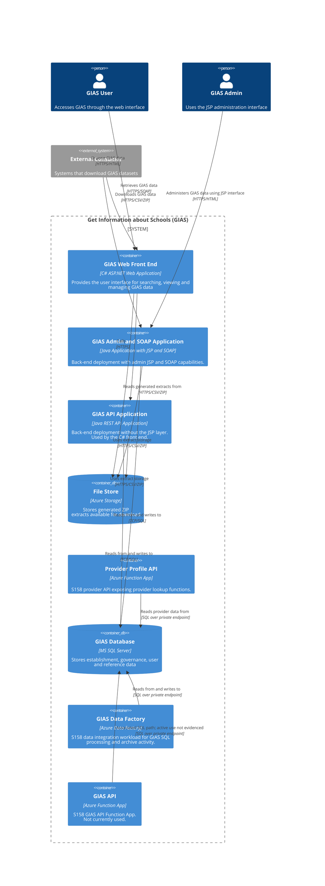

# C4 Container Diagram

Major components forming GIAS service, and how they interact with each other and external actors.

This is the container-level view of the system. It shows the major deployable/application building blocks and the main relationships between them, but it does not break the Java back end down into its internal Spring, persistence, extract, and integration components.

For lower-level Java back-end detail, see [the back-end component diagrams](../back-end-component/component/). That documentation explains the internal structure behind the Java API and admin/SOAP application capabilities, including client-facing entry points, scheduled and batch processing, reference-data provider integrations, and the authentication flow used by the front end when it calls the back-end APIs.
