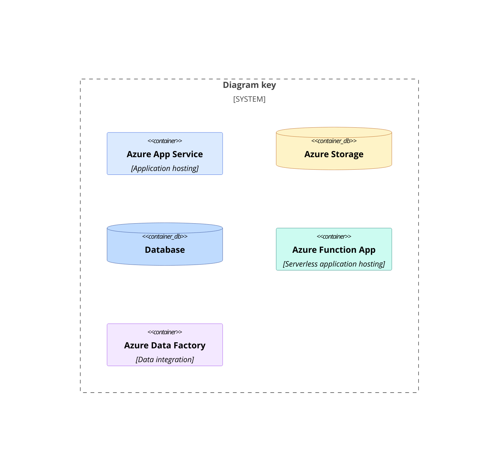

# C4 Container Diagram

Major components forming GIAS service, and how they interact with each other and external actors.

This is the container-level view of the system. It shows the major deployable/application building blocks and the main relationships between them, but it does not break the Java back end down into its internal Spring, persistence, extract, and integration components.

## How To Read This Diagram

Read the diagram from the outside in:

- `GIAS User`, `GIAS Admin` and `External Consumer` are actors or systems outside the GIAS application boundary.
- The `Get Information about Schools (GIAS)` boundary contains the main deployable containers and data stores currently in scope for this view.
- The C# web front end calls the Java API application for application behaviour and uses the file store for generated extracts.
- The Java admin and SOAP application is the back-end deployment with the JSP administration interface and SOAP capabilities.
- `S158` refers to a separate production Azure subscription/environment used by DfE Platform Identity for GIAS-related integration workloads.

## Diagram key

## Container diagram

```mermaid
C4Container

    UpdateLayoutConfig($c4ShapeInRow="2", $c4BoundaryInRow="2")

    Person(user, "GIAS User", "Accesses GIAS through the web interface")

    Person(admin, "GIAS Admin", "Uses the JSP administration interface")
        
    System_Ext(externalSystems, "External Consumer", "Systems that download GIAS datasets") 


    System_Boundary(gias, "Get Information about Schools (GIAS)") {
        
        Container(web, "GIAS Web Front End", "C# ASP.NET Web Application", "Provides the user interface for searching, viewing and<br> managing GIAS data")

        Container(adminSoapBackend, "GIAS Admin and SOAP Application", "Java Application with JSP and SOAP", "Back-end deployment with admin JSP and SOAP capabilities.")

        Container(apiBackend, "GIAS API Application", "Java REST API Application", "Back-end deployment without the JSP layer.<br>Used by the C# front end.")
        
        ContainerDb(fileStorage, "File Store", "Azure Storage", "Stores generated ZIP<br>extracts available for download")
        
        Container(providerProfileApi, "Provider Profile API", "Azure Function App", "Provider API in the S158 production environment.<br>Exposes provider lookup functions.")

        ContainerDb(db, "GIAS Database", "MS SQL Server", "Stores establishment, governance, user<br> and reference data")
        
        Container(redundantGiasApi, "GIAS API", "Azure Function App", "GIAS API Function App in the S158 production environment.<br>Not currently used.")

        Container(dataFactory, "GIAS Data Factory", "Azure Data Factory", "Data integration workload in the S158 production environment for GIAS SQL<br> processing and archive activity.")
    }

    Rel(user,web, "Browse GIAS data", "HTTPS/HTML")
    Rel(admin, adminSoapBackend, "Administers GIAS data<br>using JSP interface", "HTTPS/HTML")

    Rel(web, apiBackend, "Calls", "HTTPS")
    Rel(web, fileStorage, "Reads generated extracts from", "HTTPS/CSV/ZIP")
    Rel(apiBackend, db, "Reads from and writes to", "TCP/SQL")
    Rel(apiBackend, fileStorage, "Uses", "HTTPS/CSV/ZIP")
    Rel(adminSoapBackend, db, "Reads from and writes to", "TCP/SQL")
    Rel(adminSoapBackend, fileStorage, "Uses extract storage", "HTTPS/CSV/ZIP")
    Rel(providerProfileApi, db, "Reads provider data from", "SQL over private endpoint")
    Rel(redundantGiasApi, db, "Associated SQL path; active use not evidenced", "SQL over private endpoint")
    Rel(dataFactory, db, "Reads from and writes to", "SQL over private endpoint")

    Rel(externalSystems, web,"Downloads GIAS data","HTTPS/CSV/ZIP")
    Rel(externalSystems, adminSoapBackend,"Retrieves GIAS data","HTTPS/SOAP")

    UpdateRelStyle(user,web, $offsetX="-30", $offsetY="-170") 
    UpdateRelStyle(admin, adminSoapBackend, $offsetX="-70", $offsetY="-160") 
    UpdateRelStyle(externalSystems, web, $offsetX="-170", $offsetY="-80") 
    UpdateRelStyle(externalSystems, adminSoapBackend, $offsetX="-140", $offsetY="-80") 
    UpdateRelStyle(apiBackend, db, $offsetX="-210", $offsetY="-30") 
    UpdateRelStyle(adminSoapBackend, db, $offsetX="40", $offsetY="-130") 
    UpdateRelStyle(apiBackend, fileStorage, $offsetX="-45", $offsetY="-50") 
    UpdateRelStyle(adminSoapBackend, fileStorage, $offsetX="-100", $offsetY="-20") 
    UpdateRelStyle(web, apiBackend, $offsetX="-50", $offsetY="-20")

    UpdateElementStyle(web, $bgColor="#dbeafe", $fontColor="#000000", $borderColor="#1d4ed8")
    UpdateElementStyle(apiBackend, $bgColor="#dbeafe", $fontColor="#000000", $borderColor="#1d4ed8")
    UpdateElementStyle(adminSoapBackend, $bgColor="#dbeafe", $fontColor="#000000", $borderColor="#1d4ed8")

    UpdateElementStyle(providerProfileApi, $bgColor="#ccfbf1", $fontColor="#000000", $borderColor="#0f766e")
    UpdateElementStyle(dataFactory, $bgColor="#f3e8ff", $fontColor="#000000", $borderColor="#9333ea")

    UpdateElementStyle(db, $bgColor="#bfdbfe", $fontColor="#000000", $borderColor="#1e3a8a")
    UpdateElementStyle(fileStorage, $bgColor="#fef3c7", $fontColor="#000000", $borderColor="#b45309")

    UpdateElementStyle(redundantGiasApi, $bgColor="#ccfbf1", $fontColor="#000000", $borderColor="#0f766e")

```

## Notes

- For lower-level C# front-end detail, see [the front-end component diagram](../front-end-component/component/).
- For lower-level Java back-end detail, see [the back-end component diagrams](../back-end-component/component/).
- The `GIAS API` Azure Function App is shown because it is deployed infrastructure, but it is not currently being used.
