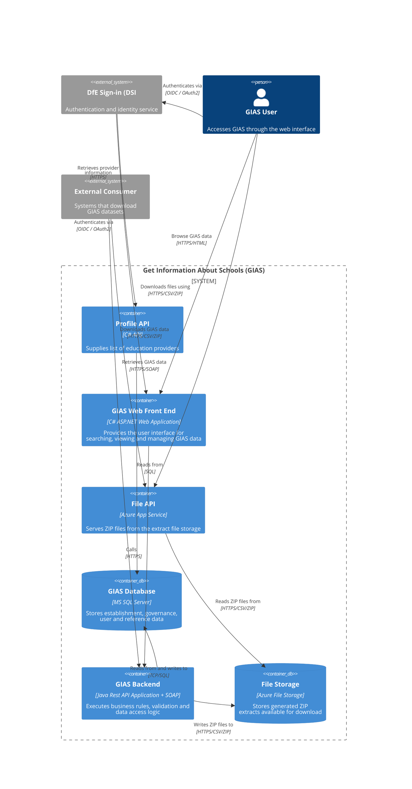

## C4 Container Diagram

Major components forming GIAS service, and how they interact with each other and external actors.

This is the container-level view of the system. It shows the major deployable/application building blocks and the main relationships between them, but it does not break the Java back end down into its internal Spring, persistence, extract, and integration components.

For that lower-level view, see [`back-end-component.md`](./back-end-component.md). This document explains how the `GIAS Backend` container is structured internally, including client-facing entry points, scheduled and batch processing, reference-data provider integrations, and the authentication flow used by the front end when it calls the back-end APIs.
