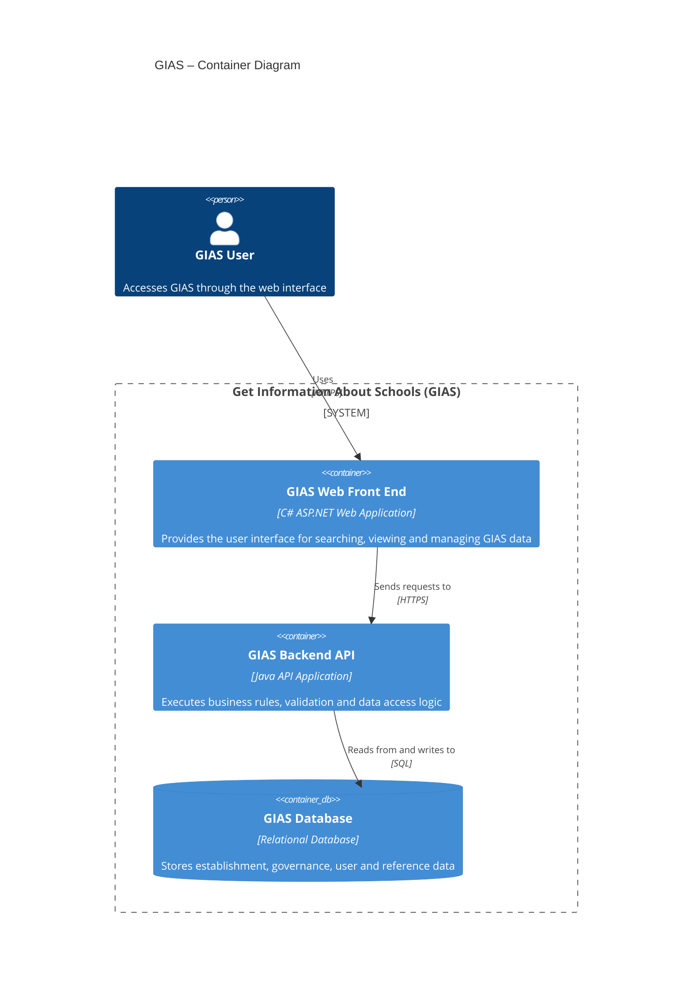

Components
- Extract scheduler/runner

```mermaid
C4Container
    title GIAS – Container Diagram


    UpdateLayoutConfig($c4ShapeInRow="1", $c4BoundaryInRow="1")
    Person(user, "GIAS User", "Accesses GIAS through the web interface")

    System_Boundary(gias, "Get Information About Schools (GIAS)") {
        Container(web, "GIAS Web Front End", "C# ASP.NET Web Application", "Provides the user interface for searching, viewing and managing GIAS data")
        Container(api, "GIAS Backend API", "Java API Application", "Executes business rules, validation and data access logic")
        ContainerDb(db, "GIAS Database", "Relational Database", "Stores establishment, governance, user and reference data")
    }

    Rel_D(user, web, "Uses", "HTTPS")
    Rel_D(web, api, "Sends requests to", "HTTPS")
    Rel_D(api, db, "Reads from and writes to", "SQL")


```