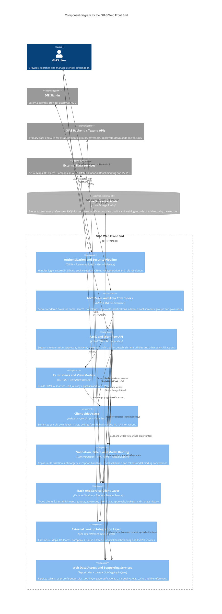

## C4 Component Diagram

Internal component view of the `GIAS Web Front End` container (`Web/Edubase.Web.UI`), based on the code under `/Web`.

### Notes

- The main runtime centre of gravity is the MVC controller layer, especially the `Areas/Establishments`, `Areas/Groups` and `Areas/Governors` flows.
- `App_Start/IocConfig.cs` wires the web app to typed service clients for the main GIAS back-end APIs and also registers direct repositories used by the web tier.
- Those direct repositories are Azure Table Storage-based via `Edubase.Data.Repositories.TableStorage.TableStorageBase<T>`, rather than direct SQL Server access from the web app.
- `Controllers/Api` provides lightweight endpoints used by the client-side bundles for AJAX and long-running workflow support.
- `Assets/Scripts/Entry` and `Assets/Scripts/GiasVueComponents` show that the UI is mostly server-rendered, with targeted JavaScript/Vue enhancement rather than a separate SPA.

Related notes in this repository:

- [`address-lookups.md`](./address-lookups.md)
- [`azure-table-storage.md`](./azure-table-storage.md)
- [`bulk-updates.md`](./bulk-updates.md)
- [`companies-house-number.md`](./companies-house-number.md)
- [`data-quality-status.md`](./data-quality-status.md)
- [`downloads.md`](./downloads.md)
- [`security-and-permissions.md`](./security-and-permissions.md)
- [`tokens.md`](./tokens.md)
