# C4 Component Diagrams

Internal component view of the `GIAS Web Front End` container (`Web/Edubase.Web.UI`), based on the code under `/Web`.

To keep the component view readable, the front-end subcomponents are grouped into two categories:

- `User-facing workflow and content components`
- `Supporting platform and integration components`

### User-facing workflow and content components

This category groups the journeys that users and administrators interact with directly.

```mermaid
C4Component

    UpdateLayoutConfig($c4ShapeInRow="6", $c4BoundaryInRow="1")

    title User-facing workflow and content components in the GIAS Web Front End

    Person(anonUser, "Anonymous User", "Browses public content and uses public search and  download journeys")

    Person(authUser, "Authenticated User", "Signs in via DfE Sign-in to access protected workflows such as approvals, bulk updates, saved<br>searches and other role-dependent features")

    Person(admin, "Administrator", "Authenticated user with additional rights to maintain front-end content and operational data")

    Container_Boundary(workflows, "GIAS Web Front End - User-facing workflow and content components") {

        Component(guidance, "Guidance Pages and Blob-backed<br>Resources", "MVC pages + blob-backed file delivery", "Serves guidance pages, PDFs,<br> CSVs and packaged guidance downloads")

        Component(search, "Search and Filtering", "MVC + JavaScript filters", "Searches establishments, groups and governors and manages<br> tokenised filter state")
       
        Component(downloads, "Downloads", "MVC + API-backed workflows", "Lets users request search-result and dataset downloads")
        
        Component(bulk, "Bulk Updates", "MVC upload workflows", "Runs spreadsheet-driven bulk update and bulk<br> association journeys")
        
        Component(approvals, "Change Requests and Approvals", "MVC review and approval flows", "Creates approval-controlled changes and,<br> manages pending approvals")

        Component(editorialContent, "Editorial Content Management", "MVC content pages + admin screens", "Serves news, notification banners, FAQ content<br> and glossary terms, and provides admin maintenance")


        Component(history, "Change History", "MVC browse/download flows", "Shows and exports establishment and group change history")

        Component(apiClients, "Texuna API Client Layer", "Typed service clients + HttpClientWrapper", "Shared back-end client layer used by search,<br> downloads, bulk operations, approvals and change history")
    }

    Container_Boundary(infra, "","") {
        System_Ext(blob, "Azure Blob Storage", "Guidance and support files served by the web front end")

        ContainerDb_Ext(tableStorage, "Azure Table Storage", "Azure Storage Tables", "Stores front-end-owned content and<br> data quality records")

        System_Ext(texuna, "GIAS Backend / Texuna APIs", "Primary back-end APIs for search, downloads, approvals,<br> batch operations and change history")
    }

    Rel(anonUser, downloads, "Uses", "HTTPS")
    Rel(anonUser, search, "Uses", "HTTPS")
    Rel(anonUser, guidance, "Views", "HTTPS")
    Rel(anonUser, editorialContent, "Views", "HTTPS")
    Rel(authUser, search, "Uses", "HTTPS")
    Rel(authUser, downloads, "Uses", "HTTPS")
    Rel(authUser, bulk, "Bulk uploads data via", "HTTPS")
    Rel(authUser, approvals, "Uses", "HTTPS")
    Rel(authUser, history, "Uses", "HTTPS")
    Rel(authUser, guidance, "Views", "HTTPS")
    Rel(authUser, editorialContent, "Views", "HTTPS")
    Rel(admin, editorialContent, "Maintains content", "HTTPS")
    Rel(admin, bulk, "Bulk uploads data via", "HTTPS")
    Rel(admin, approvals, "Uses approval workflows", "HTTPS")
    Rel(search, downloads, "Provides selected filters and<br>result context for")
    Rel(search, apiClients, "Uses")
    Rel(downloads, apiClients, "Uses")
    Rel(bulk, apiClients, "Uses")
    Rel(approvals, apiClients, "Uses")
    Rel(history, apiClients, "Uses")
    Rel(apiClients, texuna, "Calls", "HTTPS/JSON")
    Rel(editorialContent, tableStorage, "Reads and writes", "Azure Storage Tables")
    Rel(guidance, blob, "Reads and serves files", "Azure Blob Storage")

    UpdateRelStyle(anonUser, guidance, $offsetX="-65", $offsetY="-50")
    UpdateRelStyle(anonUser, search, $offsetX="-70", $offsetY="-60")
    UpdateRelStyle(anonUser, editorialContent, $offsetX="25", $offsetY="-180")
    UpdateRelStyle(authUser, guidance, $offsetX="200", $offsetY="-80")
    UpdateRelStyle(authUser, history, $offsetX="60", $offsetY="-150")
    UpdateRelStyle(authUser, editorialContent, $offsetX="100", $offsetY="-180")
    UpdateRelStyle(anonUser, downloads, $offsetX="-240", $offsetY="-110")
    UpdateRelStyle(authUser, search, $offsetX="25", $offsetY="-80")
    UpdateRelStyle(authUser, downloads, $offsetX="-50", $offsetY="-80")
    UpdateRelStyle(authUser, approvals, $offsetX="-230", $offsetY="-80")
    UpdateRelStyle(authUser, bulk, $offsetX="-150", $offsetY="-40")
    UpdateRelStyle(admin, bulk, $offsetX="-50", $offsetY="-50")
    UpdateRelStyle(admin, approvals, $offsetX="-60", $offsetY="-60")
    UpdateRelStyle(admin, editorialContent, $offsetX="400", $offsetY="-200")
    UpdateRelStyle(search, downloads, $offsetX="-50", $offsetY="50")
    UpdateRelStyle(guidance, blob, $offsetX="-150", $offsetY="-200")
    UpdateRelStyle(apiClients, texuna, $offsetX="40", $offsetY="-50")
    UpdateRelStyle(editorialContent, tableStorage, $offsetX="-40", $offsetY="-40")

```

Included subcomponents:

- [`search-and-filtering`](../reference/search-and-filtering/)
- [`downloads`](../reference/downloads/)
- [`bulk-updates`](../reference/bulk-updates/)
- [`change-history`](../reference/change-history/)
- [`change-requests-and-approvals`](../reference/change-requests-and-approvals/)
- [`content-management`](../reference/content-management/)
- [`guidance-and-blob-resources`](../reference/guidance-and-blob-resources/)

**Notes for this diagram:**

- This view shows what anonymous users, authenticated users and administrators experience directly.
- Texuna-facing workflows are shown as going through a shared `Texuna API Client Layer`, reflecting the typed service clients and common `HttpClientWrapper` used across the web app.
- The main runtime centre of gravity is still the MVC controller layer, especially the `Areas/Establishments`, `Areas/Groups` and `Areas/Governors` flows.
- `Editorial Content Management` is user-facing as well as admin-facing: users read content through it, while administrators maintain that content in Azure Table Storage-backed repositories.
  Content types include:
  - News
  - Notification banners/templates
  - FAQ items/groups
  - Glossary entries
- `Guidance Pages and Blob-backed Resources` is a separate component because it serves help/guidance pages and blob-hosted supporting files.
  Examples of guidance pages include:
  - Guidance/General
  - Guidance/EstablishmentBulkUpdate
  - Guidance/ChildrensCentre
  - Guidance/Federation
  - Guidance/Governance

  Blob-backed resources include:
  - PDFs
  - CSVs packaged guidance downloads such as the local authority name/code files
- The front-end does not have an administrator upload interface for PDF or guidance-file authoring, so the guidance/blob component behaves as a read/serve mechanism rather than an in-app authoring tool.

### Supporting platform and integration components

This component diagram groups the services that support the visible workflows by handling authentication, state, caching, storage, diagnostics and external integrations.

```mermaid
C4Component

    UpdateLayoutConfig($c4ShapeInRow="6", $c4BoundaryInRow="1")

    title Supporting platform and integration components in the GIAS Web Front End

    System_Ext(dsi, "DfE Sign-in", "External identity provider used via SAML")


    Container_Boundary(platform, "GIAS Web Front End - Supporting platform and integration components") {
        Component(security, "Security and Permissions", "OWIN + Sustainsys.Saml2 + ISecurityService", "Authenticates users, builds claims and resolves authorisation data")
        
        Component(apiClients, "Texuna API Client Layer", "Typed service clients + HttpClientWrapper", "Shared client layer for security, lookups, downloads, approvals,<br> change history and write/read workflows")
        
        Component(lookup, "Lookup and Caching", "Lookup services + cache layer", "Caches reference data and supports lookup-backed filters and forms")

        Component(addresses, "Address Lookups", "Places lookup services", "Performs place and postcode address lookup journeys")
       
        Component(tokens, "Tokens", "Token repository + token value provider", "Stores tokenised search/filter state for later reuse")


        Component(storage, "Azure Table Storage-backed Web State", "Table repositories", "Persists user preferences, content, data quality and other front-end-owned records")
        
        Component(companiesHouse, "Companies House Number Integration", "Companies House service", "Searches Companies House and persists<br> company-number based trust identifiers")
        
        Component(externalLinks, "External Lookup Links", "ExternalLookupService", "Builds and checks outbound links to Ofsted, benchmarking and<br> performance services")
        
        Component(logging, "API Session Recorder and Logging", "HttpClientWrapper + Azure Table Logger", "Captures API diagnostics and web/exception logs for support use")
    }

    Container_Boundary(infra, "","") {

    ContainerDb_Ext(tableStorage, "Azure Table Storage", "Azure Storage Tables", "Stores tokens, preferences, front-end content, data quality records and diagnostic logs")

    System_Ext(texuna, "GIAS Backend / Texuna APIs", "Provides security, lookup and core business APIs")  

    System_Ext(extData, "External Data Services", "Azure Maps, OS Places, Companies House, Ofsted, Financial Benchmarking and FSCPD")

    }

    Rel(security, dsi, "Authenticates with", "SAML2")
    Rel(security, apiClients, "Uses for role and<br>permission resolution")
    Rel(apiClients, texuna, "Calls", "HTTPS/JSON")

    Rel(tokens, tableStorage, "Reads and writes token records", "Azure Storage Tables")
    Rel(lookup, apiClients, "Uses for internal<br>reference data")
    Rel(addresses, extData, "Queries Azure Maps and OS Places", "HTTPS")
    Rel(companiesHouse, extData, "Queries Companies House", "HTTPS")
    Rel(externalLinks, extData, "Builds and checks<br>external links", "HTTPS")
    Rel(storage, tableStorage, "Reads and writes front-end-owned data", "Azure Storage Tables")
    Rel(logging, tableStorage, "Writes API traces and web logs", "Azure Storage Tables")


    UpdateRelStyle(security, dsi, $offsetX="-20", $offsetY="-50")
    UpdateRelStyle(security, apiClients, $offsetX="-60", $offsetY="50")
    UpdateRelStyle(lookup, apiClients, $offsetX="-30", $offsetY="40")
    UpdateRelStyle(tokens, tableStorage, $offsetX="-40", $offsetY="-180")
    UpdateRelStyle(storage, tableStorage, $offsetX="0", $offsetY="-200")
    UpdateRelStyle(logging, tableStorage, $offsetX="-10", $offsetY="-30")
    UpdateRelStyle(companiesHouse, extData, $offsetX="-60", $offsetY="-200")
    UpdateRelStyle(addresses, extData, $offsetX="30", $offsetY="-300")
    UpdateRelStyle(externalLinks, extData,, $offsetX="10", $offsetY="-200")

```

Included subcomponents:

- [`security-and-permissions`](../reference/security-and-permissions/)
- [`tokens`](../reference/tokens/)
- [`lookup-and-caching`](../reference/lookup-and-caching/)
- [`address-lookups`](../reference/address-lookups/)
- [`external-lookup-links`](../reference/external-lookup-links/)
- [`companies-house-number`](../reference/companies-house-number/)
- [`azure-table-storage`](../reference/azure-table-storage/)
- [`api-session-recorder-and-logging`](../reference/api-session-recorder-and-logging/)

**Notes for this diagram:**

- This view shows the internal services that support the visible workflows by handling authentication, state, caching, storage, diagnostics and external integrations.
- `App_Start/IocConfig.cs` wires the web app to typed service clients for the main GIAS back-end APIs and also registers direct repositories used by the web tier.
- Those direct repositories are Azure Table Storage-based via `Edubase.Data.Repositories.TableStorage.TableStorageBase<T>`, rather than direct SQL Server access from the web app.
- `Controllers/Api` provides lightweight endpoints used by the client-side bundles for AJAX and long-running workflow support.
