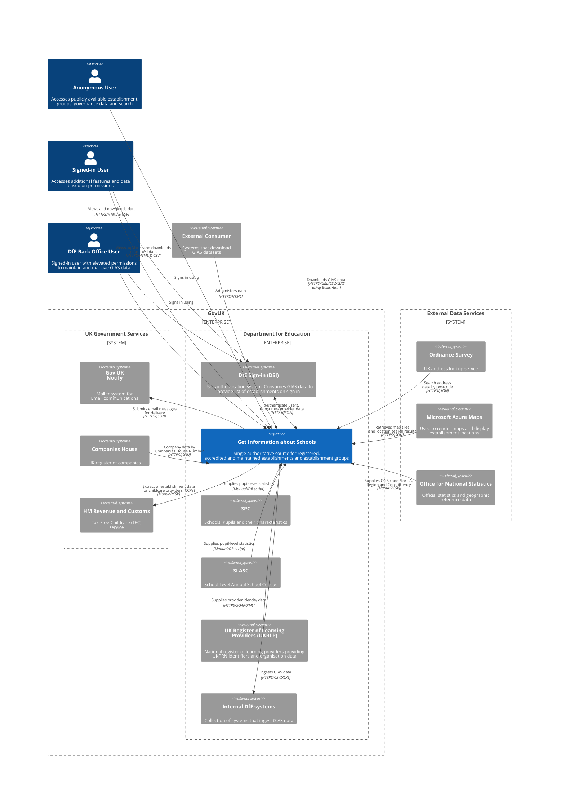

# Service Overview

> Get Information about Schools (GIAS) is the Department for Education’s official register of educational establishments in England. It provides a single, authoritative source of information used by schools, trusts, local authorities, government partners, and the public. It holds information about establishments, establishment groups and governors.
>
> GIAS is also the National Database of Governors, holding governance information for state‑funded schools and academy trusts as required by legislation

## About the C4 System Context Diagram

A C4 system context diagram is the highest-level architectural view of a system. It shows GIAS as a single system, the people and external systems around it, and the most important relationships between them.

This diagram is intended to help readers quickly understand the scope and boundaries of GIAS: who uses it, which external services and organisations it depends on, and which other systems consume its data.

It does not show the internal structure of GIAS, such as applications, containers, components, classes, data models, deployment details, or detailed request flows. Those concerns belong in lower-level C4 diagrams and supporting documentation.

## C4 System Context Diagram

### System context diagram for the Get Information about Schools Service

**Notes**

1. The `DfE Back Office User` is a signed-in user with elevated permissions. This role can do everything available to anonymous and standard signed-in users, plus additional administrative and data-management actions.
2. To keep the main context diagram easy to read, all DfE internal systems have been grouped into a single external system called `Internal DfE systems`.
3. The `External Consumer` is an external system, not a person. It consumes GIAS data either by downloading extract files or by calling the SOAP interface.
4. For more detail on how front-end authentication works between GIAS and DfE Sign-in, see [GIAS front-end authentication flow](../front-end-component/front-end-authentication-flow/).

The detailed internal DfE systems diagram has been replaced with the tables below. They separate internal DfE systems from external systems referenced in this overview, and give a short description of each service or system's primary purpose.

This list will evolve over time as more internal systems and use cases are identified.

### Internal DfE systems consuming GIAS

| Service name | Description |
| --- | --- |
| DfE Sign-in (DSI) | Department for Education identity and access management service used to sign in to DfE online services. |
| Provider Profile (for DSI) | Service and data source used to supply provider and organisation information to DSI for access management. |
| Collections Online - Learners, Education, Children and Teachers (COLLECT) | DfE's centralised data collection and management system for education returns. |
| School census | DfE statutory data collection covering school, pupil and characteristics data. |
| Submit Learner Data | Service for providers to submit, validate and review learner and funding-related data returns. |
| Individual Learner Record (ILR) | Standard learner-data return used by publicly funded providers to report learner and learning aim data. |
| School to School (S2S) | Secure service for transferring pupil data and files between schools, local authorities and DfE. |
| Document Exchange | Secure file and document exchange service used to share funding and operational documents with providers. |
| Enterprise API Management Platform (EAPIM) | Enterprise platform for publishing, securing, monitoring and managing APIs across DfE services. |
| PIMs | Internal provider information management services used to maintain provider reference data and attributes. |
| Enterprise Data and Analytics Platform (EDAP) | Enterprise platform for storing, transforming and analysing DfE data. |
| SIP | Internal information service used to bring together school profile and operational information for DfE users. |
| Provider CRM | Customer relationship management system for managing provider contacts, enquiries and casework. |
| School and College Database (SCDB) | Reference database of schools and colleges used across DfE services and reporting. |
| Schools Checking Exercise | Checking exercise that allows schools to review and confirm key data held by DfE. |
| Compare the Performance of Schools and Colleges in England (CSCP) | Public service for comparing school and college performance and related data in England. |
| Analyse School Performance (ASP) | Secure service providing detailed attainment and progress reports to support school improvement. |
| Monitor Your School Attendance | Tool for viewing, comparing and downloading daily attendance and absence data. |
| Get Information about Pupils (GIAP) | Secure service that gives authorised users access to individual pupil-level data. |
| Standard Testing Agency (STA) - Assessment Platform (Manage my Pupils) | STA assessment administration platform used to manage pupil and school data for national assessments. |
| Standard Testing Agency (STA) - Digital Platform (in development) | New STA digital platform being developed to deliver and administer assessment services online. |
| Primary Assessment Gateway (PAG) (and replacement) | Secure portal supporting the administration of primary national curriculum assessments. |
| Standard Testing Agency (STA) - Multiplication Tables Checking (MTC) | Online service used to administer the statutory year 4 multiplication tables check. |
| Capital CRM | Customer relationship management system for capital funding, capital programmes and related casework. |
| Financial Benchmarking and Insights Tool | Service that helps schools, trusts and local authorities compare spending and plan finances. |
| Academy Financial Returns | Collection of academy trust financial return submissions, including accounts-return data. |
| Further Education Financial Returns | Collection of financial returns, forecasts and related submissions for further education providers. |
| Calculate Funding Service (CFS) | Internal service used to calculate or adjust funding allocations. |
| Basic Need Allocation | Allocation process and supporting service for school-place capital funding. |
| Manage Your Education and Skills Funding (My ESF) | Service for viewing allocations and payments, signing documents and managing subcontractor information. |
| National Capacity Assessment (NCA) programme | Programme used to assess school-place capacity and need to support capital planning decisions. |
| CRM Land and Transactions | Customer relationship management system for land, property and academy transaction casework. |
| School System Accountability and Improvement Core Brief | Internal briefing product bringing together accountability, performance and improvement information about schools. |
| Trust and Academy Management service (TRAMS) | Service used to manage academy trust and academy operational, governance, land and compliance information. |
| Find Information about Academies and Trusts (FIAT) | Service for finding information about academies and academy trusts. |
| Academies and Free Schools Key Data | Data product summarising key information about academies and free schools. |
| Open Academies with United Kingdom Provider Reference Numbers (UKPRNs) | Data publication linking open academies to their UKPRNs. |
| Open Academies, Free Schools, Studio Schools and University Technology Colleges (UTCs) | Monthly publication listing open academies and academy projects in development. |
| National Foundation for Education Research (NFER) systems | NFER-operated research and assessment systems that use education reference data. |
| Project Titan | Programme to modernise how education data and digital credentials are collected, shared and used across the sector. |
| Edustat | Internal education statistics and analysis tool used by DfE teams. |
| Explore Education Statistics (EES) | Public service for exploring official education statistics, data tables and open datasets. |
| Iris (CRM) | Customer relationship management system used for operational casework and stakeholder management. |
| Database of Qualified Teachers | Teacher Regulation Agency database holding records of qualified teachers and teacher reference numbers. |
| Access Teaching Qualifications | Service that lets teachers view qualifications, induction information and download certificates. |
| Manage Training for Early Career Teachers | Service used by schools to set up and manage early career teacher training and related details. |
| Register for a National Professional Qualification (NPQ) | Service for registering for NPQ courses and checking registration or outcome details. |
| Teaching Vacancy Service | National service for advertising teaching, leadership and education support jobs and managing applications. |
| Funding Transformation Project (FTP) | Funding transformation programme to modernise funding operations and supporting digital services. |
| Funding Data Service | Internal data service that supports allocations, calculations, contracts, statements and payments. |
| Provider Profile  | Internal provider profile view or service used to surface provider reference and operational information. |
| Single Point of Information (SPI) | Internal service intended to provide a single view of key provider and institution information. |
| Complete conversions, transfers and changes | Service used to complete academy conversions, transfers and related change processes. |
| Teacher CPD service | Service family supporting teacher continuing professional development journeys, including early career and NPQ-related services. |
| Analysis and Modelling Platform (AnM) | ESFA data catalogue and analytics environment. |
| Publish Teacher Training | Service for publishing teacher training courses and related provider information. |
| Early Career Framework | Two-year professional development framework and entitlement for early career teachers. |
| Claim Additional Payments for Teaching | Service for teachers to claim eligible additional payments linked to teaching roles and eligibility rules. |
| Find placement schools | Service for schools to record placement capacity and for teacher training providers to find placement schools. |
| Claim funding for mentor training | Service for schools and education organisations to claim funding for ITT mentor training. |

