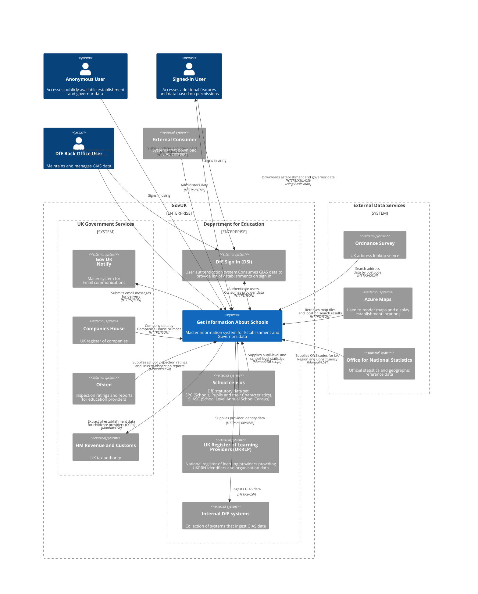
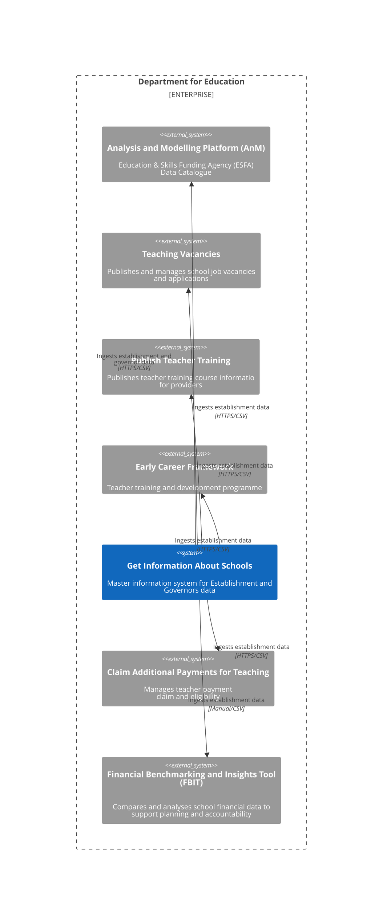

# Service Overview

> Get Information About Schools (GIAS) is the Department for Education’s official register of educational establishments in England. It provides a single, authoritative source of information used by schools, trusts, local authorities, government partners, and the public
>
> GIAS is also the National Database of Governors, holding governance information for state‑funded schools and academy trusts as required by legislation

## C4 System Context Diagram

### System context diagram for the Get Information About Schools Service

**Note** To keep the main context diagram easy to read, all DfE internal systems have been grouped into a single external system called "Internal DfE systems"

A second diagram has been created below to show these internal systems in more detail and how they relate to each other.

We do not yet know all the internal systems that interact with GIAS. This list will grow over time as more systems and use cases are identified.

3 mechanisms
 - edubase/downloads/File.xhtm?id=?
 - /edubase/downloads/public (direct file)
 - /edubase/service (SOAP)

CRM clients
 - capital
 - provider
 - IEBT

### System context diagram showing the internal DfE systems

