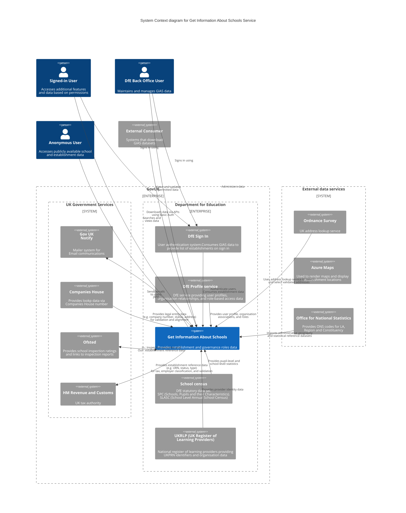

# Service Overview

> Get Information About Schools (GIAS) is the Department for Education’s official register of educational establishments in England. It provides a single, authoritative source of information used by schools, trusts, local authorities, government partners, and the public
>
> GIAS is also the National Database of Governors, holding governance information for state‑funded schools and academy trusts as required by legislation

## C4 System Context Diagram

